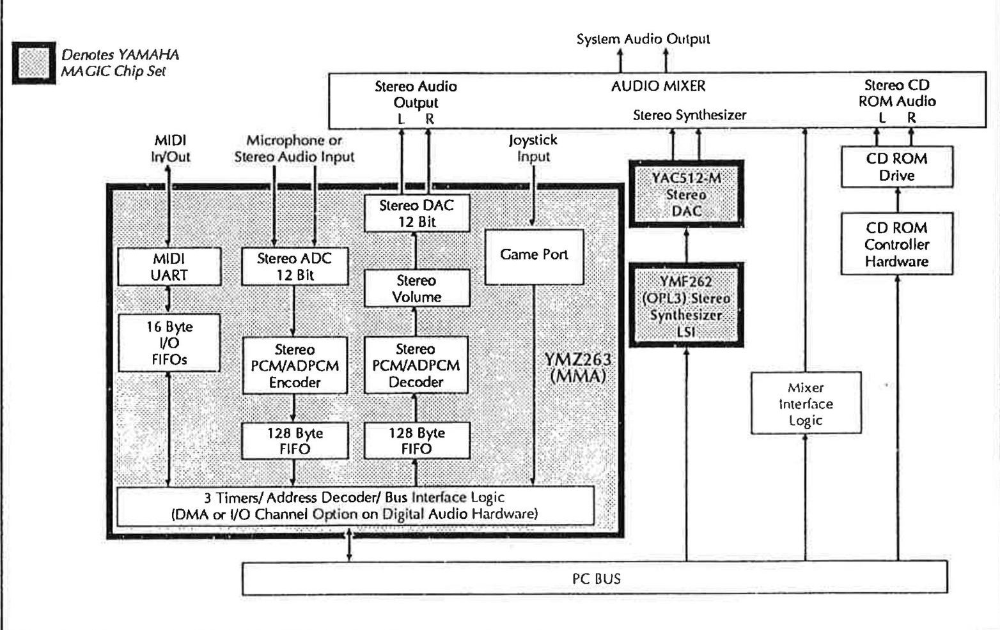
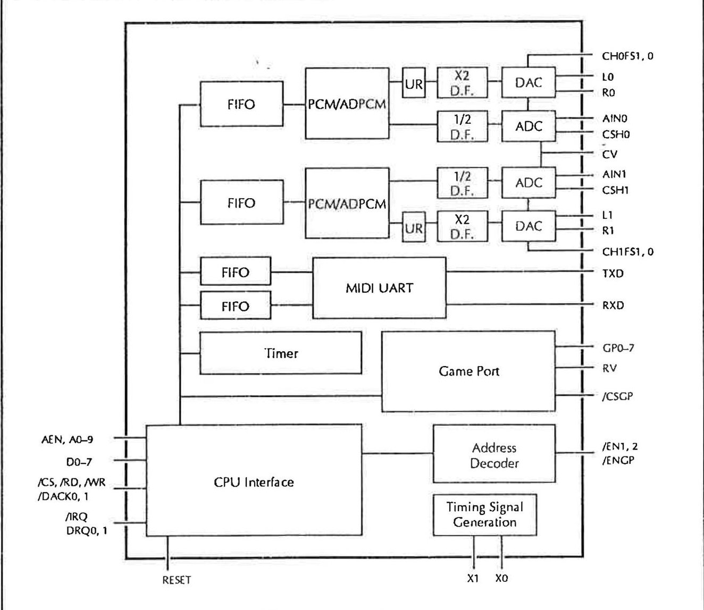
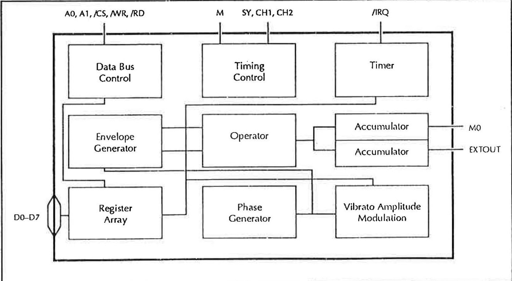
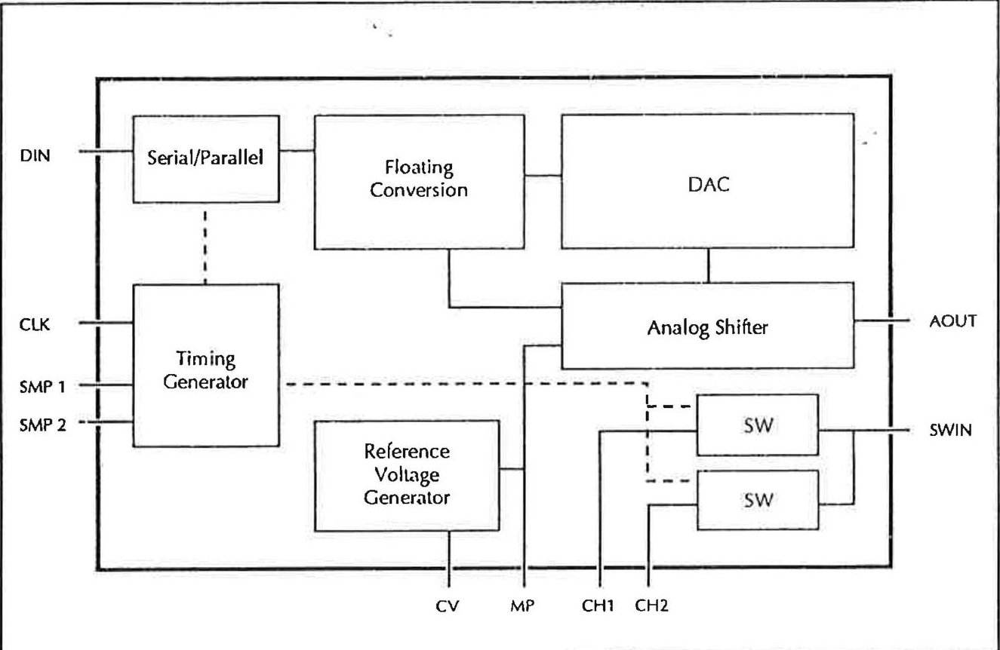
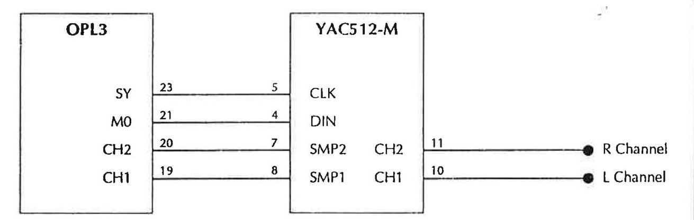

# Appendix: YAMAHA Gold Sound Standard (GSS)

*The Gold Sound Standard specification: MMA, OPL3 and mixer/set-up implementation.*

---

## YAMAHA Gold Sound Standard

March 17,1992

## Contents

Introduction ...1

Overview ...2

GSS Implementation...3

MMA: Digital Audio, MIDI, and Game Port ...4

OPL3: FM Synthesis ...6

Mixer and Set-up Section ...9

Software Issues ...11

Mixer and Set-up Function

Implementation...12

Access Method ...12

Status Register ...13

Index Register Map ...14

Register Reference ...15

Conclusion ...28

## Introduction

The rapid evolution of multimedia has necessitated an audio standard to be defined. Although Windows alleviates some of the need for compatibility, it is important that an audio standard is established for DOS, game, and "edutainment" applications. The implementation of an audio multimedia standard lessens the concerns of both hardware and software developers.

This document describes recommended procedures and practices for implementing multimedia audio hardware using the "Magic" chip set from YAMAHA. By conforming to the Gold Sound Standard, hardware manufacturers can be assured that software written for Gold Sound Standard compatible cards will run on their product.

The Gold Sound Standard is a hardware implementation specification, as well as the requirements of hardware compatibility at the register level for the mixer and set up functions. This ensures that software, which writes directly to the hardware, will run on any Gold Sound Standard implementation. This also means that any Gold Sound Standard driver kit for DOS or Windows will be capable of driving any Gold Sound Standard hardware. The Gold Sound Standard provides a safe development path for both software and hardware designers.

## Overview

The Gold Sound Standard (GSS) is composed of the YAMAHA "Magic" chip set and a form of mixer and set up circuitry. In the case of the YAMAHA "Magic" chip set, this document will summarize its functions. A more detailed reference for the individual registers of the "Magic" chip set may be found in the YAMAHA reference manual for the particular chip.

Only the minimum requirements are defined in this document. The individual hardware designer may implement additional features. The GSS provides the necessary functionality to be Level 1 MPC compatible.

The "Magic" chip set is designed as a highly integrated solution to developing a Level-1 MPC compatible audio subsystem. The following sections illustrate design concerns when using the "Magic" chip set. They also provide the I/O register map requirements to be Gold Sound Standard compatible.
## GSS Implementation

The basic features of GSS compatible hardware are a MIDI port, microphone input, stereo input/output, joystick input, and a mixer to produce the stereo audio output. Optionally, a SCSI interface may be implemented for use with CD-ROM drives. A hardware design conforming to the GSS will allow software that directly accesses the hardware to run on all GSS compatible cards. The design concerns are minimized by implementing the "Magic" chip set, which includes the YMZ263 (MMA) Multimedia Audio LSI, the YMF262 (OPL3) Advanced Algorithm Synthesizer LSI, and the YAC512-M Stereo Serial DAC. The following figure illustrates the hardware components of a typical Level 1 multimedia PC using the "Magic" chip set.

## MMA: Digital Audio, MIDI, and Game Port

The MMA integrates a stereo digital audio, game port, and MIDI interface into one LSI. The MMA also contains internal bus decode logic, two DMA channels, and two FIFOs. The internal block diagram illustrates the various portions of control circuitry.

The CPU interface is directly connectable to the address, data, and I/O control lines of the PC bus. The interrupt line is connected to the PC bus and may either be asserted when there is data in the input FIFOs, when the output FIFOs are able to receive more data, or if a timer interrupt is generated.

The DMA channels may be programmed to provide two methods of operation, allowing simultaneous record and playback. The first method uses a separate DMA channel for each channel. The second method is to interleave channel information using one DMA.

A PAL device may be used to decode jumper block settings, allowing DMA channel and IRQ level selection.

The direct ISA bus interface of the MMA contains an address decoder for built in fixed addresses. The I/O address the MMA will respond to is determined by the state of the /EN1, /EN2, and /ENGP signals. The recommended default I/O address for the MMA is from 38CH to 38FH (Channel 0: 38CH-38DH, Channel 1: 38EH-38FH). The MMA uses two port addressing for each channel. The first address of a channel is the address register, which is used to access the desired internal register. The second register is the data register. The data written to this register will be sent to the register specified by the index written to the address register.

The two inputs to the wave audio section of the MMA are a low impedance stereo microphone or a high impedance stereo audio. These inputs are A/D converted at twice the selected sampling frequency and decimated before being fed into the PCM/ADPCM encoder. External capacitors are attached to pins CSH1 and CSH2, which stabilize the analog signals during sample hold operations. A reference center voltage for the A/D converter is supplied through the CV pin of the MMA.

The buffered PCM/ADPCM decoder output is amplified and over sampled at twice the selected frequency (except for 44.1 kHz PCM mode) before passing through the DAC. The DAC output signals are fed through a series of operational amplifiers ending with a low pass reconstruction filter before final output.

The MMA contains a MIDI subsystem with three timers, an asynchronous UART, and two 16 byte FIFOs for sending and receiving MIDI data. The MIDI output channel (TXD) is inverted and sent through an external 5 mA current loop to the external MIDI output connector. The external MIDI input connector's RXD signal is optically isolated to avoid ground loops. An optional MIDI thru port may be added by transferring the MIDI input signal through two inverters out an additional MIDI output port.

The game port interface of the MMA uses internal voltage comparison circuitry to isolate changes in the signals from the game port connector.

## OPL3: FM Synthesis

The FM synthesis is produced by the OPL3 and uses the YAC512-M stereo DAC for output. The OPL3 is backward compatible with the YM3812 (OPL2) used in most popular PC audio cards, yet offers much higher quality synthesized sound. The OPL3 was designed to be directly controlled by software. The following diagram illustrates the internal functions of the OPL3.

The OPL3 requires a 14.3127 MHz oscillator, which is taken directly from the PC bus. The address, data, and I/O control lines are also taken directly from the PC bus.

The recommended default base address of the OPL3 is 388H. The OPL3 also uses two port addressing for each channel and the internal register access is identical to the procedure used with the MMA. Channel 0 will be accessed at 388H and Channel 1 at 38AH.

The internal block diagram of the YAC512-M is shown below.

The serial data output and sample/hold channel signals are directly connected to the YAC512-M. The serial data between the OPL3 and the YAC512-M is synchronized using the OPL3's SY clock signal. This data is then latched when the channel sampling lines of the OPL3 fall.

The data is converted to floating point with the mantissa being processed by the DAC and the exponent by the analog shifter. This process produces effectively 16 bit resolution. The data is then converted into a D/A voltage which is sent out the AOUT terminal. This signal passes through a buffer operational amplifier for sample holding and is used for channel 1/2 common input.

The YAC512-M converts the digital serial stream into an analog signal. The YAC512-M requires external capacitors for stabilizing the analog output. The stereo output of the YAC512-M is ready for mixing with the MMA's stereo audio output. The block diagram below illustrates the simple connections between the OPL3 and the YAC512-M.

## Mixer and Set-up Section

The mixer section is where the hardware designer may differentiate their audio implementation. The Gold Sound Standard implementation allows software to control the individual volumes of the mixer inputs.

The GSS allows for relocation of the MMA and OPL3. Software should not assume an absolute address. This document will use the default base address of the OPL3 (388H) and the MMA (38CH). The mixer section may be accessed by outputting an invalid index address to the second channel address register of the OPL3.

This access method uses the second channel of the OPL3 for the mixer registers. When the mixer registers are enabled, an index into the internal mixer registers is written to 38AH, or OPL3 base address +2, with the desired register data written to 38BH, or OPL3 base address +3.

In order to avoid the problem of hardware reentrance when accessing the mixer registers the software must push the flags and disable interrupts. Then by writing a value of FFH to port 38AH, or OPL3 base address +2, the hidden mixer registers will appear on top of the second channel of the OPL3.

The next output to port 38AH or OPL3 base address +2 will be an index into the internal registers. The specified internal register is ready for read/write operations. Multiple reads or writes may be made without continually resetting the address register. Once all accesses are complete, the internal register access is disabled by writing a FEH to port 38AH, or OPL3 base address +2. This access method is illustrated by the listing below.

<table border="1"><tr><td>PUSHF</td><td></td><td>; Push the CPU status flags.</td></tr><tr><td>CLI</td><td></td><td>; Disable Interrupts</td></tr><tr><td>OUT</td><td>OPL3_base+2,FFH</td><td>; Switch to mixer register access</td></tr><tr><td>OUT</td><td>OPL3_base+2,02H</td><td>; Select register 2,Left Smpl Gain</td></tr><tr><td>OUT</td><td>OPL3_base+3,34H</td><td>; Set gain level to 34H</td></tr><tr><td>...</td><td></td><td></td></tr><tr><td>OUT</td><td>OPL3_base+2,FEH</td><td>; Close access to internal mixer
; registers.</td></tr><tr><td>POPF</td><td></td><td>; Restore interrupt status.</td></tr></table>

This approach minimizes the address space occupied by the GSS implementation and reduces the risk of hardware conflicts with other resources.

The implementation allows access to the address and data I/O registers of the first channel of the OPL3, while accessing the internal mixing registers. The address decoding being handled by the mixer section should have no influence on the operation of the second channel of the OPL3.

As is the case with all other aspects of the GSS hardware, special care must be taken for the possibility of reentrance when separate applications access the mixer section and the OPL3 chip simultaneously. This is discussed in the section entitled "Software Issues" below.

## Software Issues

In the GSS architecture, hardware reentrance may be possible. Applications may be using the MMA to record and play back samples while the timer or MIDI functions are being used by other applications. Multiple operations are required to access the OPL3 and the MMA. There is a possibility of an interrupt occurring during these accesses, which would cause problems.

In a single-task system (such as DOS), this reentrance may be handled by disabling interrupts during accesses to the GSS hardware.

This reentrance may be handled through the use of an asynchronous queue manager, which would handle mixer register requests when appropriate.

The GSS hardware implementation will allow any standard PCM wave data files to be played, provided it is sampled at the supported frequencies of the MMA.

A method of verifying GSS audio hardware is to write a signature value to the PCM data registers of Channel 1 and 2 of the MMA. If the value read back matches the value written, the audio hardware is GSS compatible.

## Mixer and Set-up Function Implementation

The internal mixing register will have read/write capability with the exception of the supported features register. The supported features register will be read only.

## Access Method

The mixer and set-up registers, when enabled, use two port addressing like the MMA and OPL3. The first address being an index into the register map with the next address for data.

A delay of 450 microseconds is recommended after writing to the output volume registers (04H-08H).

A delay of 5 microseconds is recommended after writing to the mixing volume registers and channel/IRQ registers (09H-15H).

In order to ensure these delays, the mixer access status register should be polled.

While writing the mixer registers to memory the mixer must not be accessed. This is achieved by polling the mixer register write status bit, checking for a "0".

## Status Register

The index address register of the mixer is used as a status register. Reading the status register returns information as defined in the following figure.

<table border="1"><tr><td colspan="9">Status Register</td></tr><tr><td>D7</td><td>D6</td><td>D5</td><td>D4</td><td>D3</td><td>D2</td><td>D1</td><td>D0</td><td>Function</td></tr><tr><td></td><td></td><td></td><td></td><td></td><td></td><td></td><td>X</td><td>Indicates FM Interrupt</td></tr><tr><td></td><td></td><td></td><td></td><td></td><td></td><td>X</td><td></td><td>Indicates Sampler Interrupt</td></tr><tr><td></td><td></td><td>X</td><td>X</td><td>X</td><td>X</td><td></td><td></td><td>Reserved</td></tr><tr><td></td><td>X</td><td></td><td></td><td></td><td></td><td></td><td></td><td>Mixer Register Access Status</td></tr><tr><td>X</td><td></td><td></td><td></td><td></td><td></td><td></td><td></td><td>Mixer Register Write Status</td></tr></table>

D0. This bit provides interrupt information for the FM portion. When bit D0 is set to 0, it indicates the FM portion of the hardware has generated an interrupt.

D1. This bit provides interrupt information for the sampling portion. When bit D1 is set to 0, it indicates that the sampling portion of the hardware has generated the interrupt.

D2-D4 These bits are reserved.

D6. This bit indicates the mixer register write status. If bit D6 is set the card is currently writing to a mixer register.

D7. This bit indicates the card is currently writing its registers to memory. This is useful for notebook and portable devices utilizing power saving features.

## Index Register Map

The following figure defines the mixer index and data register map. The index value is written to the address register of the mixer to access the desired register. The data is then written to the data register of the mixer.

<table border="1"><tr><td colspan="3">Mixer and Set-up Index Register Map</td></tr><tr><td>Index</td><td>Read/Write</td><td>Description</td></tr><tr><td>00</td><td>R</td><td>ID/Feature Register</td></tr><tr><td>02</td><td>R/W</td><td>Left Channel Sampling Gain</td></tr><tr><td>03</td><td>R/W</td><td>Right Channel Sampling Gain</td></tr><tr><td>04</td><td>R/W</td><td>Left Channel Output Volume</td></tr><tr><td>05</td><td>R/W</td><td>Right Channel Output Volume</td></tr><tr><td>06</td><td>R/W</td><td>Bass Output</td></tr><tr><td>07</td><td>R/W</td><td>Treble Output</td></tr><tr><td>08</td><td>R/W</td><td>Output Mode</td></tr><tr><td>09</td><td>R/W</td><td>Left Channel FM Volume</td></tr><tr><td>0A</td><td>R/W</td><td>Right Channel FM Volume</td></tr><tr><td>0B</td><td>R/W</td><td>Left Sampling Volume</td></tr><tr><td>0C</td><td>R/W</td><td>Right Sampling Volume</td></tr><tr><td>0D</td><td>R/W</td><td>Left Auxiliary Volume</td></tr><tr><td>0E</td><td>R/W</td><td>Right Auxiliary Volume</td></tr><tr><td>0F</td><td>R/W</td><td>Microphone Volume</td></tr><tr><td>11</td><td>R/W</td><td>Audio Selection</td></tr><tr><td>13</td><td>R/W</td><td>Audio IRQ/DMA Select-Channel 0</td></tr><tr><td>14</td><td>R/W</td><td>DMA Select Channel 1</td></tr><tr><td>15</td><td>R/W</td><td>Audio Relocation</td></tr></table>

The register map is a complete set of registers required to be compatible with the GSS. These are the minimum features required for mixer implementation on a GSS compatible audio card.

## Register Reference

0H: ID/Feature Register

This read-only register provides information on supported features of the board. The bit functions are identified in the following figure.

<table border="1"><tr><td colspan="9">0H: ID/Feature Register</td></tr><tr><td>D7</td><td>D6</td><td>D5</td><td>D4</td><td>D3</td><td>D2</td><td>D1</td><td>D0</td><td>Function</td></tr><tr><td></td><td></td><td></td><td>X</td><td>X</td><td>X</td><td>X</td><td>X</td><td>Reserved</td></tr><tr><td></td><td></td><td>X</td><td></td><td></td><td></td><td></td><td></td><td>Surround Sound Option</td></tr><tr><td></td><td>X</td><td></td><td></td><td></td><td></td><td></td><td></td><td>SCSI Option</td></tr><tr><td>X</td><td></td><td></td><td></td><td></td><td></td><td></td><td></td><td>Reserved=1</td></tr></table>

## 02H: Left Channel Sampling Gain

The left channel sampling gain is controlled by values written to this register. There are 256 possible values. The amount of gain and step is dependent on the mixer implementation. The recommended gain implementation is computed by the following equation:

Gain = (Register Value * 10)/256

The bit functions of this register are identified in the following figure.

<table border="1"><tr><td colspan="9">02H: Left Channel Sampling Gain</td></tr><tr><td>D7</td><td>D6</td><td>D5</td><td>D4</td><td>D3</td><td>D2</td><td>D1</td><td>D0</td><td>Function</td></tr><tr><td>X</td><td>X</td><td>X</td><td>X</td><td>X</td><td>X</td><td>X</td><td>X</td><td>Left Channel Output Gain</td></tr></table>

## 03H: Right Channel Sampling Gain

The right channel sampling gain is controlled by values written to this register. There are 256 possible values. The amount of gain and step is dependent on the mixer implementation. The recommended gain implementation is computed by the following equation:

Gain = (Register Value * 10)/256

The bit functions of this register are identified in the following figure.

<table border="1"><tr><td colspan="9">03H: Right Channel Sampling Gain</td></tr><tr><td>D7</td><td>D6</td><td>D5</td><td>D4</td><td>D3</td><td>D2</td><td>D1</td><td>D0</td><td>Function</td></tr><tr><td>X</td><td>X</td><td>X</td><td>X</td><td>X</td><td>X</td><td>X</td><td>X</td><td>Right Channel Output Gain</td></tr></table>

## 04H: Left Channel Output Volume

This read/write register controls the overall left channel output volume. The bit functions of this register are identified in the following figure.

<table border="1"><tr><td colspan="9">04H: Left Channel Output Volume</td></tr><tr><td>D7</td><td>D6</td><td>D5</td><td>D4</td><td>D3</td><td>D2</td><td>D1</td><td>D0</td><td>Function</td></tr><tr><td></td><td></td><td>X</td><td>X</td><td>X</td><td>X</td><td>X</td><td>X</td><td>Left Channel Output Volume</td></tr><tr><td>X</td><td>X</td><td></td><td></td><td></td><td></td><td></td><td></td><td>Reserved=1</td></tr></table>

The left channel volume may range from 0 to 64 dB. The recommended volume range is from +6 dB to -64 dB, in two dB steps. The decibel values are listed in the following figure.

<table border="1"><tr><td>Decibels</td><td>D5-D0</td></tr><tr><td>6</td><td>3F</td></tr><tr><td>-62</td><td>1D</td></tr><tr><td>-80</td><td>0</td></tr></table>

## 05H: Right Channel Output Volume

This read/write register controls the overall right channel output volume. The bit functions of this register are identified in the following figure.

<table border="1"><tr><td colspan="9">05H: Right Channel Output Volume</td></tr><tr><td>D7</td><td>D6</td><td>D5</td><td>D4</td><td>D3</td><td>D2</td><td>D1</td><td>D0</td><td>Function</td></tr><tr><td></td><td></td><td>X</td><td>X</td><td>X</td><td>X</td><td>X</td><td>X</td><td>Right Channel Output Volume</td></tr><tr><td>X</td><td>X</td><td></td><td></td><td></td><td></td><td></td><td></td><td>Reserved=1</td></tr></table>

The right channel volume may range from 0 to 64 dB. The recommended volume range is from +6 dB to -64 dB, in two dB steps. The decibel values are listed in the following figure.

<table border="1"><tr><td>Decibels</td><td>D5-D0</td></tr><tr><td>6</td><td>3F</td></tr><tr><td>-62</td><td>1D</td></tr><tr><td>-80</td><td>0</td></tr></table>

## 06H: Bass Output

This read/write register controls the bass output with a range of values from 0 to 16. The bit functions of this register are identified in the following figure.

<table border="1"><tr><td colspan="9">06H:Bass Output</td></tr><tr><td>D7</td><td>D6</td><td>D5</td><td>D4</td><td>D3</td><td>D2</td><td>D1</td><td>D0</td><td>Function</td></tr><tr><td></td><td></td><td></td><td></td><td>X</td><td>X</td><td>X</td><td>X</td><td>Bass Output</td></tr><tr><td>X</td><td>X</td><td>X</td><td>X</td><td></td><td></td><td></td><td></td><td>Reserved=1</td></tr></table>

The recommended decibel range is from +15 dB to -12 dB in 3 dB steps. The decibel values are listed in the following figure.

<table border="1"><tr><td>Decibels</td><td>D3-D0</td></tr><tr><td>15</td><td>F</td></tr><tr><td>15</td><td>B</td></tr><tr><td>0</td><td>6</td></tr><tr><td>-12</td><td>2</td></tr><tr><td>-12</td><td>0</td></tr></table>

## 07H: Treble Output

This read/write register controls the treble output with a range of values from 0 to 16. The bit functions of this register are identified in the following figure.

<table border="1"><tr><td colspan="9">07H: Treble Output</td></tr><tr><td>D7</td><td>D6</td><td>D5</td><td>D4</td><td>D3</td><td>D2</td><td>D1</td><td>D0</td><td>Function</td></tr><tr><td></td><td></td><td></td><td></td><td>X</td><td>X</td><td>X</td><td>X</td><td>Treble Output</td></tr><tr><td>X</td><td>X</td><td>X</td><td>X</td><td></td><td></td><td></td><td></td><td>Reserved=1</td></tr></table>

The recommended range is from +12 dB to -12 dB, in 3 dB steps. The decibel values are listed in the following figure.

<table border="1"><tr><td>Decibels</td><td>D3-D0</td></tr><tr><td>12</td><td>F</td></tr><tr><td>12</td><td>A</td></tr><tr><td>0</td><td>6</td></tr><tr><td>-12</td><td>2</td></tr><tr><td>-12</td><td>0</td></tr></table>

## 08H: Output Mode

This read/write register controls the final output. The final output uses the input and output of the mixer. The bit functions of this register are identified in the following figure and defined below.

<table border="1"><tr><td colspan="9">08H:Output Mode</td></tr><tr><td>D7</td><td>D6</td><td>D5</td><td>D4</td><td>D3</td><td>D2</td><td>D1</td><td>D0</td><td>Function</td></tr><tr><td></td><td></td><td></td><td></td><td></td><td>X</td><td>X</td><td>X</td><td>Source of Final Output</td></tr><tr><td></td><td></td><td></td><td>X</td><td>X</td><td></td><td></td><td></td><td>Type of Effect</td></tr><tr><td></td><td></td><td>X</td><td></td><td></td><td></td><td></td><td></td><td>Mute</td></tr><tr><td>X</td><td>X</td><td></td><td></td><td></td><td></td><td></td><td></td><td>Reserved=1</td></tr></table>

D2-D0. These bits determine the channels to be selected for the final output. If only one output channel is selected, it will be directed out to both channels. The following figure defines the signal configurations.

<table border="1"><tr><td>D2</td><td>D1</td><td>D0</td><td>Channels</td></tr><tr><td>1</td><td>1</td><td>0</td><td>Left and Right</td></tr><tr><td>1</td><td>0</td><td>0</td><td>Right Only</td></tr><tr><td>0</td><td>1</td><td>0</td><td>Left Only</td></tr></table>

D4-D3. These bits determine the output effect. The following figure defines the signal configurations.

<table border="1"><tr><td>D4</td><td>D3</td><td>Type of Effect</td></tr><tr><td>1</td><td>1</td><td>Spatial Stereo</td></tr><tr><td>1</td><td>0</td><td>Pseudo Stereo</td></tr><tr><td>0</td><td>1</td><td>Linear Stereo</td></tr><tr><td>0</td><td>0</td><td>Forced Stereo</td></tr></table>

D5. This bit enables or disables mute.

D7-D6. These bits are reserved and set to 1.

## 09H-0FH

Registers 09H through 0FH are the individual mixing controls, and comprise the mixer section of the audio card. The following figure provides descriptions for these registers.

<table border="1"><tr><td colspan="2">09H-0FH</td></tr><tr><td>Register</td><td>Description</td></tr><tr><td>09H</td><td>Left Channel FM Volume</td></tr><tr><td>0AH</td><td>Right Channel FM Volume</td></tr><tr><td>0BH</td><td>Left Sampling Volume</td></tr><tr><td>0CH</td><td>Right Sampling Volume</td></tr><tr><td>0DH</td><td>Left Auxiliary Volume</td></tr><tr><td>0EH</td><td>Right Auxiliary Volume</td></tr><tr><td>0FH</td><td>Microphone Volume</td></tr></table>

There are 128 possible linear volume levels, ranging from silent (80H) up to a maximum gain (0FFH). If values less than 80H are written to this register, a negative voltage signal (negative polarity) would result. This may cancel out another signal and should be avoided. The following figure specifies the volume range.

<table border="1"><tr><td>Value</td><td>Volume Range</td></tr><tr><td>FFH</td><td>Maximum Volume</td></tr><tr><td>80H</td><td>Minimum Volume</td></tr><tr><td>00H</td><td>Negative Maximum Volume</td></tr></table>

## 11H: Audio Selection

This read/write register controls the antialiasing filters (input/output) and the auxiliary input. The same antialiasing filter is used for sampling and playback. The bit functions of this register are identified in the following figure and defined below.

<table border="1"><tr><td colspan="9">11H: Audio Selection</td></tr><tr><td>D7</td><td>D6</td><td>D5</td><td>D4</td><td>D3</td><td>D2</td><td>D1</td><td>D0</td><td>Function</td></tr><tr><td></td><td></td><td></td><td></td><td></td><td></td><td></td><td>X</td><td>Right Channel Filter</td></tr><tr><td></td><td></td><td></td><td></td><td></td><td></td><td>X</td><td></td><td>Left Channel Filter</td></tr><tr><td></td><td></td><td></td><td></td><td></td><td>X</td><td></td><td></td><td>Auxiliary Input Control</td></tr><tr><td></td><td></td><td>X</td><td></td><td></td><td></td><td></td><td></td><td>Internal Speaker Mixer</td></tr><tr><td>X</td><td>X</td><td></td><td>X</td><td>X</td><td></td><td></td><td></td><td>Reserved</td></tr></table>

D0. This bit is used to set the filter for Right Channel. When this bit is set to 1, the filter is set for recording. When set to 0, the filter is set for playback.

D1. This bit is used to set the filter for Left Channel. When this bit is set to 1, the filter is set for recording. When set to 0, the filter is set for playback.

D2. This bit controls the auxiliary input. When this bit is set to 1 forces the stereo input to monophonic to be sampled on Left Channel. When set to 0, the auxiliary input to stereo is restored.

D3-D4. These bits are reserved.

D5. This bit enables or disables the internal speaker of the PC to be mixed with the final audio output.

D7-D6. These bits are available.

## 13H: Audio IRQ/DMA Select--Left Channel

This read/write register controls the interrupt and DMA functionality of the FM and sampling features. The bit functions of this register are identified in the following figure and defined below.

<table border="1"><tr><td>D7</td><td>D6</td><td>D5</td><td>D4</td><td>D3</td><td>D2</td><td>D1</td><td>D0</td><td>Function</td></tr><tr><td></td><td></td><td></td><td></td><td></td><td>X</td><td>X</td><td>X</td><td>Select Interrupt</td></tr><tr><td></td><td></td><td></td><td></td><td>X</td><td></td><td></td><td></td><td>Enables Audio Interrupt</td></tr><tr><td></td><td>X</td><td>X</td><td>X</td><td></td><td></td><td></td><td></td><td>Selects DMA</td></tr><tr><td>X</td><td></td><td></td><td></td><td></td><td></td><td></td><td></td><td>Enables Left Channel DMA</td></tr></table>

D2-D0. These bits control the IRQ selection, as defined in the following figure.

<table border="1"><tr><td>Interrupt Select</td><td>IRQ</td></tr><tr><td>0</td><td>3</td></tr><tr><td>1</td><td>4</td></tr><tr><td>2</td><td>5</td></tr><tr><td>3</td><td>7</td></tr><tr><td>4</td><td>10</td></tr><tr><td>5</td><td>11</td></tr><tr><td>6</td><td>12</td></tr><tr><td>7</td><td>15</td></tr></table>

D3. When this bit is set to 1, audio interrupts are enabled.

D6-D4. These bits select the DMA line for Left Channel, as defined in the following figure.

<table border="1"><tr><td>DMA Select</td><td>DMA Line</td></tr><tr><td>0</td><td>0</td></tr><tr><td>1</td><td>1</td></tr><tr><td>2</td><td>2</td></tr><tr><td>3</td><td>3</td></tr></table>

D7. When this bit is set to 1, the DMA for Left Channel is enabled.

## 14H: DMA Select Right Channel

The DMA select Right Channel register controls the DMA for Right Channel and is identical to the Left Channel register except for the IRQ information. The bit functions of this register are identified in the following figure and defined below.

<table border="1"><tr><td colspan="9">14H: DMA Select Channel 1</td></tr><tr><td>D7</td><td>D6</td><td>D5</td><td>D4</td><td>D3</td><td>D2</td><td>D1</td><td>D0</td><td>Function</td></tr><tr><td></td><td></td><td></td><td>X</td><td>X</td><td>X</td><td>X</td><td>X</td><td>Reserved</td></tr><tr><td></td><td>X</td><td>X</td><td></td><td></td><td></td><td></td><td></td><td>Selects DMA</td></tr><tr><td>X</td><td></td><td></td><td></td><td></td><td></td><td></td><td></td><td>Enables Right Channel DMA</td></tr></table>

D4-D0. These bits are reserved.

D6-D5. These bits select the DMA line for Right Channel, as shown in the following figure.

<table border="1"><tr><td>DMA Select</td><td>DMA Line</td></tr><tr><td>0</td><td>0</td></tr><tr><td>1</td><td>1</td></tr><tr><td>2</td><td>2</td></tr><tr><td>3</td><td>3</td></tr></table>

D7. When this bit is set to 1, the DMA for Right Channel is enabled.

## 15H: Audio Relocation

The audio relocation register provides the flexibility of relocating the I/O map of the FM banks and the sampling channels. The value written to this register is the port address divided by eight, which will force the location to be on an even byte boundary. The OPL3 and MMA use eight I/O ports, the desired base address divided by eight is the value written to this register. The value written will immediately relocate the audio functions. The bit functions of this register are identified below.

<table border="1"><tr><td colspan="9">15H: Audio Relocation</td></tr><tr><td>D7</td><td>D6</td><td>D5</td><td>D4</td><td>D3</td><td>D2</td><td>D1</td><td>D0</td><td>Function</td></tr><tr><td></td><td>X</td><td>X</td><td>X</td><td>X</td><td>X</td><td>X</td><td>X</td><td>Audio Relocation Address</td></tr><tr><td>X</td><td></td><td></td><td></td><td></td><td></td><td></td><td></td><td>Reserved</td></tr></table>

The following figure provides the recommended default addresses.

<table border="1"><tr><td>Address</td><td>Section</td></tr><tr><td>388H,389H</td><td>FM Bank0</td></tr><tr><td>38AH,38BH</td><td>FM Bank1</td></tr><tr><td>38CH,38DH</td><td>Sampling Left Channel</td></tr><tr><td>38EH,38FH</td><td>Sampling Right Channel</td></tr></table>

## Conclusion

The Gold Sound Standard completely defines the requirements of hardware compatibility on the register level. This low level of compatibility provides the software developer, who writes directly to the hardware, with a large variety of implementations based on a common audio platform. The Gold Sound Standard is a minimum implementation standard, offering a safe migration path for today's hardware and software designs.

For more information on the "Magic" chip set and implementing the Gold Sound Standard, call your local YAMAHA representative or contact YAMAHA at:

981 Ridder Park Drive

San Jose, CA 95131

(408) 437-3133

FAX (408) 437-8791
