# Appendix: YM7128 Surround Processor (SP2)

*Yamaha YM7128 (SP2) surround-processor datasheet and the bit-serial protocol used to program it.*

---

## Introduction

This section briefly describes how to program the Yamaha YM7128 Surround Processor (SP2) on the Gold Card.

A first section describes the method used to access the SP2 chip through the Control Chip on the Ad Lib Gold card.

The second part is a hardware description of the SP2 chip.

Sample source code is also available in the Developer Toolkit disk, in the &lt;SURROUND&gt; directory. This sample source code demonstates the procedure used to download a surround preset to the SP2.

## Communicating with the SP2

Register 18H of the Control Chip is used to interface with the SP2 Surround Processor.

Communication with the SP2 is done using a bit-serial protocol.

Modifying a register value to the SP2 involves sending a "register address - register value" pair to the SP2 using a special bit-serial protocol through register 18H.

## SP2 bit-serial protocol

Bit 0 of register 18H is the Data Bit (DATA).

Bit 1 of register 18H is the Clock Bit (CLK).

Bit 2 of register 18H is the Address Latch Bit (ADR).

Each bit of a message is sent to the SP2 by first sending a byte with the CLK bit low.

The message bit is sent in a byte with CLK low and the DATA bit containing the desired bit value.

By sending a third byte with CLK high, and DATA set to the correct value, the bit is "latched" into the SP2.

The ADR bit is used to differentiate the register-address-register value parts of the message.

When the bytes related to the register address part of the message are sent, ADR should be low. When all 8 bits of the address have been sent, a bit should be sent with ADR high, to latch the register address to the SP2.

ADR should then be high while the bytes related to the register value part of the message is sent.

Finally a last byte with ADR low should be sent, to latch the register value part of the message.

Sample code on how this procedure is accomplished is supplied on the Developer Toolkit diskette (in directory SURROUND).

While communicating with the SP2, we reccomend that interrupts be disabled, in order to avoid access conflicts with background applications that could access the OPL3 chip or the Control Chip.

## YM7128

## Surround Processor (SP2)

## OUTLINE

This is an LSI which has quality digital surround sound capabilities realized by Yamaha's digital audio technology. The LSI has built-in A/D and D/A converters which enable digital surround sound processing for analog input/output. Its eight digital delay lines may provide delay time of up to 100 msec. for each, and digital adding up of delay line signals for two-channel output assures a wide range of application.

## FEATURES

- The built-in RAM realizes digital delay time of 100 msec. * at the maximum.

- Feedback loop can be constructed for reverberation.

- Various surround effect can be obtained by controlling this LSI with serial data from microprocessor.

- Digital attenuator is built in for surround sound volume control.

- Sampling frequency is 23.6 kHz * , and 14 bit floating A/D converter is built in.

- Two-times oversampling digital filter and 14 bit floating D/A converter are built in.

- 16 pin DIP package, silicone gate CMOS 5V power supply.

PIN CONFIGURATIONS

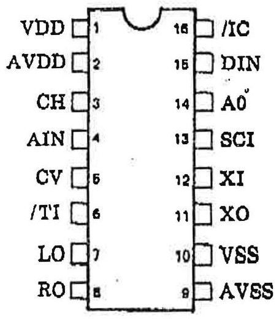

TOP VIEW

PIN DESCRIPTIONS

<table border="1"><tr><td>Pin No.</td><td>Name</td><td>I/O</td><td>Function</td></tr><tr><td>1</td><td>VDD</td><td>-</td><td>Digital+5V power supply</td></tr><tr><td>2</td><td>AVDD</td><td>-</td><td>Analog+5V power supply</td></tr><tr><td>3</td><td>CH</td><td>O</td><td>Sample/hold capacitor terminal</td></tr><tr><td>4</td><td>AIN</td><td>I</td><td>Analog signal input</td></tr><tr><td>5</td><td>CV</td><td>O</td><td>Center voltage of A/D</td></tr><tr><td>6</td><td>/TI</td><td>I+</td><td>Test terminal(without connection)</td></tr><tr><td>7</td><td>LO</td><td>O</td><td>L channel, analog out</td></tr><tr><td>8</td><td>RO</td><td>O</td><td>R channel, analog out</td></tr><tr><td>9</td><td>AVSS</td><td>-</td><td>Analog ground</td></tr><tr><td>10</td><td>VSS</td><td>-</td><td>Digital ground</td></tr><tr><td>11</td><td>XO</td><td>O</td><td rowspan="2">X&#x27;tal oscillator terminal(7.16 MHz typ.)</td></tr><tr><td>12</td><td>XI</td><td>I</td></tr><tr><td>13</td><td>SCI</td><td>I</td><td>Bit clock for microprocessor interface</td></tr><tr><td>14</td><td>A0</td><td>I</td><td>Word clock for microprocessor interface</td></tr><tr><td>15</td><td>DIN</td><td>I</td><td>Serial data for microprocessor interface</td></tr><tr><td>16</td><td>/IC</td><td>I+</td><td>Initial clear terminal</td></tr></table>

+; pulled up

BLOCK DIAGRAM

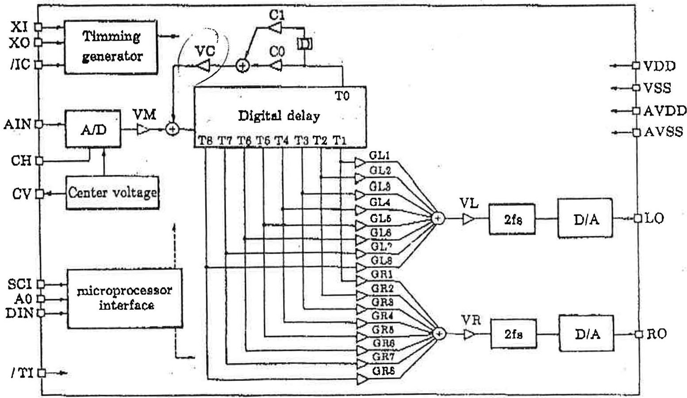

## FUNCTION DESCRIPTION

As shown in the block diagram, analog signal input at AIN terminal are converted to 14 bit digital signal with the sampling frequency of 28.6 kHz using 14 bit floating type A/D converter, and then attenuated by the digital attenuator VM. Tap T0 output of digital delay passes through first order FIR type low pass filter and attenuated by VC. These signals are added before they are input to digital delay. Digital delay has nine output taps and tap positions can be switched by the registers T0 to T8. Outputs of eight taps from T1 to T8 are attenuated and added for each channel with the digital attenuator from GL1 to GL8 and GR1 to GR8 respectively, and attenuated by digital attenuator VL or VR to be input to two-times oversampling digital filter. Since this filter attenuates aliasing noise, it reduces the burden on external analog low pass-filter. Digital input to D/A converter shall be with doubled value, which is 47.1 kHz sampling rate.

## MICROPROCESSOR INTERFACE

Digital attenuation value, delay time and FIR type low pass filter coefficients are all set by writing data into registers.

With A0 = 'L", 8 bit address data are sent synchronizing with SCI. At the rising edge of A0, register address is taken in. With A0 = 'H", 8 bit data are sent synchronizing with SCI, then register data are changed at the falling edge of A0.

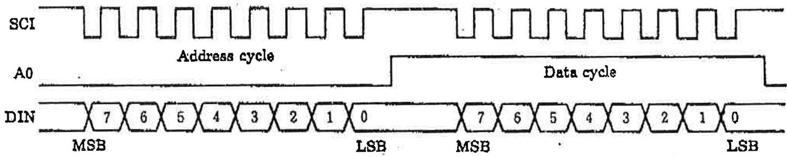

- At the time of initial clear, VM, VC, VL and VR registers are reset to 0. Other register values are not fixed.

REGISTER MAP

<table border="1"><tr><td rowspan="2">Address(HEX)</td><td colspan="2">Data</td><td rowspan="2">Function</td><td rowspan="2">Address(HEX)</td><td colspan="2">Data</td><td rowspan="2">Function</td></tr><tr><td colspan="2">76543210</td><td colspan="2">76543210</td></tr><tr><td>00</td><td>xx</td><td>GL1</td><td rowspan="8">Lch Tap attenuation value(bit 5; sign)</td><td>10</td><td>xx</td><td>VM</td><td rowspan="4">Attenuation value(bit 5; sign)</td></tr><tr><td>01</td><td>xx</td><td>GL2</td><td>11</td><td>xx</td><td>VC</td></tr><tr><td>02</td><td>xx</td><td>GL3</td><td>12</td><td>xx</td><td>VL</td></tr><tr><td>03</td><td>xx</td><td>GL4</td><td>18</td><td>xx</td><td>VR</td></tr><tr><td>04</td><td>xx</td><td>GL5</td><td>14</td><td>xx</td><td>C0</td><td rowspan="2">FIR coefficient</td></tr><tr><td>05</td><td>xx</td><td>GL6</td><td>15</td><td>xx</td><td>C1</td></tr><tr><td>06</td><td>xx</td><td>GL7</td><td>16</td><td>xxx</td><td>T0</td><td rowspan="9">Tap position</td></tr><tr><td>07</td><td>xx</td><td>GL8</td><td>17</td><td>xxx</td><td>T1</td></tr><tr><td>08</td><td>xx</td><td>GR1</td><td rowspan="8">Rch Tap attenuation value(bit 5; sign)</td><td>18</td><td>xxx</td><td>T2</td></tr><tr><td>09</td><td>xx</td><td>GR2</td><td>19</td><td>xxx</td><td>T3</td></tr><tr><td>0A</td><td>xx</td><td>GR3</td><td>1A</td><td>xxx</td><td>T4</td></tr><tr><td>0B</td><td>xx</td><td>GR4</td><td>1B</td><td>xxx</td><td>T5</td></tr><tr><td>0C</td><td>xx</td><td>GR5</td><td>1C</td><td>xxx</td><td>T6</td></tr><tr><td>0D</td><td>xx</td><td>GR6</td><td>1D</td><td>xxx</td><td>T7</td></tr><tr><td>0E</td><td>xx</td><td>GR7</td><td>1E</td><td>xxx</td><td>T8</td></tr><tr><td>0F</td><td>xx</td><td>GR8</td><td></td><td></td><td></td><td></td></tr></table>

Note 1) x; Don't Care

Note 2) Don't write to the other address

## REGISTER DATA DESCRIPTION

(1) Attenuation value setting (GL1 to GL8, GR1 to GR8, VM, VC, VL, VR)

- Output polarity (bit 5)

When bit 5 - "1": Output signal is in phase with input signal.

When bit 5 = "0": Output signal is reversed phase with input signal.

- Attenuation value (bit 4-0)

<table border="1"><tr><td rowspan="2">Level(dB)</td><td colspan="4">Data</td><td rowspan="2">(HEX)</td></tr><tr><td>4</td><td>3</td><td>2</td><td>1</td><td>0</td></tr><tr><td>0</td><td>1</td><td>1</td><td>1</td><td>1</td><td>1F</td><td></td></tr><tr><td>-2</td><td>1</td><td>1</td><td>1</td><td>1</td><td>1E</td><td></td></tr><tr><td>-4</td><td>1</td><td>1</td><td>1</td><td>0</td><td>1D</td><td></td></tr><tr><td>-6</td><td>1</td><td>1</td><td>1</td><td>0</td><td>1C</td><td></td></tr><tr><td>-8</td><td>1</td><td>1</td><td>0</td><td>1</td><td>1B</td><td></td></tr><tr><td>-10</td><td>1</td><td>1</td><td>0</td><td>1</td><td>1A</td><td></td></tr><tr><td>-12</td><td>1</td><td>1</td><td>0</td><td>1</td><td>19</td><td></td></tr><tr><td>-14</td><td>1</td><td>1</td><td>0</td><td>0</td><td>18</td><td></td></tr><tr><td>-16</td><td>1</td><td>0</td><td>1</td><td>1</td><td>17</td><td></td></tr><tr><td>-18</td><td>1</td><td>0</td><td>1</td><td>1</td><td>16</td><td></td></tr><tr><td>-20</td><td>1</td><td>0</td><td>1</td><td>0</td><td>15</td><td></td></tr><tr><td>-22</td><td>1</td><td>0</td><td>1</td><td>0</td><td>14</td><td></td></tr><tr><td>-24</td><td>1</td><td>0</td><td>0</td><td>1</td><td>18</td><td></td></tr><tr><td>-26</td><td>1</td><td>0</td><td>0</td><td>1</td><td>12</td><td></td></tr><tr><td>-28</td><td>1</td><td>0</td><td>0</td><td>1</td><td>11</td><td></td></tr><tr><td>-30</td><td>1</td><td>0</td><td>0</td><td>0</td><td>10</td><td></td></tr></table>

<table border="1"><tr><td rowspan="2">Level(dB)</td><td colspan="4">Data</td></tr><tr><td>48210</td><td></td><td></td><td>(HEX)</td></tr><tr><td>-82</td><td>01111</td><td></td><td></td><td>0F</td></tr><tr><td>-84</td><td>01110</td><td></td><td></td><td>0E</td></tr><tr><td>-38</td><td>01101</td><td></td><td></td><td>0D</td></tr><tr><td>-38</td><td>01100</td><td></td><td></td><td>0C</td></tr><tr><td>-40</td><td>01011</td><td></td><td></td><td>0B</td></tr><tr><td>-42</td><td>01010</td><td></td><td></td><td>0A</td></tr><tr><td>-44</td><td>01001</td><td></td><td></td><td>09</td></tr><tr><td>-46</td><td>01000</td><td></td><td></td><td>08</td></tr><tr><td>-48</td><td>00111</td><td></td><td></td><td>07</td></tr><tr><td>-50</td><td>00110</td><td></td><td></td><td>06</td></tr><tr><td>-52</td><td>00101</td><td></td><td></td><td>05</td></tr><tr><td>-54</td><td>00100</td><td></td><td></td><td>04</td></tr><tr><td>-56</td><td>00011</td><td></td><td></td><td>08</td></tr><tr><td>-58</td><td>00010</td><td></td><td></td><td>02</td></tr><tr><td>-60</td><td>00001</td><td></td><td></td><td>01</td></tr><tr><td>-∞</td><td>00000</td><td></td><td></td><td>00</td></tr></table>

(2) Delay time setting (T0 to T8) (XI=7.16 MHz)

<table border="1"><tr><td rowspan="2">Delay time(ms)</td><td colspan="4">Data</td></tr><tr><td>4</td><td>3</td><td>2</td><td>10</td><td>(HEX)</td></tr><tr><td>0.0</td><td>0</td><td>0</td><td>0</td><td>0</td><td>00</td></tr><tr><td>8.2</td><td>0</td><td>0</td><td>0</td><td>1</td><td>01</td></tr><tr><td>6.5</td><td>0</td><td>0</td><td>1</td><td>0</td><td>02</td></tr><tr><td>9.7</td><td>0</td><td>0</td><td>1</td><td>1</td><td>03</td></tr><tr><td>12.9</td><td>0</td><td>0</td><td>1</td><td>0</td><td>04</td></tr><tr><td>16.1</td><td>0</td><td>0</td><td>1</td><td>0</td><td>05</td></tr><tr><td>19.3</td><td>0</td><td>0</td><td>1</td><td>1</td><td>06</td></tr><tr><td>22.6</td><td>0</td><td>0</td><td>1</td><td>1</td><td>07</td></tr><tr><td>25.8</td><td>0</td><td>1</td><td>0</td><td>0</td><td>08</td></tr><tr><td>29.0</td><td>0</td><td>1</td><td>0</td><td>0</td><td>09</td></tr><tr><td>82.3</td><td>0</td><td>1</td><td>0</td><td>1</td><td>0A</td></tr><tr><td>35.5</td><td>0</td><td>1</td><td>0</td><td>1</td><td>0B</td></tr><tr><td>38.7</td><td>0</td><td>1</td><td>1</td><td>0</td><td>0C</td></tr><tr><td>41.9</td><td>0</td><td>1</td><td>1</td><td>0</td><td>0D</td></tr><tr><td>45.2</td><td>0</td><td>1</td><td>1</td><td>1</td><td>0E</td></tr><tr><td>48.4</td><td>0</td><td>1</td><td>1</td><td>1</td><td>0F</td></tr></table>

<table border="1"><tr><td rowspan="2">Delay time(ms)</td><td colspan="4">Data</td></tr><tr><td>4</td><td>3</td><td>2</td><td>10</td><td>(HEX)</td></tr><tr><td>51.6</td><td>1</td><td>0</td><td>0</td><td>0</td><td>10</td></tr><tr><td>54.9</td><td>1</td><td>0</td><td>0</td><td>0</td><td>11</td></tr><tr><td>58.1</td><td>1</td><td>0</td><td>0</td><td>1</td><td>12</td></tr><tr><td>61.9</td><td>1</td><td>0</td><td>0</td><td>1</td><td>13</td></tr><tr><td>64.5</td><td>1</td><td>0</td><td>1</td><td>0</td><td>14</td></tr><tr><td>67.8</td><td>1</td><td>0</td><td>1</td><td>0</td><td>15</td></tr><tr><td>71.0</td><td>1</td><td>0</td><td>1</td><td>1</td><td>16</td></tr><tr><td>74.2</td><td>1</td><td>0</td><td>1</td><td>1</td><td>17</td></tr><tr><td>77.4</td><td>1</td><td>1</td><td>0</td><td>0</td><td>18</td></tr><tr><td>80.7</td><td>1</td><td>1</td><td>0</td><td>0</td><td>19</td></tr><tr><td>83.9</td><td>1</td><td>1</td><td>0</td><td>1</td><td>1A</td></tr><tr><td>87.1</td><td>1</td><td>1</td><td>0</td><td>1</td><td>1B</td></tr><tr><td>90.4</td><td>1</td><td>1</td><td>1</td><td>0</td><td>1C</td></tr><tr><td>93.6</td><td>1</td><td>1</td><td>1</td><td>0</td><td>1D</td></tr><tr><td>96.8</td><td>1</td><td>1</td><td>1</td><td>1</td><td>1E</td></tr><tr><td>100.0</td><td>1</td><td>1</td><td>1</td><td>1</td><td>1F</td></tr></table>

(3) FIR Low Pass Filter coefficient setting (C0, C1).

The lower 6 bits of coefficient register are used as the upper 6 bits of 12 bit 2's compliment data actually processed inside.

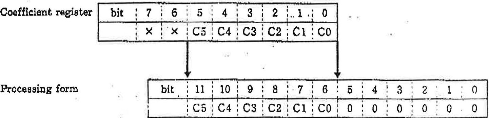

Decimal point

## SYSTEM BLOCK DIAGRAM

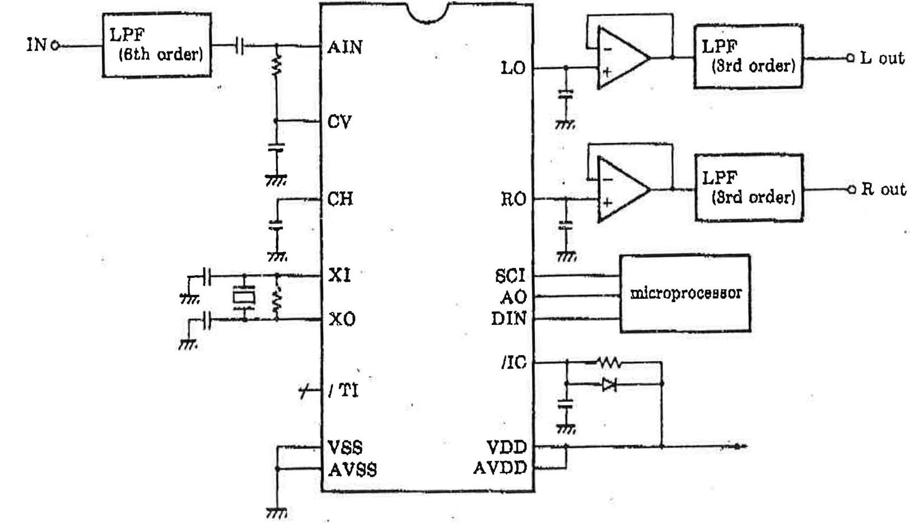

EXTERNAL DIMENSIONS

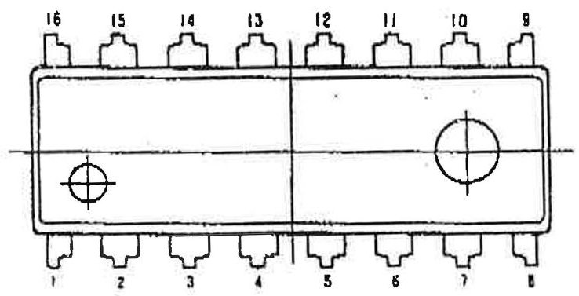

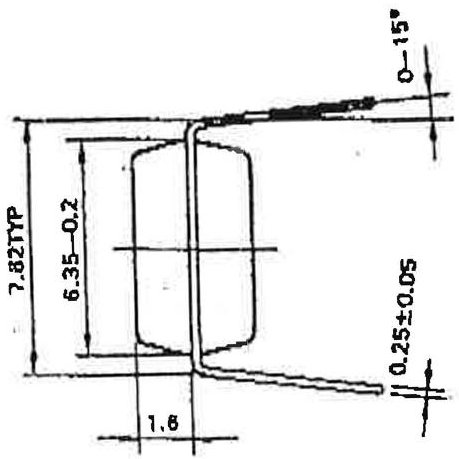

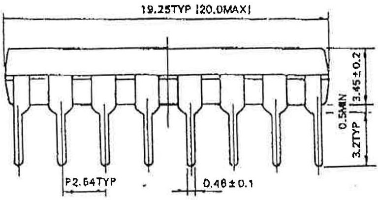

## ELECTRICAL CHARACTERISTICS

- Absolute maximum ratings

<table border="1"><tr><td>Parameter</td><td>Symbol</td><td>Rating</td><td>Unit</td></tr><tr><td>Supply voltage</td><td>VDD</td><td>-0.3~+7.0</td><td>V</td></tr><tr><td>Operating temperature</td><td>Top</td><td>-20~+85</td><td>℃</td></tr><tr><td>Storage temperature</td><td>Tatg</td><td>-50~+125</td><td>℃</td></tr></table>

- Recommended operating conditions

<table border="1"><tr><td>Parameter</td><td>Symbol</td><td>Min.</td><td>Typ.</td><td>Max.</td><td>Unit</td></tr><tr><td>Supply voltage</td><td>VDD</td><td>4.75</td><td>5.0</td><td>5.25</td><td>V</td></tr><tr><td>Operating temperature</td><td>Top</td><td>0</td><td>25</td><td>70</td><td>℃</td></tr></table>

- DC characteristics (Conditions: $ \mathrm{T a}=2 5^{\circ} \mathrm{C}, $ $ \mathrm{V D D}=5. 0 \mathrm{V} $)

<table border="1"><tr><td>Parameter</td><td>Symbol</td><td>Condition</td><td>Min.</td><td>Typ.</td><td>Max.</td><td colspan="2">Unit</td></tr><tr><td>Supply current</td><td>IDD</td><td></td><td></td><td></td><td>50</td><td>mA</td><td></td></tr><tr><td>High-level input voltage(1)</td><td>VIH1</td><td></td><td>2.0</td><td></td><td></td><td>V</td><td>*1</td></tr><tr><td>Low-level input voltage(1)</td><td>VIL1</td><td></td><td></td><td></td><td>0.8</td><td>V</td><td>*1</td></tr><tr><td>High-level input voltage(2)</td><td>VIH2</td><td></td><td>4.0</td><td></td><td></td><td>V</td><td>*2</td></tr><tr><td>Low-level input voltage(2)</td><td>VIL2</td><td></td><td></td><td></td><td>0.8</td><td>V</td><td>*2</td></tr><tr><td>High-level output voltage</td><td>VOH</td><td>IOH=-0.4mA</td><td>4.0</td><td></td><td></td><td>V</td><td></td></tr><tr><td>Low-level output voltage</td><td>VOL</td><td>IOL=0.2mA</td><td></td><td></td><td>0.4</td><td>V</td><td></td></tr><tr><td>Input leakage current</td><td>IIL</td><td>VI=0~5V</td><td>-10</td><td></td><td>10</td><td>μA</td><td></td></tr><tr><td>Input capacitance</td><td>C1</td><td></td><td></td><td>5.0</td><td>12.0</td><td>pF</td><td></td></tr><tr><td>Output capacitance</td><td>CO</td><td></td><td></td><td></td><td>10.0</td><td>pF</td><td></td></tr></table>

Note 1: Applicable to the input terminals except XI Note 2: Applicable to XI terminal

- AC characteristics (Conditions: $ \mathrm{T a}=2 5^{\circ} \mathrm{C}, \mathrm{V}_{\mathrm{D D}}=5. 0 \mathrm{V} ) $

<table border="1"><tr><td colspan="2">Parameter</td><td>Symbol</td><td>Min.</td><td>Typ.</td><td>Max.</td><td>Unit</td></tr><tr><td rowspan="4">XI</td><td>Input frequency</td><td>fc</td><td>8.6</td><td>7.16</td><td>8.6</td><td>MHz</td></tr><tr><td>Duty</td><td></td><td>40</td><td>50</td><td>60</td><td>%</td></tr><tr><td>Rise time</td><td>TCR</td><td></td><td></td><td>50</td><td>ns</td></tr><tr><td>Fall time</td><td>TCF</td><td></td><td></td><td>50</td><td>ns</td></tr><tr><td rowspan="4">SCI</td><td>Input frequency</td><td>fs</td><td></td><td></td><td>fc/8</td><td>MHz</td></tr><tr><td>On-off time</td><td>TS</td><td>600</td><td></td><td></td><td>ns</td></tr><tr><td>Rise time</td><td>TSR</td><td></td><td></td><td>200</td><td>ns</td></tr><tr><td>Fall time</td><td>TSF</td><td></td><td></td><td>200</td><td>ns</td></tr></table>

- ANALOG characteristics (Conditions: $ \mathrm{T a}=2 5^{\circ} \mathrm{C}, \mathrm{V}_{\mathrm{D D}}=5. 0 \mathrm{V} ) $

<table border="1"><tr><td>Parameter</td><td>Symbol</td><td>Condition</td><td>Min.</td><td>Typ.</td><td>Max.</td><td>Unit</td></tr><tr><td>Analog input voltage</td><td>VIA</td><td>AIN terminal</td><td></td><td></td><td>4.5</td><td>Vp-p</td></tr><tr><td>Analog output voltage</td><td>VOA</td><td>LO, RO terminal</td><td></td><td></td><td>4.5</td><td>Vp-p</td></tr><tr><td>DC offset voltage</td><td>CV</td><td></td><td></td><td>2.5</td><td></td><td>V</td></tr><tr><td>Total harmonic distortion</td><td>THD</td><td>output voltage 0dB</td><td></td><td>0.3</td><td>0.4</td><td>%</td></tr><tr><td></td><td></td><td>-10dB</td><td></td><td>0.4</td><td>0.5</td><td>%</td></tr><tr><td></td><td></td><td>-20dB</td><td></td><td>0.4</td><td>0.5</td><td>%</td></tr><tr><td></td><td></td><td>-30dB</td><td></td><td>0.6</td><td>0.8</td><td>%</td></tr><tr><td>S/N</td><td>S/N</td><td>S=0dB</td><td>75</td><td>80</td><td></td><td>dB</td></tr></table>

Note) 0dB=1.5Vrms

REFERENCE CHARACTERISTICS 2 times oversampling filter

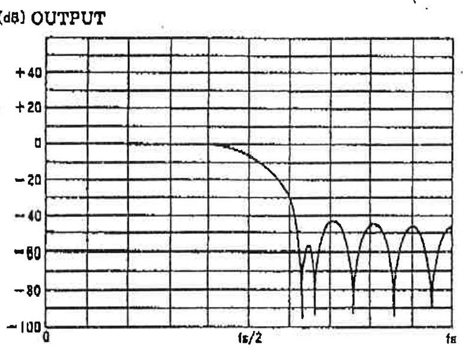

FREQUENCY

Output vs THD+NOISE

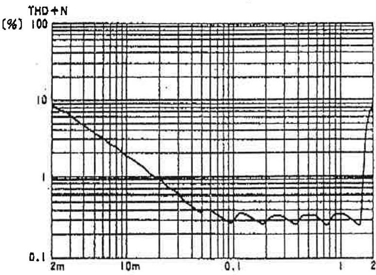

OUTPUT [Vrms]

The specifications of this product are subject to improvement changes without prior notice.

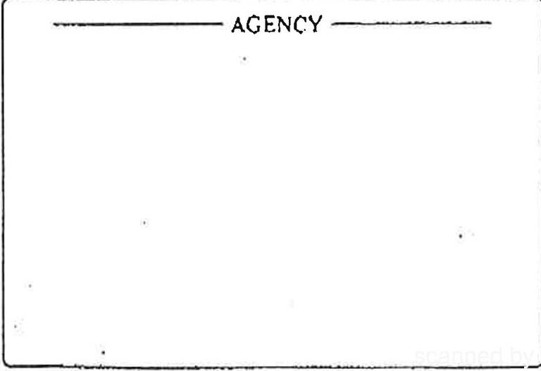

## YAMAHA CORPORATION

Address inquiries to: Semi-conductor Sales Department

Head Office 203. Matsunokijima, Toyooka-mura, Iwata-gun, Shizuoka-ken, 438-01 Electronic Equipment business section Tel. 0639-62-4918 Fax. 0639-62-5054

Tokyo Office 8-4, Surugadal Kanda, Chlyoda-ku,

Tokyo, 101

Ryumeikan Bldg. 4F

Tel. 03-265-4481 Fax. 03-255-4488

Osaka Office 3-12-9, Minami Senba, Chuo-ku.

Osaka City, Osaka, 642

Shinsaibashi Plaza Bldg. 4F

Tel. 08-252-7980 Fax. 08-252-5615

U.S.A. YAMAHA Systems Technology. 652 Ridder Park Drive San Jose, CA95131 Tel. 408-437-3133 Fax. 408-437-8791

The following source code demonstrates how to program a Surround preset.

Function Write_Srnd_Reg writes the specified value to the YM7128 through the control chip register 18H. The sample code assumes that the control chip is located at address 38AH.

Function Write_Surround sends the 32 bytes of a suuround preset to the YM7128 using the bit-serial protocol. For each byte of the Surround preset, the register number (variable addr) is sent first , followed by the register value (variable data).

```c

/*

    SURR.C

    Write a preset to the surround chip.

    Copyright 1992, Ad Lib Inc.

*/

unsigned control_io = 0x38a;        /* address of control chip section */

/* Write 'val' to the surround register in the control chip. */

static void _fastcall Write_Srnd_Reg (unsigned val)

{

    _asm {

        mov     dx, control_io

l10:

            in     al, dx

            test    al, 0c0h          ;status bits indicating chip is busy

            jnz     l10

            mov     ax, 18h          ;surround register number

            out     dx, al

            mov     ax, val

            inc     dx

            out     dx, al

    }

}

```

/* NOTE: When writing a byte to the control chip, it is very important that the transfer not be interrupted. Therefore, interrupts are disabled while the preset is being sent. */

```c
void Write_Surround (unsigned char *preset);
```

{

    unsigned addr, data, cmd;

    int i, k;

    _asm {

        pushf                        ;preserve the current interrupt state

        push     dx

        cli                        ;disable interrupts

        mov       dx, control_io

        mov       al, 0ffh            ;disable OPL3, enable control bank

        out       dx, al

    }

    /* Send the 31 array elements: */

    for (i = 0; i < 31; i++) {

        cmd = 0;                        /* clock LOW, A0 LOW */

        addr = i;

        for (k = 7; k >= 0; k--) {

            cmd &= ~2;                    /* clock LOW */

            Write_Srnd_Reg (cmd);

            cmd = (cmd & ~1) | ((addr >> k) & 1);

            Write_Srnd_Reg (cmd);

            cmd |= 2;                    /* clock HIGH */

            Write_Srnd_Reg (cmd);

        }

        cmd |= 4;                        /* Set A0 to 1 */

        Write_Srnd_Reg (cmd);

        data = preset [i];

        for (k = 7; k >= 0; k--) {

            cmd &= ~2;                    /* clock LOW */

            Write_Srnd_Reg (cmd);

            cmd = (cmd & ~1) | ((data >> k) & 1);

            Write_Srnd_Reg (cmd);

            cmd |= 2;                    /* clock HIGH */

            Write_Srnd_Reg (cmd);

        }

        cmd &= ~4;                        /* Set A0 to 0 */

        Write_Srnd_Reg (cmd);

    }

    _asm {

        mov       dx, control_io

120:

        in       al, dx

        test     al, 0c0h            ;status bits indicating chip is busy

        jnz      l20

        mov       al, 0feh            ;enable OPL3, disable control bank

        out      dx, al

        pop      dx

        popf        ;restore previous interrupt state

    }

}

Ad Lib Gold © Ad Lib Inc.1992 Confidential Mon, Mar 23,1992

PIN OUT FOR JOYSTICK-MIDI CONNECTOR OF THE Ad Lib GOLD CARD

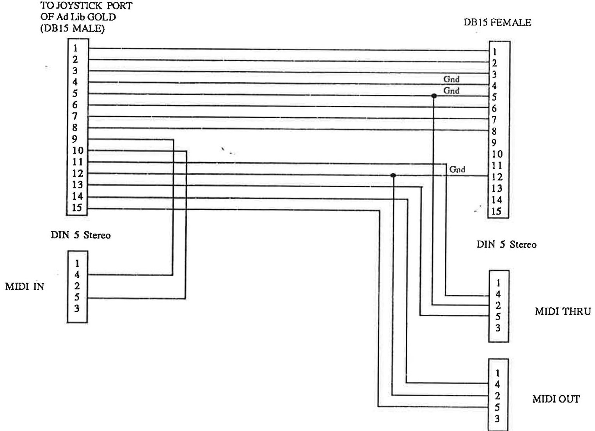
