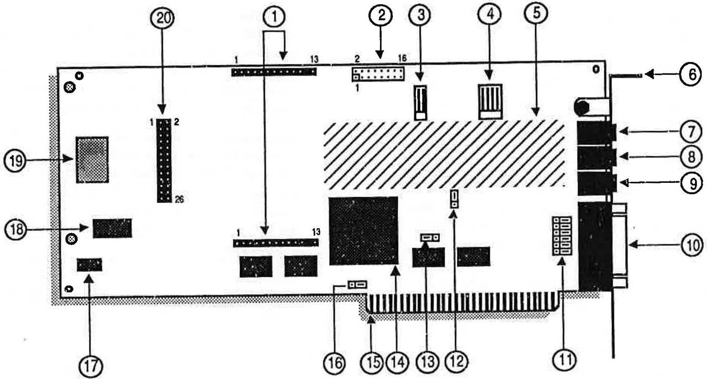
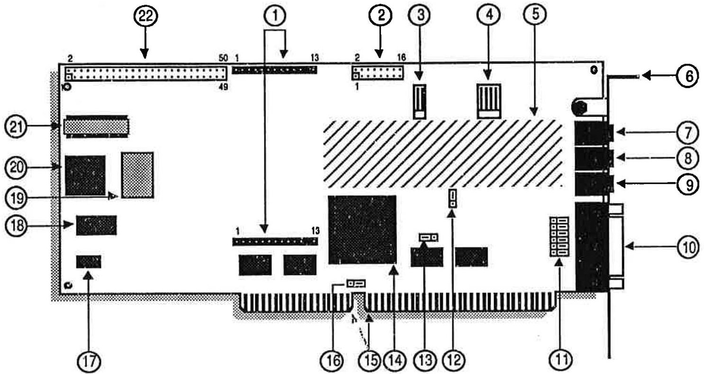
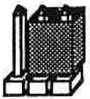
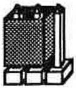
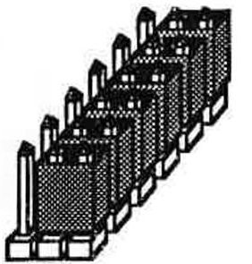
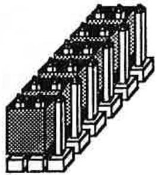
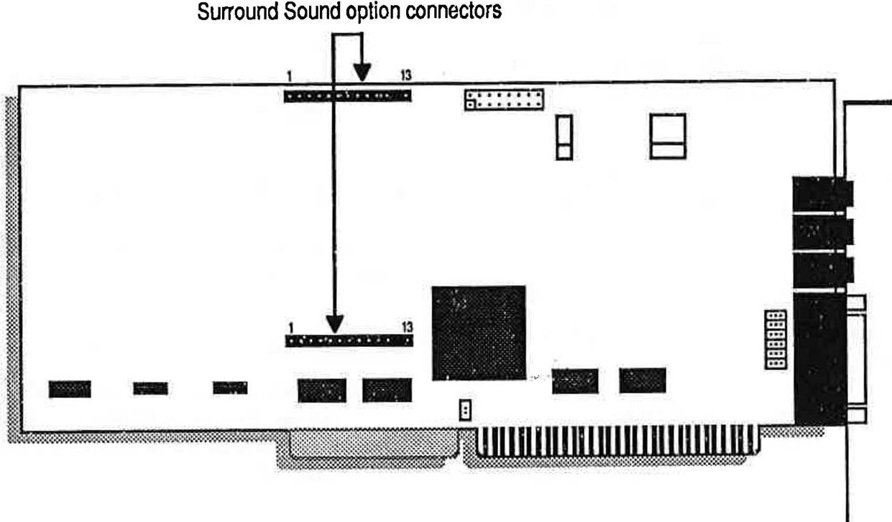
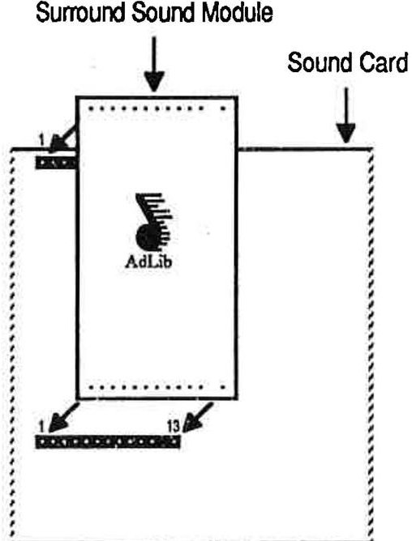
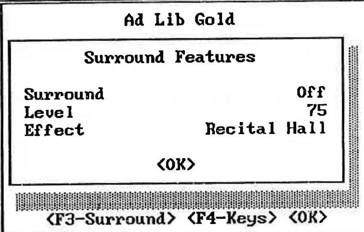

# Chapter 3 - Gold Hardware

*Card layout, connectors, jumpers, IRQ/DMA options, and the Surround Sound module.*

---

3.1 Description of the Hardware 1

Functionality 1

Digital Recording 1

Digitized and Synthesized Sound Playback 1

MIDI Recording and Playback 2

Game Port 2

SCSI Interface 2

Layout of the Card 2

Bracket Connectors 2

On-board Connectors and Main Components 3

The On-board Jumpers 6

Available Interrupt Lines and DMA Channels 7

3.2 Getting Installed 9

System Requirements 9

Installing the Hardware 9

Hardware Configuration Settings 9

Removing the Computer Cover 11

Removing the Slot Cover 11

Installing the Gold Card 11

Connecting Other Peripherals 12

3.3 Surround Sound Module 15

Required Equipment 15

Installing the Surround Sound Module 15

Remove the Computer Cover 15

Remove the Sound Card 16

Attach the Surround Sound Module 17

Reinstall the Sound Card 17

Using the Surround Sound Option 18

Surround-based Applications 19

Using Surround Sound with Other Sound Sources 19

Programming the Surround Sound Module 20

## Functionality

Your Ad Lib Gold Stereo Sound Adapter is a multifunction card with digital recording, playback of digitized and synthesized sounds, analog audio mixing, MIDI recording and playback, game port, and (for model Gold 2000) SCSI/CD-ROM interface.

## Digital Recording

With the Ad Lib Gold card, you can record from:

- A microphone, using Voice Pad or third party software;

- An audio tape or a compact disk, using Voice Pad or third party software;

- A telephone, using the optional add-on board contained in the Ad Lib PC Telephone Answering System.

## Digitized and Synthesized Sound Playback

With the Gold card, you can play back:

- Digitized sounds: The Gold card has two channels for digitized sounds. These channels can be used in a variety of ways, such as for voice notes with the Voice Pad program, percussion sounds in the Juke Box Gold songs, or third party software using stereo music or music with voiceover.

- Synthesized sounds: The Gold card has a 20-voice FM synthesizer which is used for Juke Box Gold songs and third party software music.

The sound capability of the Gold card also features:

- Audio mixing: The internal analog mixer of the Gold card controls the volume of various audio sources, through programming, such as within third party software, or manually using the Mixer Panel (see "Mixer Panel TSR" section).

- Volume control: The output volume of the Gold card is software controlled (see "Mixer Panel TSR").

- Tone control: Bass and treble controls are software controlled (see "Mixer Panel TSR").

## MIDI Recording and Playback

The MIDI (Musical Instrument Digital Interface) interface of the Gold card allows MIDI files to be recorded and played back using a MIDI adapter cable, any external MIDI instrument and an Ad Lib Gold supporting sequencer program.

## Game Port

The Ad Lib Gold card allows a standard IBM compatible joystick to be connected.

## SCSI Interface

The Gold card SCSI interface (optional with Gold 1000 and included on-board with Gold 2000) allows a CD-ROM drive or any SCSI type peripheral to be connected.

## Layout of the Card

## Bracket Connectors

Ad Lib Gold Stereo Sound Adapters have three 1/8" connectors and one DB-15 connector on the support brackets, as shown in the diagrams (Figures 1 and 2).

These connectors are:

- The microphone input (No.7), for sampling and/or mixing with other audio sources.

- The stereo auxiliary input (No.8), for connecting an external source such as a CD or cassette player, a synthesizer or any audio source, in order to sample and/or mix with other audio sources.

- The main stereo audio output (No.9), for connecting to standard headphones, bookshelf speakers or a stereo system.

- The Game Port/MIDI connector (No.10), for using a standard PC joystick and/or a MIDI device. This requires an optional MIDI cable adapter available from Ad Lib.

## On-Board Connectors and Main Components

Ad Lib Gold Stereo Sound Adapters have on-board connectors to support many different options and internal/external devices. These connectors are shown in the diagrams (Figures 1 and 2).

## These connectors are:

- On model Gold 2000, the SCSI port connector (Figure 2: No. 22), to connect a SCSI device, such as a CD-ROM, hard disk or tape backup drive. A 50-pin flat cable is provided for connecting an internal device. Cabling for connecting an external device is optional.

- On model Gold 1000, the SCSI option connectors (Figure 2: No.20), to snap on a SCSI piggyback board.

- The Surround Sound option connectors (No.1), to connect a Surround Sound Module. This module is used to provide stereo and depth enhancements.

- The telephone option connector (No.2), to connect a telephone line interface add-on board. This board allows the Ad Lib Gold card to be connected to a standard telephone line and provides access to various functions, such as creating a completely digital telephone answering system capable of leaving

personalized messages for callers and recording and playing back messages left by callers directly to and from a hard disk, or creating an interactive automated telephone routing and database navigation station. It is also capable of automated dialing.

- The internal stereo auxiliary input (No.4), to connect a PC internal audio device (such as an internal CD-ROM drive) for direct input. This connector is in parallel with and has exactly the same functions as the external stereo auxiliary input connector on the support bracket.

NOTE: It is not recommended to use both the external and internal stereo auxiliary input at the same time, because this will decrease the volume of the auxiliary audio source.

- The PC speaker connector (No.3), to connect the signal of the PC's internal speaker directly to the Ad Lib Gold card, so that it is mixed with the other audio signals on the card and can be heard through the headphones or speakers.

Figure 1: Gold 1000 diagram

1. Surround Sound option connectors

2. Telephone option connector

3. PC speaker connector

4. Internal stereo aux. input

5. Power amp and analog mixer

6. Bracket

7. Microphone input (mono)

8. Stereo aux. input

9. Main audio output

10. Game port/MIDI DB-15 connector

11. Dual joystick selector jumpers (JP2-7)

12. Port address jumper (JP8)

13. Control chip reset jumper (JP9)

14. Custom control VLSI chip

15. Bus connector

16. Game port enable jumper (JP1)

17. 16-bit FM DAC

18. Professional FM synthesis chip

19. Sampling 12-bit DAC and MIDI chip

20. SCSI option connector

Figure 2: Gold 2000 diagram

1. Surround Sound option connectors

2. Telephone option connector

3. PC speaker connector

4. Internal stereo aux. input

5. Power amp and analog mixer

6. Bracket

7. Microphone input (mono)

8. Stereo aux. input

9. Main audio output

10. Game port/MIDI DB-15 connector

11. Dual joystick selector jumpers (JP2-7)

12. Port address jumper (JP8)

13. Control chip reset jumper (JP9)

18. Professional FM synthesis chip

17. 16-bit FM DAC

14. Custom control VLSI chip

15. Bus connector

19. Sampling 12-bit DAC and MIDI chip

20. SCSI chip

16. Game port enable jumper (JP1)

21. SCSI terminator resistor

22. SCSI cable connector

## The On-board Jumpers

To make it easier to configure the Ad Lib Gold card, we have made the Interrupt lines (IRQ) and DMA channels software selectable, thereby keeping the amount of jumpers to a minimum. The four remaining jumper sets are the game port enable jumper (JP1), the dual joystick selector jumpers (JP2-7), the port address change jumper (JP8), and the Control chip reset jumper (JP9).

The Gold card jumpers are the following:

- Game port enable jumper (No.16) This jumper lets the user enable/disable Ad Lib Gold's on-board game port interface. The interface should be disabled in cases where the user already has a standard PC game port interface inside his/her PC, to avoid conflicts.

Jumper setting is shown here:

Game port enabled

Game port disabled

Figure 3: Game port jumper enabling

<table border="1"><tr><td>·</td><td>NOTE: The jumper is factory set to the game port enabled position.</td></tr></table>

- Dual joystick selector jumpers (No.11) These jumpers let the user change the factory-set "joystick plus MIDI" option (all jumpers on the bracket side) to the "two joysticks without MIDI" option (all jumpers on the opposite side). All jumpers in this selector must be changed to the same position, as shown in the following illustrations.

Single joystick with MIDI option (factory-set)

Dual joystick option

Figure 4: Dual joystick jumper selection

## Port address jumper (No. 12)

This jumper lets the user choose a single or double port address for the Gold card. The Ad Lib Gold card addresses can be assigned by software programming. The default port address of the Gold card is 388H and can be changed by software in cases where another card inside the PC uses the same address, in order to avoid conflicts. In the case where the software cannot recognize the programmed address, the port address jumper is used to force the Gold card into answering at both the programmed address and at the default factory address 388H.

## NOTE: The port address jumper is factory set to single port address position (jumper plugged on the two pins on the bracket side) which enables only one port address to be used at a time.

The port address jumper can be changed to double port address position (jumper plugged on the side opposing the bracket) which forces the default address 388H to be used in conjunction with any other user-defined one.

- Control chip reset jumper (No.13) This jumper is used where the programmed configuration of the control chip is lost. In some cases, losing the configuration can cause the card to use addresses that are already in use by other hardware. Removing

the control chip reset jumper disables certain functions of the Gold card that could cause hardware conflicts. Once the jumper is removed, reconfigure the Gold card to the factory preset values by issuing the following command:

setup /R

Once the Gold card is reconfigured, replace the control chip reset jumper.

## Available Interrupt Lines and DMA Channels

- There are four software selectable interrupt lines (IRQ 3,4,5 and 7) on the Gold 1000, and four additional choices on the Gold 2000 (IRQ 10,11,12 and 15).

- DMA channels 1,2 and 3 are software selectable on the Gold 1000, and DMA channels 0,1,2, and 3 are software selectable on the Gold 2000.

## System Requirements

To use the Ad Lib Gold card and the Gold software, you need the following:

1. For the Gold 1000: an IBM PC, XT, AT (286), 386, 486 compatible computer, PS/2 Model 25 and 30, or Tandy 1000 (except EX/HX), a disk drive (1.2 MB 5 1/4" or 720 KB 3 1/2") and 640K of RAM.

For the Gold 2000: an IBM AT (286), 386 and 486 compatible computer, a disk drive (1.2 MB 5 1/4" or 720 KB 3 1/2") and 640K of RAM.

2. A hard disk.

3. Graphics adapter, any model.

4. PC/MS-DOS 3.0 or higher.

5. Headphones, an external speaker or a home stereo system.

6. A microphone.

## Installing the Hardware

We suggest that you read this section thoroughly before you begin. This will familiarize you with the standard installation procedure.

These instructions are for installing your Ad Lib Gold card in your computer. We recommend that you read the owner's manual supplied with your computer for instructions specific to your model of computer.

## Hardware Configuration Settings

To install the Ad Lib Gold card, there are two types of configuration settings: hardware settings and software settings. The Gold card uses software for most of the configuration settings (see the sections on installation and configuration below). Only three hardware settings, made with jumpers, are necessary: game port enabling/disabling, dual joystick selection and port address. These should be made before installing the Gold card in your computer.

## To Set Game Port Enable/Disable Jumper

The game port enable/disable jumper lets the user enable or disable Ad Lib Gold's on-board game port interface. The interface should be disabled in cases where the user already has a standard PC game port interface inside his/her PC, in order to avoid conflicts. To obtain the desired setting:

1. Locate the jumpers for the game port enable/disable setting (refer to Figure 1 or 2, No.15).

2. If your computer does not have a game port, make sure that the jumper is over the two left pins as shown in Figure 3. This jumper is factory set in the game port enabled position.

3. If your computer has a game port, unplug the jumper from the two left pins and replug it onto the two right pins as shown in Figure 3.

## To Set Dual Joystick Selector Jumpers

The dual joystick selector jumpers let the user change the factory-set "joystick plus MIDI" option to the "two joysticks without MIDI" option. All jumpers in this selector must be changed to the same position, as shown in Figure 4. To obtain the desired setting:

1. Locate the dual joystick selection jumpers (refer to Figure 1 or 2, No.11).

2. If you wish to use the Gold card's game port in the "single joystick with MIDI option", leave the jumpers in the factory-set position (i.e. plugged into the bracket side of the card) as shown in Figure 4.

3. If you want to use the Gold card's game port in the "dual joystick option", unplug all six jumpers and replug them onto the jumpers, as shown in Figure 4.

## To Set Port Address Jumper

The port address jumper lets the user choose a single or double port address for the Gold card. The default port address of the Gold card is 388H. It can be changed with the Setup program in cases where another card inside the PC uses the same address as the Ad Lib card.

The port address jumper is factory set to the single port address position which enables only one port address to be used at a time. These port addresses can be modified by software. It can be changed to double port address position, which forces the default address 388H to be used in conjunction with any other.

To obtain the desired setting:

1. Locate the jumpers for the port address setting (refer to Figure 1 or 2, No. 12).

2. If you wish to use only one port address at a time (388H or any other), make sure that the jumper is over the two upper pins. This jumper is factory set in the single port address position.

3. If you wish to force the default port address 388H to be used in conjunction with another one, unplug the jumper from the two upper pins and replug it onto the two lower pins.

## Removing the Computer Cover

1. Switch off the computer.

2. Disconnect the power cord and all peripheral devices and cables.

3. Set the computer on a flat, clear surface.

4. Remove the mounting screws that hold the computer cover.

5. Remove the computer cover.

## Removing the Slot Cover

1. Choose a free slot as far as possible from the video adapter card.

NOTE: Certain cards, such as video adapters, produce high-frequency signals which can interfere with the sound quality of the sound card.

2. Remove the screw that holds the slot cover in place.

3. Lift the slot cover to remove it.

! WARNING: If a screw falls into the computer, you absolutely must remove it before switching your system back on. If a metal object is left loose inside the casing of your computer, It may cause a short circuit that will damage your system.

## Installing the Gold Card

1. Place the card immediately above the slot without inserting it into the socket.

2. Make sure that the bracket is inserted in the groove previously occupied by the slot cover.

3. Press the card down into the socket.

4. Put the card's bracket screw back on and tighten it.

5. Put the computer cover back on and tighten the screws.

6. Reconnect the power cord and other cables.

## Connecting Other Peripherals

The card is equipped with jacks and plugs for connecting various peripherals. These allow devices to be connected to: stereo audio output, microphone input, line-level stereo audio input, MIDI/game port, PC internal speaker and SCSI port (Gold 2000 model only).

## Audio Output

The Gold card is equipped with three 1/8" jacks for connecting audio equipment. The main audio output is the lowermost of the three jacks, located above the DB-15 connector (refer to Figure 3 or 4). This jack can be connected to headphones, external speakers or a stereo system using stereo adapters and cables. Model Gold 2000 comes with a cable. To avoid distortion when connecting to a stereo system, connect the card to an auxiliary-type input.

## Microphone Input

The microphone input is the uppermost of the three audio jacks on the card's bracket (refer to Figure 3 or 4). This connector lets the audio signal from a standard microphone be mixed with other audio sources or to be used as a source for sampling sounds.

## Stereo Auxiliary Input - External Connector

The external stereo auxiliary input connector is located in the center of the three audio jacks on the card's bracket (refer to Figure 3 or 4). This connector lets audio signals from a stereo source (such as a CD player, CD-ROM drive, synthesizer or cassette player) be mixed with the other audio sources or to be used as a source for sampling sounds.

WARNING: To avoid distortion, it is important to keep the audio level of the device you are connecting to this input Jack at low volume and to adjust the volume using the software controls explained in the next section. Also, make sure that you are using the auxiliary output of the device you are connecting to the card, instead of using the speaker output which would overload the card's amplifier.

## Stereo Auxiliary Input - Internal Connector

As mentioned in the "Description of the Hardware: Layout of the Card" section, there is an internal connector (see No. 4 in Figure 1 or 2) for connecting the audio output of an internal CD-ROM drive. This connector is electrically in parallel with the external stereo auxiliary input connector. Thus, to obtain good sound results, you may only use one of these at a time.

## MIDI/Game Port

The Ad Lib Gold card features a standard DB-15 connector at the bottom of its supporting bracket (refer to Figure 1 or 2). This connector lets the user

connect one of the following three options:

1. An IBM compatible joystick.

2. A MIDI device. (This requires an adapter cable.)

3. Dual joystick. (This requires a special adapter which is usually supplied by the joystick manufacturer. See Figure 4 for related jumper settings.)

Ad Lib Gold Stereo Sound Adapters have an expansion connector for an optional plug-in module capable of adding a "surround" sound effect to the audio output of the card. This effect can range from stereo depth simulation to artificial reverberation and echo.

The Ad Lib Surround Sound Module is a piggyback card and so does not require its own dedicated slot.

## Required Equipment

To use the Ad Lib Surround Sound Module, you need the following equipment:

1. An Ad Lib Gold Stereo Sound Adapter: Gold 1000 or Gold 2000.

2. For the Gold 1000: an IBM PC, XT, AT (286), 386, 486 compatible computer, PS/2 Model 25 and 30, or Tandy 1000 (except EX/HX), a disk drive (1.2 MB 5 1/4" or 720 KB 3 1/2") and 640K of RAM.

For the Gold 2000: an IBM AT (286), 386 and 486 compatible computer, a disk drive (1.2 MB 5 1/4" or 720 KB 3 1/2") and 640K of RAM.

3. A hard disk.

4. An operating system: PC/MS-DOS 3.0 or later.

5. A graphics adapter (monitor).

6. Headphones, external speaker(s) or home stereo system.

## Installing the Surround Sound Module

To install the Surround Module onto the Ad Lib Gold card, proceed as follows:

## Remove the Computer Cover

1. Switch off the computer, disconnect the power cord, and disconnect all peripheral devices and cables connected to the computer.

2. Set the computer on a flat, clear surface.

3. Remove the mounting screws at the back of the computer (consult your hardware user's guide).

4. Remove the computer cover (consult your hardware user's guide).

Figure 1: Location of the Surround Sound option sockets on the Ad Lib Gold 1000 and 2000 cards

Remove the Sound Card

! WARNING: Users should ground themselves before handling the card. Please read the manual before beginning Installation.

1. Remove the sound card bracket screw.

2. Take the sound card out of the computer and place it on a flat surface so that it is positioned as in Figure 1.

## Attach the Surround Sound Module

1. Locate the Surround Sound option sockets on the sound card (see Figure 1).

2. Place the module connector pins immediately above the socket holes on the sound card.

3. Make sure that the No.1 pins of the module line up with the No.1 holes of the sound card. (If properly aligned, the Ad Lib logo will be in an upright position.)

4. Simultaneously press both ends of the module firmly into the card sockets (see Figure 2).

! WARNING: The module only fits in one way, since both No.12 pins are missing and the No.12 socket holes are stoppered. Do not force the module in if you feel resistance; it may be Incorrectly positioned.

Figure 2: Attaching the Surround Sound Module

## Reinstall the Sound Card

1. Place the card immediately above the slot without inserting it into the socket.

2. Make sure that the bracket is inserted in the groove previously occupied by the slot cover.

3. Press the card down into the socket.

4. Put the card's bracket screw back on and tighten it.

5. Put the computer cover back on and tighten the screws.

6. Reconnect the power cord and other cables.

## Using the Surround Sound Option

Once your module is connected to the sound card, the Surround Sound option is ready to use.

Ad Lib's control software offers the user a choice of various pre-programmed audio enhancements that create totally new, compelling effects. To use the Surround Sound option, simply proceed as follows:

1. Load the Ad Lib Gold Mixer Panel Utility (see the Gold card user guide for complete information on the Mixer Panel).

2. Activate the Mixer Panel. Alt - M are the default activation keys, but you may change this combination with the "Keys" window of the Mixer Panel.

3. Press the key when in the Mixer Panel main window to open the Surround Features control window (see Figure 3).

Figure 3: Mixer Panel Surround Features window

<table border="1"><tr><td>* NOTE: If the Surround Sound Module is not installed, or not correctly installed, the program will display the message:"OPTION NOT INSTALLED" and changes you make to the parameters will have no effect.</td></tr></table>

4. Using the arrow keys, select (with and and set (with and the Surround Sound option parameters:

## Surround

A toggle On/Off allows the Surround Sound option to be enabled or disabled. The default setting is Surround Off. The Mixer Panel also allows you to use a combination of keys for enabling and disabling the surround sound effect. The default combination is Alt- S, but you may change this combination with the "Keys" window of the Mixer Panel.

## Level

Sets the volume level of the surround sound effect.

! WARNING: Do not set the level of the surround sound effect too high, because it may result in distortion in some cases. It is advisable to increase the level by only a few units at a time.

## Effect

Sets the type of surround sound effect you want from among the presets.

## &lt;OK&gt; ( or Esc )

Closes the Surround Features control window, then the main Mixer Panel window with the changes you made in the parameter settings.

## Surround-based Applications

Software does not have to be specially written to take advantage of the Ad Lib Surround Sound module. The module will instantly enhance any music and sound program written with Ad Lib sound support. Nevertheless, software developers can program surround sound effect changes within their application for contrast and drama.

## Using Surround Sound with Other Sound Sources

Besides sound and music software, any audio source mixed with the Gold card can take advantage of Surround effects. The internal analog mixer allows you to blend FM and sampling sounds, with live mike sounds, a CD or cassette player, a synthesizer, a CDROM drive, etc. Simply connect your instrument, choose the surround effect you want and set the output balance for these sound sources with the Ad Lib Gold Mixer Panel Utility. Please refer to your Ad Lib Gold Stereo Sound Adapter and DOS Software user guide for details on the mixer and Mixer Panel.

It is also possible to add surround sound effects to regular tape recordings. To do so, simply connect the audio source (microphone, synthesizer, etc.) to the input connector of the Gold card, and the output of the card to the tape input of your tape recorder.

## Programming the Surround Sound Module

If you do your own programming, it is possible to program the Surround Sound Module with the Ad Lib Gold Programmer's Manual. It shows you how to program your own presets and dynamic surround changes, to add extra contrast and drama to your Ad Lib Gold Sound applications.
