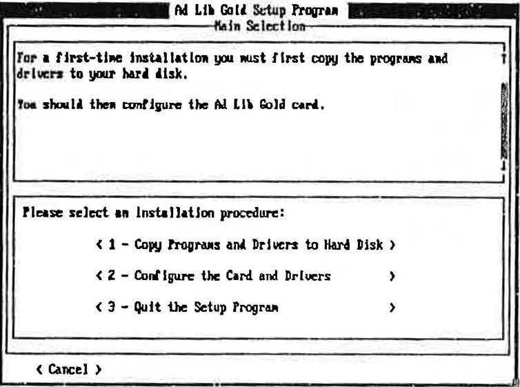
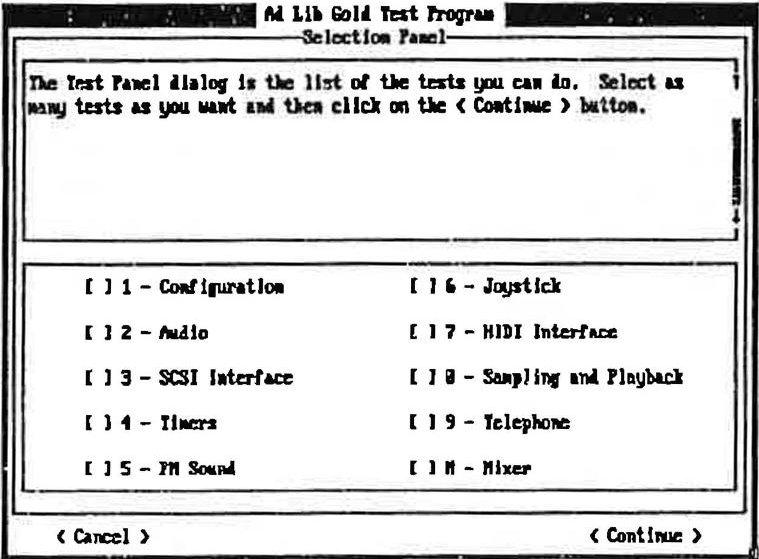
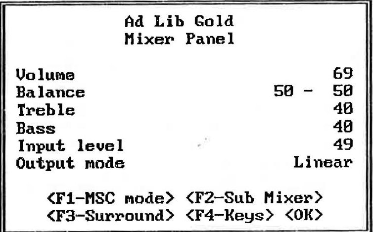
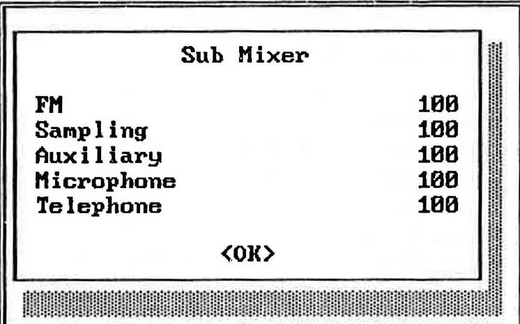
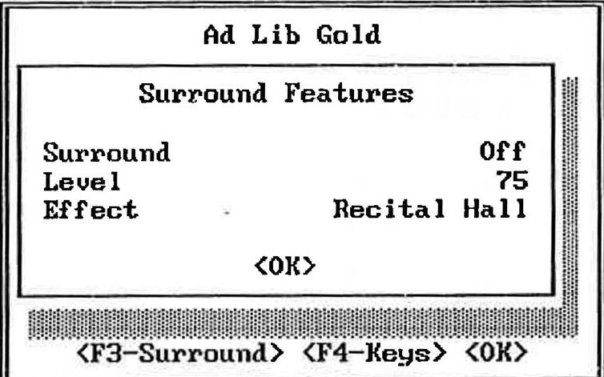
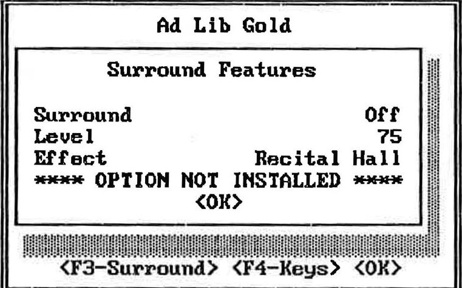
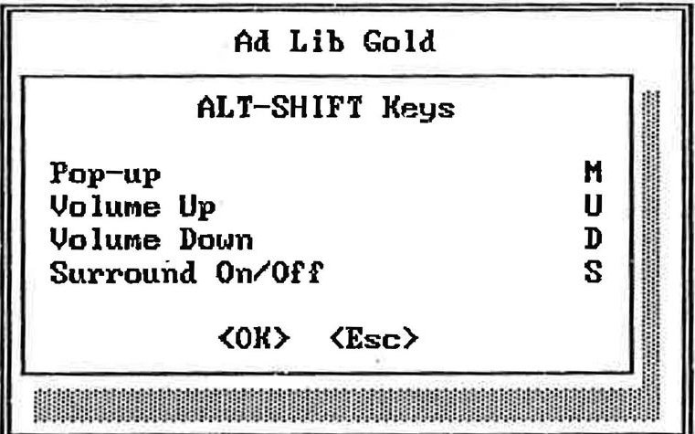
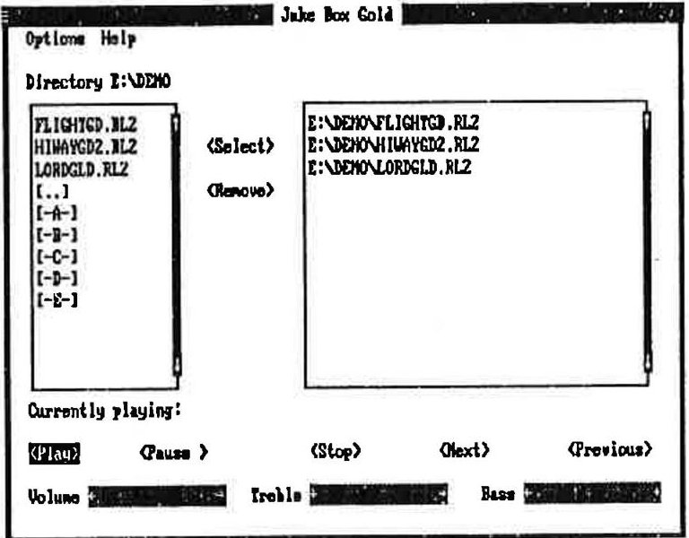
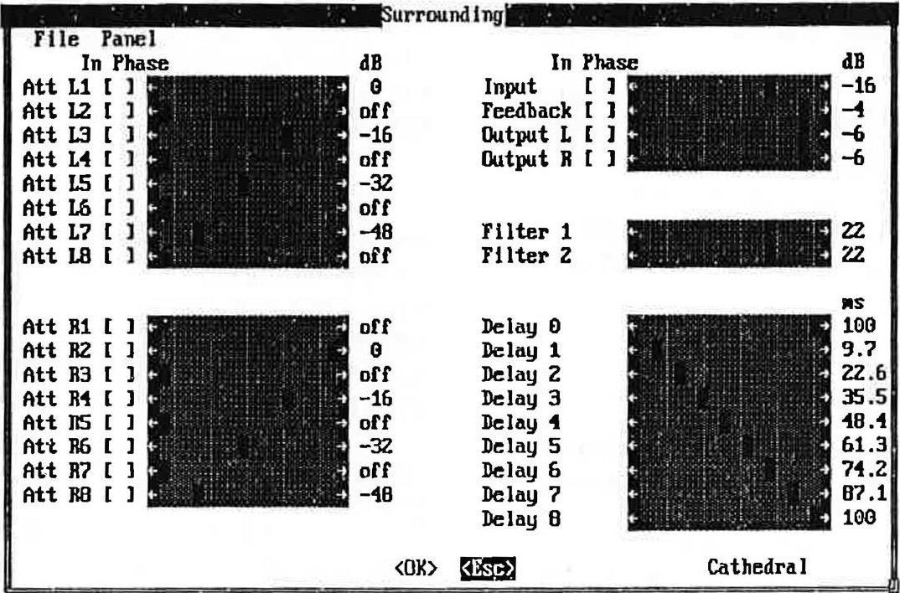

# Chapter 4 - Software Applications

*Setup, the hardware test program, the Mixer Panel TSR, Juke Box Gold, Instrument Maker, Sample Maker and the Surround Sound Editor.*

---

- 4.1 Software Installation and Configuration

Using the Setup Program 1

Configuration Environment Variable 3

- 4.2 Test Program

Testing the Hardware 5

Preparing the Test Program 5

Loading the Test Program 5

To Continue the Test 5

To Cancel the Test and Exit the Program 6

Choosing Test Options 6

- 4.3 Mixer Panel TSR

Loading the Mixer Panel TSR 7

Activating the Mixer Panel 8

Using the Mixer Panel 8

Sound Parameters 8

Sub Mixer 9

Surround Features 10

ALT-SHIFT Keys (Short Cuts) 11

Closing the Mixer Panel 12

Removing the Mixer Panel TSR 12

- 4.4 Juke Box Gold Music Playback Program

Loading Juke Box Gold 13

Selecting Songs 14

Creating a Selection of Songs 14

To Remove Songs from the Selection 14

Playing Music 14

To Play Songs 14

To Stop Music Playback 14

To Pause and Resume Music Playback 14

To Scan Songs 15

Adjusting the Sound 15

To Adjust the Volume, Bass or Treble 15

To Set the Stereo/Mono Option 15

Asking for Help 15

Exiting the Program 16

Using the ROL2 Playback TSR 16

4.5 Instrument Maker Gold 17

Loading Instrument Maker Gold 17

Using Menu Commands 17

F5 File 17

F6 Options 17

F7 Document 18

Editing FM Instrument Sounds 18

4.6 Sample Maker 19

Loading Sample Maker 19

Using Menu Commands 19

F5 File 19

F6 Edit 19

F7 Sampling 20

F8 Options 20

Important Warnings for this Development Version of Sample Maker 21

Sampling Rate Limitations 21

Sampling Length Limitation 21

Scope Mode 21

Graphic Display in Different PCM Format 21

4.7 Surround Sound Editor 23

Ad Lib Surround Sound Editor 23

Technical Features 23

Opening the Surround Sound Editor 23

Using the Surround Sound Editor 24

Channel Line Attenuation Sections 25

Global Level and Feedback Parameter Section 25

Filter Parameter Section 25

Global Delay Line Parameter Section 25

Editing Surround Sound Presets 26

Using Menu Commands 26

File Menu 26

Panel Menu 27

Closing the Surround Sound Editor 27

4.8 Batch File Utilities 29

ROL2 Playback Utility 29

Digitized Sound Playback Utility 29

4.9 ROL2 Playback TSR 31

Using the ROL2 Playback TSR 31

ROL2 Playback TSR Data Files 31

ROL2 Playback TSR Options 32

The running and using of the Ad Lib Gold card drivers and programs require hard disk space of 3 megabytes. They must be installed onto the hard disk following a precise procedure. For this purpose, the Gold software package includes a special Setup Program. This program enables you to install the drivers and all associated programs, and to configure your Ad Lib Gold card.

## Using the Setup Program

The Ad Lib diskettes are not copy-protected. We recommend that you make a back-up copy before installing Gold software. Put the originals away in a safe place. This way, if a diskette is lost or damaged, you will have a replacement. We suggest that you use the DISKCOPY command. (For all details concerning the copy commands, refer to your DOS manual.)

## To Load the Setup Program

To load the Ad Lib Gold Setup Program:

1. Insert the first Ad Lib diskette into the floppy drive.

2. Set the current drive to A (or B, depending on the drive you are using).

3. Type the following commands:

A: \>ctr1drv

A:\>setup

When the program opens, a window entitled "Installation Notes" introduces you to the Setup Program and its basic commands. Two main buttons are displayed at the bottom of each screen: &lt;Cancel&gt; and &lt;Continue&gt;.

Activating the &lt;Continue&gt; button in the Installation Notes introductory screen makes the Setup Program open the Main Selection menu (see Figure 5).

This menu lets you choose and access the three following submenus:

1. Copy programs and drivers to hard disk

2. Configure the card and drivers

3. Leave the Installation Program

Figure 5: Setup Program's Main Selection menu

## To Cancel the Setup Process

At any moment, you can interrupt the setup process by clicking on the &lt;Cancel&gt; button at the lower left corner of the screen, or by pressing the Esc key. Doing this will abort the setup and cancel the steps you have made. The changes you made are not saved in permanent memory on the card. When you reboot your system, these changes will not be restored. So, if you have a problem after making a change, just reboot your system.

NOTE: Certain elements cannot be reversed and will remain installed, such as copied files. To cancel the entire operation, it is necessary to re-run the Setup Program and reverse the corresponding steps, or delete the copied files. See Appendix A for a list of the installed files.

## To Continue the Setup Process

In the setup process, activating the &lt;Continue&gt; button lets you close the current dialog box and access the next step. Doing this will initiate the changes you made in this dialog box, if there were any.

## To Answer Program Questions

During each step of the setup procedure, you will be asked to choose between different options or to enter answers in edit fields. The program suggests an answer that will be correct in most situations. You can use this default, or enter your own answer.

## Configuration Environment Variable

A special environment variable, called "GOLD" is used by the software to recognize the base address of the Gold card. When the card is relocated by the Setup program, the program automatically modifies the environment variable in the AUTOEXEC.BAT file.

To change the GOLD environment variable, type the following command, which should be preferably put in the AUTOEXEC.BAT file:

$$
\mathrm {S E T} \quad \mathrm {G O L D} = x x x
$$

When the Gold environment variable is not defined, the programs assume a default base address of 388H.

Where xxx is the hexadecimal value of the Gold card base address (Control chip address).

## Testing the Hardware

The Ad Lib Gold Test Program, which is supplied with the Gold software, enables you to verify that the Gold card is functioning properly. These tests are not only used to test the Ad Lib hardware, but also to test the connections to all associated peripherals (MIDI ports, joystick, SCSI, etc.).

## Preparing the Test Program

## Prior to running the Test Program:

1. Make sure that the Gold card is properly installed. If necessary, refer to the previous section, "Installing the Hardware".

2. Connect headphones, a speaker or stereo system to the audio jack.

3. Connect the peripherals you plan to use with the Gold card.

4. Turn on your computer. If it is already on, we recommend resetting it.

## Loading the Test Program

To load the Test Program:

1. Make the directory where you placed the Gold software the current directory. For example:

## C:\>cd gold

2. Load the TEST program by typing the following command at the DOS prompt:

C:\GOLD>test

When the program opens, a first window entitled "Installation Notes" introduces you to the Test Program and its basic commands. Two main buttons are displayed at the bottom of each screen: &lt;Cancel&gt; and &lt;Continue&gt;.

Before each test, the program will explain what the test does. It will also point out the procedure to follow to complete the test. This information is shown at the top of each test screen. To see the whole text, click on the scroll bar with the mouse, or select the scroll bar with the Tab key and use the vertical arrow keys ( and ).

If a test does not succeed, a message will appear giving probable causes and solutions.

## To Continue the Test

The &lt;Continue&gt; button lets the user access the next step of the test.

## To Cancel the Test and Exit the Program

When all tests are finished, or anytime within the test procedure, you can exit the Test Program and return to DOS by activating the &lt;Cancel&gt; button.

## Choosing Test Options

Clicking on the &lt;Continue&gt; button in the Installation Notes introductory screen opens the Selection Panel dialog box (see Figure 6). This dialog box presents the list of the tests you can execute:

- Configuration

- Joystick

- Audio

- MIDI Interface

- SCSI Interface

- Sampling and Playback

- Timers

- Telephone

- FM Sound

- Mixer

Some of these options may be grayed to indicate that they are disabled depending on the available hardware. Checking off any of these check boxes will let you access the corresponding tests.

Figure 6: Test Program's Selection Panel

The options can be selected by using either the mouse, the Tab key (Tab or Tab) or the arrow keys (or ). Select the option you wish to test and then activate the &lt;Continue&gt; button. You can also test several options in a row by selecting the options you want and activating the &lt;Continue&gt; button. Any test can be executed more than once if desired.

Each test panel displays information on the test currently being performed and describes the problems and solutions which may be encountered during the test.

The Ad Lib Gold cards (models 1000 and 2000) have an on-board analog mixer that permits the volume of different audio sources to be controlled, as well as overall output volume, balance and tone. These features can be accessed using the Mixer Panel TSR.

The Mixer Panel TSR is a program that allows you to set the different sound parameters of the Ad Lib Gold card at anytime and from within any application. This memory resident program includes four different control windows:

1. Sound Parameters

2. Sub Mixer

3. Surround Features

4. Activation and Volume Keys

? TSR stands for Terminate-and-Stay Resident program, which is also called memory resident program. It is a utility program designed to remain in the computer's memory at all times after loading so the user can activate it with a keystroke at any time, even while running another program. For more information on TSRs, see Appendix D.

## Loading the Mixer Panel TSR

To load the Mixer Panel TSR, set the current directory to the one where you placed the Mixer Panel at installation and type the following command:

mixer

<table border="1"><tr><td>* NOTE: This command can be placed in a batch file so that it is loaded automatically. See your DOS user guide for details.</td></tr></table>

When the program is loaded, it will display a message indicating that the program has been successfully loaded. It will also indicate which keys must be used to activate the Mixer Panel.

The Mixer Panel window will not open upon loading and has to be activated as explained in the next section. If you want the Mixer Panel window open upon loading the program, you can use the option " /a " with the loading command. To do this, go to the appropriate directory and type the following at the DOS prompt:

mixer /a

## Activating the Mixer Panel

are the default activation keys, but you may change this combination, as explained in the "Activation and Volume Keys" section. To activate the Mixer Panel, press all of the activation keys down at the same time and release them. Upon releasing the keys, the main Mixer Panel window will appear as shown in Figure 7.

This TSR can be activated at any time with applications supporting the Ad Lib Gold. The screen will be returned to its original state and mode when you exit the Mixer Panel window.

NOTE: If you use a Hercules card with a MGA monitor, the Mixer Panel can be activated only in text mode. If you activate the Mixer Panel while in graphics mode, this may cause problems with your system.

## Using the Mixer Panel

Each window of the Mixer Panel displays the different parameters and options of the Gold card (see Figure 7). To set one of these:

1. Select the item you want using the vertical arrow keys ( and ).

2. After this, you can modify the chosen item in one of the following ways:

- increase or decrease the numerical parameters and option words one step at a time using the horizontal arrow keys ( and );

- increase or decrease the numerical parameters ten steps at a time using Shift with the horizontal arrow keys ( and );

- toggle On/Off parameters using the Space bar.

## Sound Parameters

When the program is activated, you will see a window appear for setting the basic sound parameters of the Gold card.

Figure 7: The main Mixer Panel window

## Volume

Sets the master output volume of the board.

## Balance

Sets the relative volume of the two stereo channels. Setting the right channel will automatically set the left channel; when you increase the right by one unit, the left channel decreases by one unit, and vice versa.

## Treble

Sets the relative loudness of the high frequencies of the sound.

## Bass

Sets the relative loudness of the low frequencies of the sound.

## Input level

Sets the gain (input level) of the external auxiliary source and of the microphone.

## Output mode

Sets the output mode of the audio source to one of four options:

- Linear: without any effect on the audio source;

- Pseudo: pseudo stereo effect that can be applied when the source is mono;

- Mono: forced mono effect that can be applied when the source is stereo;

- Spatial: light surround sound effect that can

be applied when the source is stereo.

The default setting is Linear.

&lt;F1-MSC mode/Gold mode&gt; Resets the Gold card so it is compatible with the original Ad Lib Music Synthesizer Card. This might be necessary in cases where a third party application that does not properly put the Gold card in its default mode for full compatibility with the original Ad Lib card.

## &lt;F2-Sub Mixer&gt;

Opens the Sub Mixer window.

## &lt;F3-Surround&gt;

Opens the Surround Features window (when using the add-on Surround Sound Module).

## &lt;F4-Keys&gt;

Opens the ALT-SHIFT Keys (short cuts) window.

&lt;OK&gt; ( or Esc Closes the Mixer Panel main window and returns to the current application saving the changes you made in the settings.

## Sub Mixer

Activating the F2 key when in the Mixer Panel main window will open the Sub Mixer control window. Sub Mixer parameters allow the output volume from the five different audio sources to be controlled:

Figure 8: The Sub Mixer control window

## FM

Sets the output volume of the FM source.

## Sampling

Sets the output volume of the Sampling source.

## Auxiliary

Sets the output volume of the auxiliary source (external or internal).

## Microphone

Sets the output volume of the microphone.

## Telephone

Sets the output volume of the telephone (when using the add-on Telephone Module).

## &lt;OX&gt; ( or Esc )

Closes the Sub Mixer control window and returns to the main Mixer Panel window saving the changes you made in the Sub Mixer parameter settings.

## Surround Features

Activating the key when in the Mixer Panel main window will open the Surround Features control window.

Figure 9: The Surround control window

<table border="1"><tr><td>$\cdot$</td><td>NOTE: If the Surround Sound Module is not installed, the program will display the message"OPTION NOT INSTALLED"and the changes you make to the parameters will have no effect(Fig.10).</td></tr></table>

Figure 10: The Surround control window when option not installed

## Surround

A toggle On/Off allows the Surround Sound option to be enabled or disabled. The default setting is Surround Off.

## Level

Sets the level of the surround sound effect produced by the Surround Sound Module.

## Effect

Sets the type of surround sound effect you want to enhance the sound ambience selected from a variety of presets.

## &lt;OK&gt; ( or Esc )

Closes the Surround Features control window and returns to the main Mixer Panel window saving the changes you made in the parameter settings.

## ALT-SHIFT Keys (Short Cuts)

In order to avoid conflicts with other programs, you may change the last key in the combination of keys used to activate the Mixer Panel, to set the master volume and to turn On and Off the Surround Sound. Activating the key when in the Mixer Panel main window will open the Keys window.

Figure 11: The ALT-SHIFT Keys window

## Using the Mixer Panel

## Pop-up

Sets the key combination used to activate the main Mixer Panel window. The default combination is Alt- M.

## Volume Up

Sets the key combination used to increase the master volume one unit at a time. The default combination is Alt-U.

## Volume Down

Sets the key combination used to decrease the master volume one unit at a time. The default combination is AIT- D.

## Surround On/Off

Sets the key combination used to enable and disable the surround sound effect. The default combination is Alt- -5.

## &lt;OK&gt; ( )

Closes the Keys window and returns to the main Mixer Panel window saving the changes you made in the control keys.

## &lt;Esc&gt; (Esc)

Closes the Keys window and returns to the main Mixer Panel window canceling the changes you made in the control keys.

## Closing the Mixer Panel

When in the main window of the Mixer Panel, press the or ESC key to leave the program and return to where you were when the Mixer Panel was activated.

## Removing the Mixer Panel TSR

When the Mixer Panel TSR is already installed but you do not wish to use it, you can unload the program with the option "/x". This option removes the Mixer Panel TSR from the computer's memory. To remove the Mixer Panel TSR, go to the appropriate directory and type the following command:

## mixer /r

Once this command is entered, the program will display a message indicating that the Mixer Panel has been removed.

Juke Box Gold is a music playback program specially designed to demonstrate the sound capabilities of the Ad Lib Gold card itself. It enables you to play pre-programmed songs, or those you create yourself using the Visual Composer Gold music composition program (sold separately). Selected songs can also be played at any time while other applications are running, with the use of the ROL2 Playback TSR commands.

## Loading Juke Box Gold

To load Juke Box Gold, set the current directory to the one in which you placed Juke Box Gold at installation and type:

## jukegold

Once the program is loaded, the main Juke Box Gold window will appear as shown in Figure 12.

Figure 12: The main Juke Box Gold window

This window displays the various menu titles and command buttons (see Figure 12). Other possible options are contained in the menus. To activate a menu, use one of the following methods:

1. Using the Tab key: Scroll and choose the command you want with the Tab key.

2. Using the keyboard shortcuts: To activate the menu or command you want, press the Alt key and the letter highlighted in its name. To activate a command in an open menu, press the highlighted letter.

3. Using a mouse: To activate the menu or command you want, click on the menu or button command with the mouse.

## Selecting Songs

## Creating a Selection of Songs

The main Juke Box Gold window contains two large boxes for song selection. The box located at the left of the screen displays the contents of the current directory. This is a list of files, subdirectories and drives through which you can navigate by selecting a name and pressing the key, or by double clicking with the mouse. The name of the current directory is displayed above the box. When the program is loaded, the default directory is the directory where you placed Juke Box Gold.

To create a selection of songs, go to any directory containing ROL2 files, highlight the file and activate the Select command, or press , or double click with the mouse, for each song you wish to add to the selection. As each song is selected, its DOS file name will be displayed in the Selection box at the right of the screen in its order of selection. You may select as many songs as you wish (depending on memory capacity), but only from a single directory.

## To Remove Songs from the Selection

The box at the right of the screen displays the list of songs contained in the selection you have made. To remove a song from the selection, highlight its name and activate the Remove command.

## Playing Music

## To Play Songs

To play your selection of songs, activate the Play command. Each song in the list will be played in order.

Once the music begins playing, the name of the song currently playing is displayed at the bottom of the window.

## To Stop Music Playback

To stop music playback, activate the Stop command.

## To Pause and Resume Music Playback

To pause music playback, activate the Pause command. When the music pauses, the Pause button toggles to Resume.

To continue music playback at the exact place where it stopped, activate the Resume command. Once the music starts up again, the Resume button switches back to Pause.

## To Scan Songs

To skip to the next song during playback, activate the Next command. This will immediately start the next song if there are any left in the song selection list.

To return to the previous song during playback activate the Previous command. This will immediately start the previous song.

## Adjusting the Sound

The Ad Lib Gold card has an on-board analog mixer that allows volume and tone controls to be adjusted. These features can be accessed from any application by using the Mixer Panel TSR program (see the section "Mixer Panel TSR"). But you can also adjust the sound directly inside the Juke Box Gold program. Three sliders located along the bottom of the window allow you to adjust volume, bass and treble controls while listening to Juke Box songs.

## To Adjust the Volume, Bass or Treble

To adjust one of these three parameters, activate the slider you want and use the left and right arrow keys (and) to raise or lower the value of the chosen parameter. You can also scroll the indicator inside a slider with a mouse.

## To Set the Stereo/Mono Option

The Gold card output can be set either to stereo sound (distinctive signals for the left and right channels) or mono sound (identical signals from both channels). To change from one to the other, choose the Stereo or the Mono option from the Options menu.

## Asking for Help

When you choose the Help command, a window opens up on the screen containing summarized information on how to operate Juke Box Gold and how to use the various features.

## Exiting the Program

To leave the program and return to DOS, use one of the following methods:

- Activate the Exit command from the Options menu.

OR

- Click on the System menu box at the upper left corner of the window and activate the Close command.

## Using the ROL2 Playback TSR

The music files played by Juke Box Gold are called ROL files (.ROL or .RL2). In order to play these music files, the application uses a TSR driver, which we refer to as ROL2 Playback TSR.

Since TSRs stay in memory while we use other programs, the ROL2 Playback TSR allows you to play the songs previously selected in Juke Box Gold, while using other applications.

For details on the loading options of the ROL2 Playback TSR, see the section 4.9 "ROL2 Playback TSR".

The playback commands of this TSR can be used at any time by the following key combinations:

Alt - P Plays the selected songs.

All - - Pauses and resumes the music playback.

Alt T Stops the music playback.

All N Skips to the next song from the selection.

Returns to the previous song from the selection.

In order to avoid conflicts with other programs, you may change the last key in the combination of keys used to activate the above commands by using the Setup program.

WARNING: Do not use the ROL2 Playback TSR while running other music applications, as this will cause conflicts with the ROL2 Playback driver.

## Loading Instrument Maker Gold

To load Instrument Maker Gold, type the following command at the DOS prompt:

## INSGOLD

OR

## ED /BBANKNAME.BNK

Where "BANKNAME" is the name of the bank.

## Using Menu Commands

## F5 File

## New

Opens a new empty sound patch.

## Open...

Opens an existing sound patch.

## Close

Closes the current sound patch.

## Save

Automatically saves changes made to sound patch.

## Save As...

Saves the current sound patch under a new name (maximum of 11 characters).

## Delete...

Deletes an existing sound patch.

## Read "opl3.txt"

## Save "opl3.txt"

## Debug...

You do not have to use these commands. They were implemented for development and will be removed for the final version of Instrument Maker Gold.

## Quit

Closes all opened sound patches, quits the Instrument Maker Gold application and returns to DOS.

## F6 Options

## Note Select

You do not have to use this option. It was implemented for development and will be removed for the final version of Instrument Maker Gold.

## AM Depth

Amplitude Modulation Depth: When this option is checked, it increases the LFO volume modulation (tremolo).

## Using Menu Commands

## PM Depth

Pitch Modulation Depth: when this option is checked, it increases the LFO frequency modulation (vibrato).

## Octave Up

This command makes the screen keyboard and computer keyboard play an octave higher.

## Octave Down

This command makes the screen keyboard and computer keyboard play an octave lower.

## F7 Document

This menu gives you a fast way to switch between open sound patch documents. It lists all the sound patch documents you have open, to a maximum of ten (including the untitled document). The checkmarked document is the active one on which you can work. An asterisk (*) placed beside a document name indicates that the document has been modified.

## Editing FM Instrument Sounds

## To select a parameter:

1. Click on the chosen parameter with the mouse.

2. Use the arrows to navigate between the

## different parameters.

## To modify a parameter:

1. Use the Space Bar to increase the value of the chosen parameter one unit at a time.

2. Use Shift- Space Bar to decrease the value of the chosen parameter one unit at a time.

3. Use the Plus Key on the numeric keyboard to increase the value of the chosen parameter one unit at a time.

4. Use the Minus Key on the numeric keyboard to decrease the value of the chosen parameter one unit at a time.

## To mute operators:

- The Mute function allows you to disable (turn off) any instrument sound operator, thus making it possible to work on individual operators and listen separately to each as you change the parameters. Use the F1, F2, F3 and F4 keys to mute operators 1, 2, 3, and 4 respectively.

NOTE: In the supplied sound bank, the two-operator sound names begin with a capital letter and end with a "#", while four-operator sound names begin with a lower case letter.

## Loading Sample Maker

To load Sample Maker, go to the appropriate directory and type the following command at the DOS prompt:

## SAMPL

## Using Menu Commands

## F5 File

## New

Opens a new empty sampled sound.

## Open from Bank...

Opens an existing sampled sound in ADPCM format from the bank.

## Save to Bank As...

Saves the current sampled sound in ADPCM format under a new name in the bank.

## Delete from Bank...

Deletes an existing sampled sound in ADPCM format from the bank.

WARNING: All sampled sounds saved to bank are temporarily limited to 64 K. Furthermore, the format of sampled sounds saved to bank will change in the next development versions. For these reasons, we recommend that you do not use the commands related to a bank.

## Compact Bank

You do not have to use this command. It was implemented for development and will be removed for the final version of Sample Maker.

## Open File...

Opens an existing sampled sound in PCM format (.SMP file) from the current directory.

## Save File As...

Saves the current sampled sound in PCM format (as .SMP file) in the current directory.

## Open Sample Vision File...

## Open Lyre File...

You do not have to use these commands. They were implemented for development and will be removed for the final version of Sample Maker.

## Quit

Closes the displayed sampled sound, quits the Sample Maker application and returns to DOS.

## F6 Edit

## Copy

Copies the selected section of the sampled sound and puts it into a memory buffer.

<table border="1"><tr><td colspan="2">Using Menu Commands</td></tr><tr><td>Cut
Deletes the selected section from the sampled sound and puts it into a memory buffer.</td><td>Sampling Params...
Use this command to determine the value of the various parameters related to the sampled sound you are working on.</td></tr><tr><td>Paste
Inserts a copy of the buffer&#x27;s contents at the point where the cursor is positioned in the displayed sampled sound.</td><td></td></tr><tr><td>Clear
Deletes the selected section from the sampled sound, but, unlike the command Cut, does not put it into the buffer.</td><td>F8 Options
Scope Mode
This command makes Sample Maker&#x27;s screen display the sampled signal received at the input as a scope.</td></tr><tr><td>Clear All
Deletes the entire sampled sound from the screen.</td><td>NOTE: When in Scope Mode, only the sampling frequency (in PCM) is an effective parameter in the &quot;Sampling Params...&quot; dialog.</td></tr><tr><td>F7 Sampling
Record
This command enables any audio signals mixed with the Gold card to be recorded and sampled with Sample Maker. The sampling process will follow the sampling parameters defined within the Sampling Params... dialog.</td><td>Scale Up
Each time you use this command, Sample Maker zooms the displayed sampled sound out horizontally by a ratio of 1 to 1/2.</td></tr><tr><td>Play
This command lets you listen to the opened sample sound. When a section of the sampled sound is selected, you will only hear that section played.</td><td>Scale Down
Each time you use this command, Sample Maker zooms the displayed sampled sound in horizontally by a ratio of 1 to 2.</td></tr><tr><td></td><td>Scale Reset
Resets a zoomed out sampled sound to the original 1 to 1 scale.</td></tr></table>

## ADPCM File Format

This command is grayed out because you do not have to use it. The PCM to ADPCM file format converter is not completely implemented at this time.

## Gen. Example

This command automatically generates a sampled sin wave and pastes it onto the screen. You should not use this command. It was implemented for development and will be removed for the final version of Sample Maker.

## Important Warnings for this Development Version of Sample Maker

## Sampling Rate Limitations

1. Due to a limitation of the sampling chip, the sampling rate of 5.5125 kHz does not work in 4-bit PCM format. Do not choose this option because Sample Maker will then set another sampling rate, which will give unexpected results.

2. Due to a limitation of the sampling chip, the sampling rate of 44.1 kHz does not work in 4bit ADPCM format. Do not choose this option because Sample Maker will then set another sampling rate, which will give unexpected results.

See "Digital Input and Output".

## Sampling Length Limitation

- Sampled sounds are limited to 256 K. If a recording goes over 256 K, it will clip at 256 K.

## Scope Mode

- When in Scope Mode, choosing the Record command will make the program lock up.

## Graphic Display In Different PCM Format

- Even though every PCM format makes Sample Maker record and play correctly, only PCM 8-bit format is displayed correctly on screen.

## Ad Lib Surround Sound Editor

Ad Lib is providing a special application program, the Surround Sound Editor, which allows you to program your own presets for the Surround Sound Module. This program is included within a special version of Juke Box Gold so that you may play back Juke Box songs and listen to changes you make while working in the editor.

## Technical Features

The underlying technology of the Surround Sound Module is a circuit designed as a general-purpose digital processing element. The board's main component is an LSI chip which has quality digital surround sound capabilities made possible through Yamaha's digital audio technology. Each of its eight digital delay lines may provide a delay time of up to 100 milliseconds, and combining delay line signals for two-channel output assures a wide range of applications.

## Opening the Surround Sound Editor

As stated above, the Surround Sound Editor is at this moment included within a special version of Juke Box Gold. So, to open the editor, you first have to load Juke Box Gold.

To load Juke Box Gold with the Surround Sound Editor, set the current directory to the one in which you placed Juke Box Gold during installation and type the following command:

## surround

Once the program is loaded, the main Juke Box Gold window will appear. You can then select and play back songs as you wish. For complete information on using Juke Box Gold, refer to the "Juke Box Gold Music Playback Program" section of Ad Lib Gold Pre-Release Evaluation Kit.

When ready, open the Surround Sound Editor by choosing Surround from the Options menu. Upon opening, the Surround Sound Editor window will appear as shown in the following figure.

## The Surround Sound Editor window

This window displays the various parameters used to construct a surround sound effect.

## Using the Surround Sound Editor

The Surround Sound Editor window contains five main parts:

- The left channel line attenuation section, located

at the upper left corner of the screen.

- The right channel line attenuation section, located at the lower left corner of the screen.

- The global level and feedback parameter section, located at the upper right corner of the screen.

- The filter parameter section, located in the middle of the right side of the screen.

- The global delay line parameter section, located at the lower right corner of the screen.

## Channel Line Attenuation Sections

These two sections display the two delay line attenuation parameters related to left and right channels.

## In Phase

When this check box is checked off, means that the delay line output signal is in phase with the input signal. When this check box is not checked off, means that the delay line output signal is phase reversed with the input signal.

## dB

Displays the attenuation value setting of the delay line, which ranges from -60 decibels to 0 decibels, in steps of 2 dB. A delay line can also be turned off (-oo).

## Global Level and Feedback Parameter Section

This section displays the two global attenuation parameters related to global signal input, feedback output, and left and right channel global outputs.

## In Phase

When this check box is checked off, means

that the output signal is in phase with the input signal. When this check box is not checked off, means that the output signal is phase reversed with the input signal.

## dB

Displays the attenuation value setting of the signal, which ranges from -60 decibels to 0 decibels, in steps of 2 dB. A signal can also be turned off (- $ \infty $).

## Filter Parameter Section

This section displays the value setting of the two low pass filters for the feedback loop, which ranges from 0 to 31 units, in steps of 1 unit.

## Global Delay Line Parameter Section

ms

Displays the time value setting for each of the 8 delay lines (Delay 1 to Delay 8) and the feedback loop delay line (Delay 0), which range from 0 to 100 milliseconds, in steps of approximately 3.2 milliseconds.

## Editing Surround Sound Presets

To modify a parameter, use one of the following methods:

1. Click on the slide bar indicator of the chosen parameter with the mouse and drag it to the desired value.

2. Click on the gray zone of a slide bar to move the indicator and to decrease or increase the value of the chosen parameter several steps at a time.

3. Click on the left or right arrows at the end of a slide bar to decrease or increase the value of the chosen parameter one step at a time.

4. Click on a check box to turn it On or Off.

## Using Menu Commands

To activate menu commands, use one of the following methods:

1. Using a mouse: To activate a menu command, click on the menu with the mouse, drag to the command you want and release the mouse button.

2. Using the keyboard shortcuts: To activate a menu command, press the letter highlighted in the menu's name and the Alt key at the same

time. Then, activate the command you want by pressing the letter highlighted in its name.

## File Menu

## New

Opens a new empty surround sound preset with no name.

## Open

Opens an existing surround sound preset from the bank entitled STANDARD .SRD.

## Save

Opens a dialog box which allows the current surround sound preset to be saved under a chosen name (maximum of 8 characters) in the bank entitled STANDARD .SRD.

## Text

This command will save the current preset in text form, in both C and Assembler formats, in the file PRESET.TXT. If PRESET.TXT exists, the text will be appended

## Delete

Deletes an existing surround sound preset from the bank entitled STANDARD . SRD.

## Panel Menu

Opens an existing surround sound preset from the Control Panel executable file (CONTROL.EXE).

Saves the current surround sound preset in the Control Panel executable file (CONTROL.EXE).

NOTE: This command does not allow the name of the current surround sound preset to be changed.

## Closing the Surround Sound Editor

Closes the Surround Sound Editor window and returns to Juke Box Gold, temporarily keeping the changes you have just made to the current preset for a further work session.

Closes the Surround Sound Editor window and returns to Juke Box Gold, without keeping the changes you have just made to the current preset.

## ROL2 Playback Utility

The ROL2 Playback utility is a small program that allows the user to play RL2 music files from the DOS command line or from a batch file.

The format of the command running the ROL2 Playback utility is the following:

playrl2 fileName [/Q]

Where fileName is the name of the ROL2 music file (.RL2) to be played.

The optional "/Q" parameter can be used to start the playback of the RL2 song file and immediately returns control to DOS. The playback of the song will be taken in charge by the ROL2 Playback memory resident driver.

If you enter "playrl2" alone or with the option "/?" ("playrl2 /?"), the program displays help lines giving summarized information on program parameters.

The ROL2 Playback utility uses the following five drivers, which have to be loaded before running it:

- Control driver (CTRLDRV.EXE)

- FM driver (FMDRV.EXE)

- Timer driver (TIMERDRV.EXE)

- Wave driver WAVEDRV.EXE)

- ROL2 Playback driver (RL2DRV.EXE)

## Digitized Sound Playback Utility

The Digitized Sound Playback utility is a small program that allows to play back digitized sound files (recorded in the .SMP format) from the DOS command line or from a batch file.

The format of the command running the Digitized Sound Playback utility is the following:

playdigi fileName [/p] [/n]

Where fileName is the name of the digitized sound file (.SMP) to be played.

Where "p" in the option "/p", may be "C" (center), "R" (right), or "L" (left), indicating the stereo position you want for the playback of the digitized sound file.

Where "n" in the option "/n", may be a number from 0 to 100, indicating the volume you want for the playback of the digitized sound file.

If you enter "playdigi" alone or with the option "/?" ("playdigi /?"), the program displays help lines giving summarized information on program parameters.

The Digitized Sound Playback utility uses the following two drivers, which have to be loaded before running it:

- Control driver (CTRLDRV.EXE)

- Wave driver (WAVEDRV.EXE)

## Using the ROL2 Playback TSR

The music files played by Juke Box Gold are called ROL files (.ROL or .RL2). In order to play these music files, the application uses a TSR driver, which we refer to as ROL2 Playback TSR.

The ROL2 Playback TSR is used by various applications to control the playback of Ad Lib music files. It is a powerful utility that uses the services of the other underlying drivers to simplify the task of integrating music and digitized sound to applications. (See below for the options supported with this driver.)

Since TSRs stay in memory while we use other programs, the ROL2 Playback TSR allows you to play the songs previously selected in Juke Box Gold, while using other applications.

The playback commands of the ROL2 Playback TSR can be used at any time by the following key combinations:

Alt P Plays the selected songs.

Alt- A Pauses and resumes the music playback.

Alt - T Stops the music playback.

Alt N Skips to the next song from the selection.

Returns to the previous song from the selection.

In order to avoid conflicts with other programs, you may change the last key in the combination of keys used to activate the above commands by using the Setup program.

! WARNING: Do not use the ROL2 Playback TSR while running other music applications, as this will cause conflicts with the ROL2 Playback driver.

## ROL2 Playback TSR Data Files

The ROL2 Playback TSR uses the a number of data files. All the data files must be in the same directory. Unless the path for these files is specified as a command line argument, the directory containing those files must be the current directory when RL2DRV.EXE is loaded. The data files used by the ROL2 Playback TSR are:

- SAMPLES.BNK and OPL3.BNK: instrument description files (for digitized and FM sounds, respectively).

- SAMPLBNK.EQU: Digitized sounds name translation table.

- *.SMP: Digitized sound files used in the songs.

## ROL2 Playback TSR Options

The following command-line options can be used with the ROL2 Playback TSR:

## r12drv /r

This option removes the ROL2 Playback TSR from the computer's memory when it is installed but you do not wish to use it. Once this command is entered, the program will display a message indicating that the ROL2 Playback TSR has been removed and is no longer loaded.

## r12drv

Loads the ROL2 Playback TSR into the computer's memory (RAM).

## r12drv /vn

This option disables the specified sampling voice "n", which can be "1" or "2". Use two options consecutively, "/v1 /v2", to disable the two sampling voices.

The playback of sampled voices consumes a lot of computer resources. On slower PCs, or when the ROL2 Playback TSR is used in conjunction with more demanding applications, this option can be used to ensure a proper functioning of all parts involved.

## r12drv /spath

This option is used to specify a path for the data files used by ROL2 Playback TSR, if the data files are not in the default directory.
