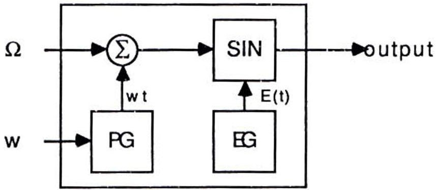
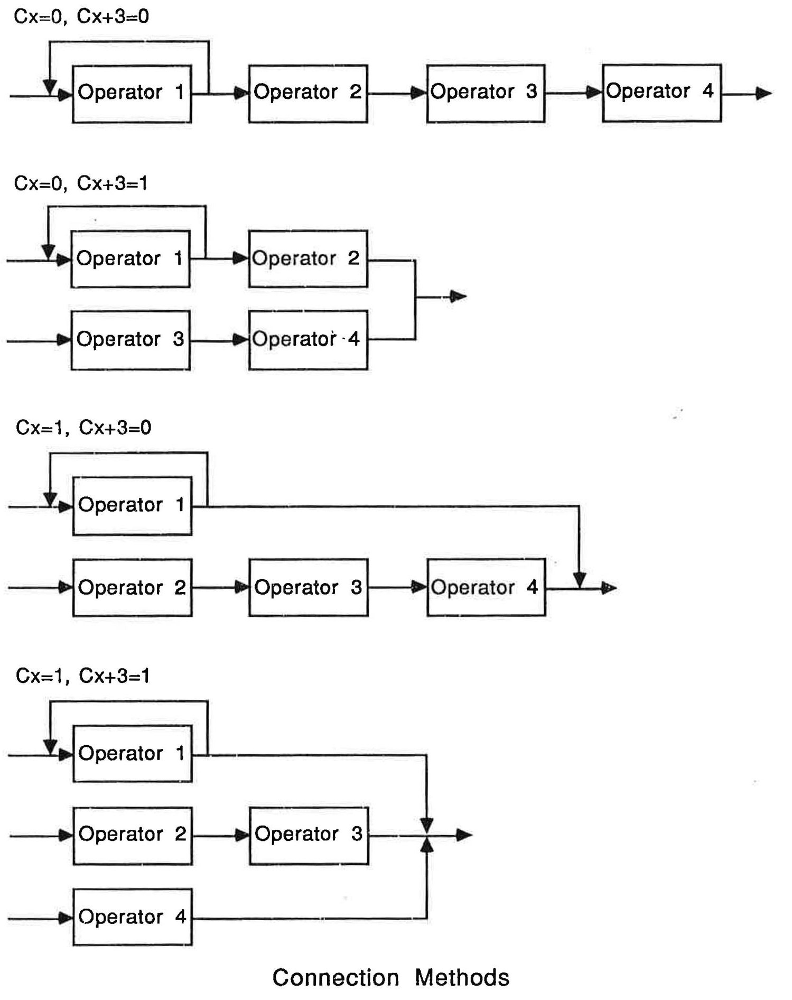

# Chapter 7 - Low-Level Programming

*Direct register-level programming of the MMA controller, the OPL3 (ALMSC) synthesizer, and the mixer.*

---

Mixer and Setup Features 1

Register Access 1

Status Register 2

Register Map 2

Register Reference 4

Control/ID 4

Telephone Control 5

Sampling Gain 5

Final Output Volume 5

Bass 6

Treble 7

Output Mode 7

Mixing Volumes 8

Audio Selection 8

Register 12h 9

Audio IRQ/DMA Select - Channel 0 9

DMA Select - Channel 1 10

Audio Relocalisation 11

SCSI IRQ/DMA Select 12

SCSI Relocalization 13

Surround 13

FM Synthesis 15

Programming the YM3812 17

The Ad Lib Music Synthesizer Card 17

Operators 18

ALMSC Input / Output Map 19

Register Reference 21

Test Register/WSE 21

Timers 21

Status Register 22

CSM/Keyboard Split 23

AM/VIB/EG-TYP/KSR/Multiple 23

KSL/Total Level 25

ADSR 26

BLOCK/F-Number 26

Rhythm/AM Dep/VIB Dep 27

FeedBack/Connection 27

Wave Select 28

Programming the YMF262 29

Register Array 0 29

Register Array 1 33

4-Operator Voices 33

Digital Input and Output (Digital Audio and MIDI) 37

Register Reference 40

Status Register 40

Register 00H: Test Register 40

Registers 02H - 07H: Timer Counters 41

Register 08H: Timer Control 42

Stand-by Mode 42

Timer Interrupt Masks 42

Timer Controls 42

Register 09H: Playback and Recording Control 42

Reset PCM/ADPCM 42

Select Output Channel 42

Select Frequency 43

PCM/ADPCM Selection 43

Select Record/Playback 43

Start/Stop Record/Playback 43

Register 0AH: Output Volume Control 43

Register 0BH: PCM/ADPCM Data 44

Register 0CH: Sampling Format and Control 44

Interleaving 44

Set Data Format 44

Set FIFO Interrupt 45

FIFO Interrupt Mask 45

DMA Mode Specification 46

Register 0DH: MIDI and Interrupt Control 46

Mask Digital Overrun Error 46

Mask MIDI Overrun Error 46

Reset MIDI transmit circuit 46

Mask MIDI transmit FIFO interrupts 46

Reset MIDI Receive Circuit 46

Mask MIDI Receive FIFO Interrupts 46

Register 0EH: MIDI Data 46

MMA Programming Tips 47

## Register Access

The control chip registers are implemented as a set of phantom registers to the second bank of FM registers. Access to the the control chip is triggered by writing 0FFh to the address register of the second FM bank (38Ah). Thereafter, all reads/writes will access the control chip. Access to the second FM bank is returned by writing 0FEh to the same address register.

As with the FM and sampling chips, the control chip uses two port addresses. The first address, 38Ah, is the address register and writing a register number to this address selects a given data register. The second address, 38Bh, is the data address. Values written to this address are directed to the register number specified by the previous write to the address register. There are delays that must be respected when writing to certain registers. These delays are explained in detail in the Status Register section.

By default, the control chip is located at 38Ah and 38Bh. However, the chip may be relocated (as explained in the section Audio Relocalization). Regardless of where the chip is located, the data register port address is always one greater than the address register port address.

All data registers on the control chip are read/write. Reading a register will return its current value. The only execption to this are registers 0 and 1. All registers are explained below in detail.

The Gold cards contain permanent memory (EEPROM) in which the boot-up values for all registers are stored.

## Status Register

Reading the address port (38Ah by default) when the control chip access has been triggered returns the following information:

<table border="1"><tr><td>D7</td><td>D6</td><td>D5</td><td>D4</td><td>D3</td><td>D2</td><td>D1</td><td>D0</td></tr><tr><td>RB</td><td>SB</td><td>X</td><td>X</td><td>SCSI</td><td>TEL</td><td>SMP</td><td>FM</td></tr></table>

The 4 least significant bits indicate interrupt status. Reading this register does not reset the interrupt status. A zeroed bit indicates which section of the board has generated an interrupt. FM indicates the FM section has generated an interrupt; SMP, the sampling section; TEL, the telephone section; SCSI, the SCSI section. SB set indicates that the card is busy writing to a register. RB set indicates that the card is busy writing its registers to memory.

A delay of approximately 450 $ \mu $sec is required after writing to any of registers 4 to 8. A delay of approximately 5 $ \mu $sec is required after writing to any of registers 9 through 16. As well, the chip must not be accessed while the chip is saving its registers to memory. In order to respect these delays, the SB and RB bits should be polled until they become zero. As a general rule, always poll the SB and RB bits before writing anything to the chip.

As well, the chip must not be accessed while it is restoring its registers from memory. This process takes a bit less than 2.5 milliseconds. As there is no status bit for this action, the timing must be done in software.

IMPORTANT: Before returning access to the FM chip (writing FEh to 38Ah), all delays must have expired. Results will be unpredictable otherwise.

## Register Map

The diagram on the following page is a summary of the control chip registers. When writing to registers which contain undesignated bits, these bits must be set to zero. Locations where certain bits must be set are indicated by a "1" in the register map.

Register Map, Control Chip

<table border="1"><tr><td>REG</td><td>D7</td><td>D6</td><td>D5</td><td>D4</td><td>D3</td><td>D2</td><td>D1</td><td>D0</td></tr><tr><td>00</td><td colspan="6"></td><td>ST</td><td>RT</td></tr><tr><td>01</td><td colspan="6"></td><td>RING</td><td>TC</td></tr><tr><td>02</td><td colspan="8">SAMPLING GAIN - LEFT</td></tr><tr><td>03</td><td colspan="8">SAMPLING GAIN - RIGHT</td></tr><tr><td>04</td><td>1</td><td>1</td><td colspan="6">FINAL OUTPUT VOLUME - LEFT</td></tr><tr><td>05</td><td>1</td><td>1</td><td colspan="6">FINAL OUTPUT VOLUME - RIGHT</td></tr><tr><td>06</td><td>1</td><td>1</td><td>1</td><td>1</td><td colspan="4">BASS</td></tr><tr><td>07</td><td>1</td><td>1</td><td>1</td><td>1</td><td colspan="4">TREBLE</td></tr><tr><td>08</td><td>1</td><td>1</td><td>MU</td><td colspan="2">ST-MONO</td><td colspan="3">SOURCE</td></tr><tr><td>09</td><td colspan="8">FM VOLUME - LEFT</td></tr><tr><td>0A</td><td colspan="8">FM VOLUME - RIGHT</td></tr><tr><td>0B</td><td colspan="8">SAMPLING VOLUME - LEFT</td></tr><tr><td>0C</td><td colspan="8">SAMPLING VOLUME - RIGHT</td></tr><tr><td>0D</td><td colspan="8">AUX VOLUME - LEFT</td></tr><tr><td>0E</td><td colspan="8">AUX VOLUME - RIGHT</td></tr><tr><td>0F</td><td colspan="8">MICROPHONE VOLUME</td></tr><tr><td>10</td><td colspan="8">TELEPHONE VOLUME</td></tr><tr><td>11</td><td></td><td>SPKR</td><td></td><td>MFB</td><td>XMO</td><td>FLT0</td><td>FLT1</td><td></td></tr><tr><td>12</td><td colspan="8"></td></tr><tr><td>13</td><td>DEN0</td><td colspan="3">DMA SEL 0</td><td>AEN</td><td colspan="3">INT SEL A</td></tr><tr><td>14</td><td>DEN1</td><td colspan="3">DMA SEL 1</td><td colspan="4"></td></tr><tr><td>15</td><td></td><td colspan="7">AUDIO RELOCATE</td></tr><tr><td>16</td><td>DENS</td><td colspan="3">DMA SEL S</td><td>SIEN</td><td colspan="3">INT SEL S</td></tr><tr><td>17</td><td></td><td colspan="7">SCSI RELOCATE</td></tr><tr><td>18</td><td colspan="8">SURROUND</td></tr></table>

## Register Reference

## Control/ID

<table border="1"><tr><td>D7</td><td>D6</td><td>D5</td><td>D4</td><td>D3</td><td>D2</td><td>D1</td><td>D0</td></tr><tr><td>X</td><td>X</td><td>X</td><td>X</td><td>X</td><td>X</td><td>ST</td><td>RT</td></tr></table>

Register #0: Write

Writing to the Control/ID byte with the ST bit set will cause all control chip registers, in their current state, to be written to memory. If RT is set, then all registers will be restored from memory. When the operation is finished, the control chip sets the appropriate bit back to zero. It is not necessary to manually clear the bit.

<table border="1"><tr><td>D7</td><td>D6</td><td>D5</td><td>D4</td><td>D3</td><td>D2</td><td>D1</td><td>D0</td></tr><tr><td>X</td><td>OP2</td><td>OP1</td><td>OP0</td><td colspan="4">MODEL ID</td></tr></table>

Register #0: Read

Reading this register gives information on the model of the card and which options are present. The currently defined MODEL ID's are:

<table border="1"><tr><td>ID</td><td>Gold Model</td></tr><tr><td>0</td><td>2000</td></tr><tr><td>1</td><td>1000</td></tr><tr><td>2</td><td>2000MC</td></tr></table>

The OP0, OP1 and OP2 bits indicate which of the board options are present and are SET when the option is NOT present.

<table border="1"><tr><td>Bit</td><td>Option</td></tr><tr><td>OP0</td><td>Telephone</td></tr><tr><td>OP1</td><td>Surround</td></tr><tr><td>OP2</td><td>SCSI</td></tr></table>

## Telephone Control

<table border="1"><tr><td>D7</td><td>D6</td><td>D5</td><td>D4</td><td>D3</td><td>D2</td><td>D1</td><td>D0</td></tr><tr><td>X</td><td>X</td><td>X</td><td>X</td><td>X</td><td>X</td><td>X</td><td>TC</td></tr></table>

Register #1: Write

<table border="1"><tr><td>D7</td><td>D6</td><td>D5</td><td>D4</td><td>D3</td><td>D2</td><td>D1</td><td>D0</td></tr><tr><td>X</td><td>X</td><td>X</td><td>X</td><td>X</td><td>X</td><td>RING</td><td>TC</td></tr></table>

Register #1: Read

Setting TC engages the telephone line; clearing the bit hangs up. Reading this register returns the state of the telephone ring signal: RING set indicates that the line is NOT ringing and TC returns the status of the telephone line (i.e. the previously written value of TC).

## Sampling Gain

Registers 2 and 3 control the gain on sampling channels 0 (left) and 1 (right). 256 different gain values are possible, giving a range from approximately 0.04 to 10 times the input value. The exact gain is given by the equation:

$$
\mathrm {G a i n} = (\mathrm {R e g i s t e r V a l u e} * 1 0) / 2 5 6
$$

## Final Output Volume

These registers control the overall output volume of the card. They replace the potentiometer found on the original Ad Lib card. Adjusting for left and right channels separately allows the balance to be varied.

The volume ranges from +6 dB to -64 dB in steps of 2 dB. An additional step gives -80 dB (off). IMPORTANT: Bits D6 and D7 must be set to 1.

<table border="1"><tr><td>dB</td><td>D5-D0</td></tr><tr><td>6</td><td>3F</td></tr><tr><td>4</td><td>3E</td></tr><tr><td>$\vdots$</td><td>$\vdots$</td></tr><tr><td>-62</td><td>1D</td></tr><tr><td>-64</td><td>1C</td></tr><tr><td>-80</td><td>1B</td></tr><tr><td>$\vdots$</td><td>$\vdots$</td></tr><tr><td>-80</td><td>0</td></tr></table>

Registers #4 and #5

## Bass

The bass control has a range of +15dB to -12 dB in 3 dB steps. The bass is set using bits D0-D3. IMPORTANT: Bits D4 - D7 must be set to 1.

<table border="1"><tr><td>dB</td><td>D3-D0</td></tr><tr><td>15</td><td>F</td></tr><tr><td>$\vdots$</td><td>$\vdots$</td></tr><tr><td>15</td><td>B</td></tr><tr><td>12</td><td>A</td></tr><tr><td>$\vdots$</td><td>$\vdots$</td></tr><tr><td>0</td><td>6</td></tr><tr><td>$\vdots$</td><td>$\vdots$</td></tr><tr><td>-12</td><td>2</td></tr><tr><td>$\vdots$</td><td>$\vdots$</td></tr><tr><td>-12</td><td>0</td></tr></table>

Register #6
## Treble

The treble control has a range of +12dB to -12 dB in 3 dB steps. The treble is set using bits D0-D3. IMPORTANT: Bits D4 - D7 must be set to 1.

<table border="1"><tr><td>dB</td><td>D3-D0</td></tr><tr><td>12</td><td>F</td></tr><tr><td>$\vdots$</td><td>$\vdots$</td></tr><tr><td>12</td><td>A</td></tr><tr><td>$\vdots$</td><td>$\vdots$</td></tr><tr><td>0</td><td>6</td></tr><tr><td>$\vdots$</td><td>$\vdots$</td></tr><tr><td>-12</td><td>2</td></tr><tr><td>$\vdots$</td><td>$\vdots$</td></tr><tr><td>-12</td><td>0</td></tr></table>

Register #7

## Output Mode

<table border="1"><tr><td>D7</td><td>D6</td><td>D5</td><td>D4</td><td>D3</td><td>D2</td><td>D1</td><td>D0</td></tr><tr><td>1</td><td>1</td><td>MU</td><td colspan="2">ST-MONO</td><td colspan="3">SOURCE</td></tr></table>

Register #8

This register controls the final output. This final output section takes as its input the output from the mixing section. SOURCE indicates which channels from the mixer are selected for final output. If only one input channel is selected, it is directed to both output channels. Stereo input results in stereo output.

<table border="1"><tr><td>SOURCE</td><td>Channels</td></tr><tr><td>6</td><td>Left and right</td></tr><tr><td>4</td><td>Right only</td></tr><tr><td>2</td><td>Left only</td></tr></table>

ST-MONO selects the type of effect applied to the final output:

<table border="1"><tr><td>ST-MONO</td><td>Effect</td></tr><tr><td>3</td><td>Spatial stereo</td></tr><tr><td>2</td><td>Pseudo stereo</td></tr><tr><td>1</td><td>Linear stereo</td></tr><tr><td>0</td><td>Forced mono</td></tr></table>

Linear stereo is ordinary, stereo output with no effects added. The spatial and pseudo stereo effects will be useful primarily when the original sources are monophonic. If the surround option is present, the output signal is modified after mixing and the attributes of this register are then applied.

Setting MU enables muting; clearing it disables muting.

IMPORTANT: Bits D6 and D7 must be set to 1.

## Mixing Volumes

Registers 9 through 10h are individual volume control registers and constitute the mixing section of the card. 128 different linear volume levels are possible, ranging from 128 (silent) to 255 (maximum gain). Note that writing values less than 128 will result in a signal with negative polarity and should be avoided because the resulting signal may cancel out another signal of opposite polarity.

## Audio Selection

<table border="1"><tr><td>D7</td><td>D6</td><td>D5</td><td>D4</td><td>D3</td><td>D2</td><td>D1</td><td>D0</td></tr><tr><td>X</td><td>X</td><td>SPKR</td><td>X</td><td>MFB</td><td>XMO</td><td>FLT0</td><td>FLT1</td></tr></table>

Register #11h

The Gold card uses antialiasing filters during sampling and playback to ensure maximum audio quality. Because these operations are mutually exclusive on a given channel, the same antialiasing filter is used for sampling and playback. When FLT0 is set, the filter for Channel 0 (left) is set for input (recording); clearing the bit sets the filter for output (playback). FLT1 operates similarly, but is applied to Channel 1 (right).

Normally, the Aux input on the card is sampled in stereo on both channels at the same time. This stereo input can be turned monophonic and sampled on Channel 0 by setting XMO. Clearing XMO returns Aux input to its normal state.

When the telephone option of the Gold card is present, microphone input is directed to both the loudspeaker output as well as the telephone when MFB is cleared. However, this could cause feedback to occur. When MFB is set, the microphone signal is not directed to the loudspeaker output, thus eliminating possible causes of feedback. Although this feature is intended for use with the telephone option, it is operational at all times so that setting MFB always removes the microphone from the final output.

The internal audio speaker from the PC can be mixed directly with the final audio signal of the Gold Card. When SPKR is cleared, the signal is disconnected; when set it is connected.

## Register 12h

Register 12h is unused and should be ignored or set to 0 otherwise.

## Audio IRQ/DMA Select - Channel 0

<table border="1"><tr><td>D7</td><td>D6</td><td>D5</td><td>D4</td><td>D3</td><td>D2</td><td>D1</td><td>D0</td></tr><tr><td>DEN0</td><td colspan="3">DMA SEL 0</td><td>AEN</td><td colspan="3">INT SEL A</td></tr></table>

Register #13h

Audio interrupts (FM, sampling and telephone) are enabled when AEN is set. The following values for INT SEL A select the corresponding interrupt line:

<table border="1"><tr><td>INT SEL A</td><td>IRQ</td></tr><tr><td>0</td><td>3</td></tr><tr><td>1</td><td>4</td></tr><tr><td>2</td><td>5</td></tr><tr><td>3</td><td>7</td></tr><tr><td>4</td><td>10</td></tr><tr><td>5</td><td>11</td></tr><tr><td>6</td><td>12</td></tr><tr><td>7</td><td>15</td></tr></table>

Only IRQ 3,4,5, and 7 are available on model Gold 1000. All listed interrupts are available on the Gold 2000 and the Gold 2000MC.

DMA for sampling channel 0 is enabled when DEN0 is set. The following values for DMA SEL 0 select the corresponding DMA line:

<table border="1"><tr><td>DMA SEL 0</td><td>DMA Line</td></tr><tr><td>0</td><td>0</td></tr><tr><td>1</td><td>1</td></tr><tr><td>2</td><td>2</td></tr><tr><td>3</td><td>3</td></tr></table>

Only DMA 1,2 and 3 are available on model Gold 1000. All listed DMA lines are available on the Gold 2000 and the Gold 2000MC.

DMA Select - Channel 1

<table border="1"><tr><td>D7</td><td>D6</td><td>D5</td><td>D4</td><td>D3</td><td>D2</td><td>D1</td><td>D0</td></tr><tr><td>DEN1</td><td colspan="3">DMA SEL 1</td><td>X</td><td>X</td><td>X</td><td>X</td></tr></table>

Register #14

DMA for sampling channel 1 is enabled when DEN1 is set. The following values for DMA SEL 1 select the corresponding DMA line:

<table border="1"><tr><td>DMA SEL 1</td><td>DMA Line</td></tr><tr><td>0</td><td>0</td></tr><tr><td>1</td><td>1</td></tr><tr><td>2</td><td>2</td></tr><tr><td>3</td><td>3</td></tr></table>

Only DMA 1,2 and 3 are available on the model Gold 1000. All listed DMA lines are available on the Gold 2000 and the Gold 2000MC.

## Audio Relocalisation

<table border="1"><tr><td>D7</td><td>D6</td><td>D5</td><td>D4</td><td>D3</td><td>D2</td><td>D1</td><td>D0</td></tr><tr><td>X</td><td colspan="7">AUDIO RELOCATE</td></tr></table>

Register #15h

This register indicates the port address for the audio section (FM, sampling, control chip). Writing here immediately relocates the audio section to the specified address. The AUDIO RELOCATE value is the port address divided by eight. This forces the address to be on an 8-byte boundary.

The audio section uses 8 port addresses. It is the first of these 8 addresses which is used in this register. Note that the control chip address is considered to be part of the audio section, so that the address of the control chip changes as soon as this register is modified.

The following is the default configuration for the audio section:

<table border="1"><tr><td>Address</td><td>Section</td></tr><tr><td>388h,389h</td><td>FM Bank0</td></tr><tr><td>38Ah,38Bh</td><td>FM Bank1,Control Chip</td></tr><tr><td>38Ch,38Dh</td><td>Sampling Channel0</td></tr><tr><td>38Eh,38Fh</td><td>Sampling Channel1</td></tr></table>

## SCSI IRQ/DMA Select

<table border="1"><tr><td>D7</td><td>D6</td><td>D5</td><td>D4</td><td>D3</td><td>D2</td><td>D1</td><td>D0</td></tr><tr><td>DENS</td><td colspan="3">DMA SEL S</td><td>SIEN</td><td colspan="3">INT SEL S</td></tr></table>

Register #16h

SCSI interrupts are enabled when SIEN is set. The following values for INT SEL S select the corresponding interrupt line:

<table border="1"><tr><td>INT SEL S</td><td>IRQ</td></tr><tr><td>0</td><td>3</td></tr><tr><td>1</td><td>4</td></tr><tr><td>2</td><td>5</td></tr><tr><td>3</td><td>7</td></tr><tr><td>4</td><td>10</td></tr><tr><td>5</td><td>11</td></tr><tr><td>6</td><td>12</td></tr><tr><td>7</td><td>15</td></tr></table>

Only IRQ 3,4,5, and 7 are available on the model Gold 1000. All listed interrupts are available on the Gold 2000 and the Gold 2000MC.

SCSI DMA is enabled when DENS is set. The following values for DMA SEL S select the corresponding DMA line:

<table border="1"><tr><td>DMA SEL S</td><td>DMA Line</td></tr><tr><td>0</td><td>0</td></tr><tr><td>1</td><td>1</td></tr><tr><td>2</td><td>2</td></tr><tr><td>3</td><td>3</td></tr></table>

Only DMA 1,2 and 3 are available on model GOLD 1000. All listed DMA lines are available on the Gold 2000 and the Gold 2000MC.

## SCSI Relocalization

<table border="1"><tr><td>D7</td><td>D6</td><td>D5</td><td>D4</td><td>D3</td><td>D2</td><td>D1</td><td>D0</td></tr><tr><td>X</td><td colspan="7">SCSI RELOCATE</td></tr></table>

Register #17h

This register indicates the port address for the SCSI section. Writing here immediately relocates the SCSI section to the specified address. The SCSI RELOCATE value is the port address divided by eight. This forces the address to be on an 8-byte boundary. The SCSI section uses 8 port addresses. It is the first of these 8 addresses which is used in this register. The default configuration has the SCSI section at addresses 390h to 397h.

## Surround

<table border="1"><tr><td>D7</td><td>D6</td><td>D5</td><td>D4</td><td>D3</td><td>D2</td><td>D1</td><td>D0</td></tr><tr><td colspan="8">SURROUND</td></tr></table>

Register #18h

The surround sound option of the card is accessed via this register. It will be documented at a later date.

This chapter explains the features of the new FM synthesis chip, the YMF262, on the Ad Lib Gold cards. This chip is similar to the YM3812, the chip on the original Ad Lib card, and contains a compatibility mode to emulate the YM3812. Because of this similarity, the first part of this section discusses the features of the YM3812. Those of you who are already familiar with this chip may wish to skip this section and proceed to Programming the YMF262, which discusses the differences between the two chips.

(NOTE: This section is reproduced from the original Ad Lib Synthesizer Card Programmer's Manual. It is necessary for understanding the functioning of the new FM chip, the YMF262. If you are already familiar with this material, you may wish to proceed to the following section which discusses the YMF262.)

This section provides information about the Ad Lib Music Synthesizer Card for advanced programmers who wish to program it directly. There is information on the components of the card, a technical description of the operators, the input / output map and a register reference section.

## The Ad Lib Music Synthesizer Card

The card is equipped with a vibrato oscillator, an amplitude oscillator (tremolo), a noise generator which allows for the combination of a number of frequencies, two programmable timers, composite sine wave synthesis and 18 operators.

A white noise generator is used to create rhythm sounds. This white noise generator uses voices 7 and 8 (melodic voices), frequency information (Block, F-Number, Multi), and the proper phase output. Various rhythm sounds are produced by combining this output signal with white noise. The resulting signal is then sent to the operators. Experience has shown that the best ratio for the two frequencies is 3:1 (melodic voice 7 frequency = 3 times melodic voice 8 frequency). Finally, envelope information is multiplied with the wave table output. As the envelope is set for one operator which corresponds to a single rhythm instrument, the values which express that instrument's characteristics are set in the parameter registers in the same manner as for melody instruments.

## Operators

The ALMSC uses pure sine waves that interact together to produce the full harmonic spectrum for any voice. Each digital sine wave oscillator is combined with its own envelope generator to form an "operator".

An operator has 2 inputs and 1 output. One input is the pitch oscillator frequency and the other is for the modulation data. The frequency and modulation data (phases) are added together and converted to a sine wave signal. The phase generator (PG) converts the frequency (w) into a phase by multiplying it by time (t). An envelope generator (EG) produces a time variant amplitude signal (ADSR). The EG's output is then multiplied by the sine wave and output to the outside world.

The operator output can be expressed as a mathematical expression:

$$
F (t) = E (t) \sin (w t + \Omega)
$$

E(t) is the output from the EG, w is the frequency, t is time and $ \Omega $ is the phase modulation.

The operators can be connected in three different ways: additive, frequency modulation and composite sine wave.

## FM synthesis

FM synthesis uses two operators in series. The first operator, the modulator, modulates the second operator via its modulation input. The name given to the second operator is the carrier. The modulator can feed back its output into its modulation data input;

$$
F _ {m} (t) = E _ {m} (t) \sin \left(w _ {m} t + \beta F _ {m} (t)\right)
$$

$$
F _ {\mathrm {c}} (t) = E _ {\mathrm {c}} (t) \sin \left(w _ {\mathrm {c}} t + F _ {\mathrm {m}} (t)\right)
$$

Modulator and feedback

Carrier and Modulator

## Additive synthesis

Additive synthesis connects two operators in parallel, adding both outputs together. This method of synthesis is not as interesting as FM synthesis, but it can generate good organ type sounds.

The simplified formula for the additive synthesis is:

$$
F (t) = E _ {1} (t) \sin \left(w t + \Omega_ {1}\right) + E _ {2} (t) \sin \left(w t + \Omega_ {2}\right)
$$

## Composite sine wave synthesis

Composite sine wave synthesis (CSW) may be used to generate speech or other related sounds by playing all voices simultaneously. When using this mode the card cannot generate any other sounds. This mode is not used because other methods have proved to provide better quality speech.

## ALMSC Input / Output Map

The ALMSC is located at address 388H in the i/o space. The card decodes two addresses: 388H and 389H. The first address is used for selecting the register address and the second is used for writing data to the selected register. There also exists the possibility of using three other addresses: 218H, 288H and 318H. The port address is currently hardwired, but address jumpers may be added in the future so you may want to take into account the possibility of using different addresses when programming. Here is a register map of the ALMSC:

<table border="1"><tr><td>REG</td><td colspan="7">D7 D6 D5 D4 D3 D2 D1 D0</td></tr><tr><td>01</td><td colspan="2"></td><td>WSE</td><td colspan="4">TEST</td></tr><tr><td>02</td><td colspan="7">TIMER-1</td></tr><tr><td>03</td><td colspan="7">TIMER-2</td></tr><tr><td>04</td><td>RST</td><td colspan="2">maskT1T2</td><td colspan="3"></td><td>start/stopT2T1</td></tr><tr><td>08</td><td>CSM</td><td>SEL</td><td colspan="5"></td></tr><tr><td>20-35</td><td>AM</td><td>VIB</td><td>EG</td><td>KSR</td><td colspan="3">MULTI</td></tr><tr><td>40-55</td><td colspan="2">KSL</td><td colspan="5">TL</td></tr><tr><td>60-75</td><td colspan="4">AR</td><td colspan="3">DR</td></tr><tr><td>80-95</td><td colspan="4">SL</td><td colspan="3">RR</td></tr><tr><td>A0-A8</td><td colspan="8">F-NUMBER(L)</td></tr><tr><td>B0-B8</td><td colspan="2"></td><td>KON</td><td colspan="3">BLOCK</td><td colspan="2">F-NUM(H)</td></tr><tr><td>BD</td><td>DEPAM</td><td>DEPVIB</td><td>R</td><td>BD</td><td>SD</td><td>TOM</td><td>TC</td><td>HH</td></tr><tr><td>C0-C8</td><td colspan="4"></td><td colspan="3">FB</td><td>C</td></tr><tr><td>E0-F5</td><td colspan="6"></td><td colspan="2">WS</td></tr></table>

Because of the nature of the card, you must wait 3.3 μsec after a register select write and 23 μsec for a data write. Only the status register located at address 388H can be read.

For many parameters, there is one register per operator. However, there are holes in the address map so that the operator number cannot be used as an offset into the map. The operator offsets are as follows:

<table border="1"><tr><td></td><td colspan="8">Operator Address Offset</td></tr><tr><td>Opr.</td><td>1</td><td>2</td><td>3</td><td>4</td><td>5</td><td>6</td><td>7</td><td>8</td><td>9</td></tr><tr><td>Off.(hex)</td><td>00</td><td>01</td><td>02</td><td>03</td><td>04</td><td>05</td><td>08</td><td>09</td><td>0A</td></tr></table>

<table border="1"><tr><td>Opr.</td><td>10</td><td>11</td><td>12</td><td>13</td><td>14</td><td>15</td><td>16</td><td>17</td><td>18</td></tr><tr><td>Off.(hex)</td><td>0B</td><td>0C</td><td>0D</td><td>10</td><td>11</td><td>12</td><td>13</td><td>14</td><td>15</td></tr></table>

For example, the KSL/TL registers are at 40H-55H. If we wish to access the register for operator 8, we must write to register 49H (NOT 48H).

## Register Reference

## Test Register/WSE

This register must be initialized to zero before taking any action. The wave select enable/disable bit (WSE) is D5. If set to 1, the value in the WS register will be used to select the wave form used to generate sound. If the WSE is set to 0, the value in the WS register will be ignored and the chip will use a sine wave. (The available waveforms are detailed later in this section).

## Timers

The timers are not wired on the card. However, the following information is included since the timers can be used to detect the presence of our card in the computer.

Timer-1 is an upward 8 bit counter with a resolution of 80 $ \mu $sec. If an overflow occurs, the status register flag FT1 is set, and the preset value (address = 02) is loaded into Timer-1. Timer-2 (address = 03) is an upward 8 bit counter just like Timer-1 except that the resolution is 320 $ \mu $sec.

$$
T _ {\mathrm {o v e r f l o w}} (\mathrm {m s}) = (2 5 6 - \mathrm {N}) ^ {*} \mathrm {K}
$$

N is the preset value and K is the timer constant equal to 0.08 for Timer-1 and 0.32 for Timer-2. Register address 04 controls the operation of both timers. ST1 and ST2 (start/stop T1 or T2) bits start or stop the timers. When the corresponding bit is 1 the counter is loaded and counting starts, but when 0 the counter is held.

The Mask bits are used to gate the status register timer flags. If a mask bit is 1 then the corresponding timer flag bit is kept low (0) and is active when the mask bit is cleared (0). The most significant bit (MSb) is called IRQ-RESET. It resets timer flags and IRQ flag in the status register to zero. All other bits in the control register are ignored when the IRQ- RESET bit is 1.

## Status Register

Reading at address 388H yields the following byte of information:

D0 - D4 are unused.

D5 Timer 2 flag: Set to 1 when the preset time in Timer 2 has elapsed. The flag remains until reset.

D6 Same as D5, except for Timer 1.

D7 IRQ flag: set if D5 or D6 are 1.

As mentioned earlier, the timer interrupts are not connected, but the timers can be used to detect the presence of the board as follows:

1. Reset T1 and T2: write 60H to register 4.

2. Reset the IRQ: write 80H to register 4 (this step must NOT be combined with Step #1).

3. Read status register: read at 388H. Save the result.

4. Set timer-1 to FFH: write FFH to register 2.

5. Unmask and start timer-1: write 21H to register 4.

6. Wait (in a delay loop) for at least 80 $ \mu $sec.

7. Read the status register and save the result.

8. Reset T1, T2 and IRQ as in steps #1 and #2.

9. Test the results of the two reads: the first should be 0, the second should be C0H. If either is incorrect, then an ALMSC board is not present. (NOTE: You should AND the result bytes with E0H as the unused bits are undefined.)

## CSM/Keyboard Split

This register (address = 08) will determine if the card is to function in music mode (CSM=0) or speech synthesis mode (CSM=1) as well as the keyboard split point.

When using composite sine wave speech synthesis mode all voices should be in the KEY-OFF state. The bit NOTE-SEL (D6) is used to control the split point of the keyboard. When 0, the keyboard split is the second bit from the MSb (bit 8) of the F-Number. The MSb of the F-number is used when

NOTE-SEL = 1. This is illustrated in the following table:

NOTE-SEL = 0

<table border="1"><tr><td>BLOCK/OCT</td><td colspan="2">0</td><td colspan="2">1</td><td colspan="2">2</td><td colspan="2">3</td><td colspan="2">4</td><td colspan="2">5</td><td colspan="2">6</td><td colspan="2">7</td></tr><tr><td>FNUM(MSb)</td><td colspan="2">X</td><td colspan="2">X</td><td colspan="2">X</td><td colspan="2">X</td><td colspan="2">X</td><td colspan="2">X</td><td colspan="2">X</td><td colspan="2">X</td></tr><tr><td>FNUM(8)</td><td>0</td><td>1</td><td>0</td><td>1</td><td>0</td><td>1</td><td>0</td><td>1</td><td>0</td><td>1</td><td>0</td><td>1</td><td>0</td><td>1</td><td>0</td><td>1</td></tr><tr><td>Split Num.</td><td>0</td><td>1</td><td>2</td><td>3</td><td>4</td><td>5</td><td>6</td><td>7</td><td>8</td><td>9</td><td>10</td><td>11</td><td>12</td><td>13</td><td>14</td><td>15</td></tr></table>

NOTE-SEL = 1

<table border="1"><tr><td>BLOCK/OCT</td><td colspan="2">0</td><td colspan="2">1</td><td colspan="2">2</td><td colspan="2">3</td><td colspan="2">4</td><td colspan="2">5</td><td colspan="2">6</td><td colspan="2">7</td></tr><tr><td>FNUM(MSb)</td><td>0</td><td>1</td><td>0</td><td>1</td><td>0</td><td>1</td><td>0</td><td>1</td><td>0</td><td>1</td><td>0</td><td>1</td><td>0</td><td>1</td><td>0</td><td>1</td></tr><tr><td>FNUM(8)</td><td>X</td><td>X</td><td>X</td><td>X</td><td>X</td><td>X</td><td>X</td><td>X</td><td>X</td><td>X</td><td>X</td><td>X</td><td>X</td><td>X</td><td>X</td><td>X</td></tr><tr><td>Split Num.</td><td>0</td><td>1</td><td>2</td><td>3</td><td>4</td><td>5</td><td>6</td><td>7</td><td>8</td><td>9</td><td>10</td><td>11</td><td>12</td><td>13</td><td>14</td><td>15</td></tr></table>

X = Ignored

## AM/VIB/EG-TYP/KSR/Multiple

This group of registers (addresses 20H to 35H), one per operator, controls the frequency conversion factor and modulating wave frequencies corresponding to the frequency components of music.

The MULTI 4-bit field determines the multiplication factor applied to the input pitch frequency in the PG section. That is, an operator's frequency will automatically be multiplied according to the value in this field. The multiplication factors are given in the following table:

<table border="1"><tr><td>MULTI</td><td>Factor</td></tr><tr><td>0</td><td>1/2</td></tr><tr><td>1</td><td>1</td></tr><tr><td>2</td><td>2</td></tr><tr><td>3</td><td>3</td></tr><tr><td>4</td><td>4</td></tr><tr><td>5</td><td>5</td></tr><tr><td>6</td><td>6</td></tr><tr><td>7</td><td>7</td></tr></table>

<table border="1"><tr><td>MULTI</td><td>Factor</td></tr><tr><td>8</td><td>8</td></tr><tr><td>9</td><td>9</td></tr><tr><td>10</td><td>10</td></tr><tr><td>11</td><td>10</td></tr><tr><td>12</td><td>12</td></tr><tr><td>13</td><td>12</td></tr><tr><td>14</td><td>15</td></tr><tr><td>15</td><td>15</td></tr></table>

The operator output can then be expressed, with " $ \partial $ " as the multiplication factor, as follows:

$$
F (t) = E _ {c} (t) \sin \left(\partial_ {c} w _ {c} t + E _ {m} \sin \left(\partial_ {m} w _ {m} t\right)\right)
$$

The KSR bit (position = D4) changes the rates for the envelope generator (EG). This parameter makes it possible to gradually shorten envelope length (increase EG rates) as higher notes on the keyboard are played. This is particularly useful for simulating the sound of stringed instruments such as piano and guitar, in which the envelope of the higher notes is noticeably shorter than the lower notes. The actual rate is then equal to the ADSR value plus an offset:

$$
\text {A c t u a l r a t e} = 4 ^ {*} \text {R a t e} + \text {K S R o f f e t}
$$

The KSR offset is specified in the following table:

<table border="1"><tr><td>Rate</td><td>KSR=0</td><td>KSR=1</td></tr><tr><td>0</td><td>0</td><td>0</td></tr><tr><td>1</td><td>0</td><td>1</td></tr><tr><td>2</td><td>0</td><td>2</td></tr><tr><td>3</td><td>0</td><td>3</td></tr><tr><td>4</td><td>1</td><td>4</td></tr><tr><td>5</td><td>1</td><td>5</td></tr><tr><td>6</td><td>1</td><td>6</td></tr><tr><td>7</td><td>1</td><td>7</td></tr></table>

<table border="1"><tr><td>Rate</td><td>KSR=0</td><td>KSR=1</td></tr><tr><td>8</td><td>2</td><td>8</td></tr><tr><td>9</td><td>2</td><td>9</td></tr><tr><td>10</td><td>2</td><td>10</td></tr><tr><td>11</td><td>2</td><td>11</td></tr><tr><td>12</td><td>3</td><td>12</td></tr><tr><td>13</td><td>3</td><td>13</td></tr><tr><td>14</td><td>3</td><td>14</td></tr><tr><td>15</td><td>3</td><td>15</td></tr></table>

The EG-Type activates the sustaining part of the envelope when the EG-Type is set (1). Once set, an operator's frequency will be held at its sustain level until a KEY-OFF is done.

The VIB parameter toggles the frequency vibrato (1 = on, 0 = off). The frequency of the vibrato is 6.4 Hz and the depth is determined by the DEP VIB bit in register 0BDH.

The AM parameter is similar to the VIB parameter except that it is an amplitude vibrato (tremolo) of frequency 3.7Hz. The amplitude vibrato depth is determined by the DEP AM bit in register 0BDH.

## KSL/Total Level

These registers (addresses 40H to 55H, 1 per operator) control the attenuation of the operator's output signal. The KSL parameter produces a gradual decrease in note output level towards higher pitch notes. Many acoustic instruments exhibit this gradual decrease in output level. The KSL is expressed on 2 bits (value 0 through 3). The corresponding attenuation is given below:

<table border="1"><tr><td>D7</td><td>D6</td><td>Attenuation</td></tr><tr><td>0</td><td>0</td><td>0</td></tr><tr><td>1</td><td>0</td><td>1.5dB/oct</td></tr><tr><td>0</td><td>1</td><td>3.0dB/oct</td></tr><tr><td>1</td><td>1</td><td>6.0dB/oct</td></tr></table>

The Total Level (TL) attenuates the operator's output. In FM synthesis mode, varying the output level of an operator functioning as a carrier results in a change in the volume of that operator's voice. Attenuating the output from a modulator will change the frequency spectrum produced by the carrier. In additive synthesis, varying the output level of any operator varies the volume of its corresponding voice. The TL value has a range of 0 through 63 (6 bits). To convert this value into an output level, apply the following formula:

$$
\text {O u t p u t l e v e l} = (6 3 - \mathrm {T L}) ^ {*} 0. 7 5 \mathrm {d B}
$$

## ADSR

These values change the shape of the envelope for the specified operator by changing the rates or the levels. The attack (AR) and the decay (DR) rates are at addresses 60H to 75H (1 per operator). The Sustain Level (SL) and Release Rate (RR) are located at addresses 80H to 95H. All of these values are 4 bits in length (range 0 to 15). Refer to the diagram on page 11 for more information.

The attack rate (AR) determines the rising time for the sound. The higher the value in this register, the faster the attack.

The decay rate (DR) determines the diminishing time for the sound. The higher the value in the DR register, the shorter the decay.

The sustain level (SL) is the point at which the sound ceases to decay and changes to a sound having a constant level. The sustain level is expressed as a fraction of the maximum level. When all bits are set, the maximum level is reached. Note that the EG-Type bit must be set for this to have an effect.

The release rate (RR) determines the rate at which the sound disappears after a Key-Off. The higher the value in the RR register, the shorter the release time.

## BLOCK/F-Number

These parameters determine the pitch of the note played. The Block parameter determines the octave while the F-Number (10 bits) further specifies the frequency. The following formula is used to determine the value of F-Number and Block:

$$
F - N u m = F _ {m u s} ^ {*} 2 ^ {(2 0 - b)} / 4 9. 7 1 6 k H z
$$

In this formula, $ F_{mus} $ is the desired frequency (Hz) and "b" is the block value (0 to 7). Refer to Appendix C for a table of note frequencies.

The D5 bit in the register that contains the BLOCK information is called KEY-ON (KON) and determines if the specified voice (0 to 8) is enable (1) or disable (0). The lower bits of F-Number are at location A0H through A8H (1 per voice) and the 2 MSb are at positions D0 and D1 of addresses B0H to B8H.

<table border="1"><tr><td>REG</td><td>D7</td><td>D6</td><td>D5</td><td>D4</td><td>D3</td><td>D2</td><td>D1</td><td>D0</td></tr><tr><td>A0H-A8H</td><td colspan="8">F-Number2^{7}2^{6}2^{5}2^{4}2^{3}2^{2}2^{1}2^{0}</td></tr><tr><td>B0H-B8H</td><td></td><td></td><td>KEYON</td><td colspan="3">Block2^{2}2^{1}2^{0}</td><td colspan="2">F-Number2^{9}2^{8}</td></tr></table>

## Rhythm/AM Dep/VIB Dep

This register allows for control over AM and VIB depth, selection of rhythm mode and ON/OFF control for various rhythm instruments. Bit D5 (R) is used to change the mode from melodic (0) to percussive (1). When in percussive mode, bits D0 through D4 are the KEY-ON/KEY-OFF controls for the rhythm instruments listed below. The KEY-ON bit in registers B6H, B7H and B8H must always be 0 when in percussive mode.

D0 Hi-Hat

D1 Cymbal

D2 Tom-Tom

D3 Snare Drum

D4 Bass Drum

The AM Depth is 4.8dB when D7 is 1 and 1dB when 0. The VIB Depth is 14 cents when D6 is 1, and 7 cents when zero. (A "cent" is 1/100th of a semi-tone.)

## FeedBack/Connection

These two parameters influence the way the operators are connected together and the B factor in the feedback loop of the modulator. These parameters are assigned 1 per voice at locations C0H through C8H. The Connection bit (C) determines if the voice will be functioning in Additive synthesis mode (C = 1) of in Frequency modulation mode (C = 0). The other parameter, Feedback (FB), gives the modulation factor, B, for the feedback loop:

<table border="1"><tr><td></td><td>0</td><td>1</td><td>2</td><td>3</td><td>4</td><td>5</td><td>6</td><td>7</td></tr><tr><td>β</td><td>0</td><td>π/16</td><td>π/8</td><td>π/4</td><td>π/2</td><td>π</td><td>2π</td><td>4π</td></tr></table>

## Wave Select

The WS parameter enables the card to generate other kinds of wave shapes. This is done by changing the sine function of the specified operator. (Note that the WSE bit must be set in order to use this feature.) The addresses of this feature are E0H to F5H. The following figure gives the corresponding wave forms:

<table border="1"><tr><td>D1</td><td>D0</td><td>Wave Form</td></tr><tr><td>0</td><td>0</td><td>Sine</td></tr><tr><td>0</td><td>1</td><td>Half-sine</td></tr><tr><td>1</td><td>0</td><td>Abs-sine</td></tr><tr><td>1</td><td>1</td><td>Pulse-sine</td></tr></table>

This section explains the differences between the Ad Lib Gold Sound Adapter and the original Ad Lib Music Synthesizer Card as regards FM synthesis. A previous knowledge of the original Ad Lib card is assumed. If you are unfamiliar with the original card, you should first read the following section: "Programming the Synthesizer", which is reproduced from the original Programmer's Manual.

You can see from the register map on the following page that the new FM section is quite similar to the original FM chip but with extra features added. Register Array 0 is accessed by writing to addresses x and x+1 (388H and 389H by default). Register Array 1 is accessed by writing to addresses x+2 and x+3 (38AH and 38BH by default). This scheme allows for complete compatibility with older software which recognizes only the original Ad Lib card.

All registers are cleared at reset. The TEST registers at 01 should be cleared or not accessed at all. Bits in the register map which are not designated should be left in their cleared state.

## Register Array 0

Register Array 0 emulates the original chip and will be used as such by software written for the original card. However, there are several changes to be noted.

The Wave Select Enable bit (WSE, D5 at 01) no longer exists. Wave Select is now "on" permanently. Writing 1 to D5 at 01 has no effect so that compatiblity is thereby maintained.

The CSM bit (D7 at 08) found on the original chip is no longer present. Although this bit was documented on the original chip, it was nonfunctional. Compatibility is, therefore, not an issue.

The timers are now functional. How to program them is explained in the Timers section of Programming the Synthesizer.

Register Map, FM Array 0

<table border="1"><tr><td>REG</td><td>D7</td><td>D6</td><td>D5</td><td>D4</td><td>D3</td><td>D2</td><td>D1</td><td>D0</td></tr><tr><td>01</td><td colspan="8">TEST</td></tr><tr><td>02</td><td colspan="8">TIMER-1</td></tr><tr><td>03</td><td colspan="8">TIMER-2</td></tr><tr><td>04</td><td>RST</td><td colspan="2">mask
T1 T2</td><td colspan="3"></td><td colspan="2">start/stop
T2 T1</td></tr><tr><td>05</td><td colspan="8"></td></tr><tr><td>08</td><td></td><td>SEL</td><td colspan="6"></td></tr><tr><td>20-35</td><td>AM</td><td>VIB</td><td>EG</td><td>KSR</td><td colspan="4">MULTI</td></tr><tr><td>40-55</td><td colspan="2">KSL</td><td colspan="6">TL</td></tr><tr><td>60-75</td><td colspan="4">AR</td><td colspan="4">DR</td></tr><tr><td>80-95</td><td colspan="4">SL</td><td colspan="4">RR</td></tr><tr><td>A0-A8</td><td colspan="8">F-NUMBER(L)</td></tr><tr><td>B0-B8</td><td colspan="2"></td><td>KON</td><td colspan="3">BLOCK</td><td colspan="2">F-NUM(H)</td></tr><tr><td>BD</td><td>DEP
AM</td><td>DEP
VIB</td><td>R</td><td>BD</td><td>SD</td><td>TOM</td><td>TC</td><td>HH</td></tr><tr><td>C0-C8</td><td colspan="2"></td><td>SRL</td><td>STR</td><td colspan="3">FB</td><td>C</td></tr><tr><td>E0-F5</td><td colspan="5"></td><td colspan="3">WS</td></tr></table>

Register Map, FM Array 1

<table border="1"><tr><td>REG</td><td>D7</td><td>D6</td><td>D5</td><td>D4</td><td>D3</td><td>D2</td><td>D1</td><td>D0</td></tr><tr><td>01</td><td colspan="8">TEST</td></tr><tr><td>02</td><td colspan="8"></td></tr><tr><td>03</td><td colspan="8"></td></tr><tr><td>04</td><td colspan="8">CONNECTION SELECT</td></tr><tr><td>05</td><td colspan="8"></td><td>NEW</td></tr><tr><td>08</td><td colspan="8"></td></tr><tr><td>20-35</td><td>AM</td><td>VIB</td><td>EG</td><td>KSR</td><td colspan="4">MULTI</td></tr><tr><td>40-55</td><td colspan="2">KSL</td><td colspan="6">TL</td></tr><tr><td>60-75</td><td colspan="4">AR</td><td colspan="4">DR</td></tr><tr><td>80-95</td><td colspan="4">SL</td><td colspan="4">RR</td></tr><tr><td>A0-A8</td><td colspan="8">F-NUMBER(L)</td></tr><tr><td>B0-B8</td><td colspan="2"></td><td>KON</td><td colspan="3">BLOCK</td><td colspan="2">F-NUM(H)</td></tr><tr><td>BD</td><td colspan="8"></td></tr><tr><td>C0-C8</td><td colspan="2"></td><td>SRL</td><td colspan="2">STR</td><td colspan="2">FB</td><td>C</td></tr><tr><td>E0-F5</td><td colspan="5"></td><td colspan="3">WS</td></tr></table>

Each voice now has two bits which control stereo output: STL and STR (D5/D4 at C0-C8). Setting STL enables output to the left channel. Setting STR enables output to the right channel. Clearing both bits will result in no output for a given voice. However, for these bits to have effect, the NEW bit (explained in the next section) must be set. If NEW is not set (its default state), then the STL and STR bits are ignored and sound is output to both channels. This maintains compatibility with older software which ignores the existence of the stereo bits.

The stereo bits affect pairs of operators, which creates a particularity in percussive mode. The stereo bits in C7 simultaneously affect the Hi-Hat and Snare Drum; C8 affects the Tom-Tom and Cymbal similarly. The Bass Drum (C6) uses two operators and functions the same as a melodic voice.

The Wave Select has been expanded to 3 bits, thus allowing for a total of 8 different waveforms. The waveforms are shown below.

<table border="1"><tr><td>D2-D0</td><td>Waveform</td></tr><tr><td>0</td><td>Sine</td></tr><tr><td>1</td><td>Half-sine</td></tr><tr><td>2</td><td>Abs-sine</td></tr><tr><td>3</td><td>Pulse-sine</td></tr><tr><td>4</td><td></td></tr><tr><td>5</td><td></td></tr><tr><td>6</td><td>Square</td></tr><tr><td>7</td><td></td></tr></table>

Register Array 1 is similar to Register Array 0 with some omissions and additions. The timer registers are unused or are used for other purposes. Register Array 1 does not offer percussive voices, so the bits relating to percussive mode are not present.

The SEL, DEP AM and DEP VIB bits are globally affective and so are found only in the first register array. Setting any one of these three bits will affect both register arrays.

The NEW bit (D0 at 05) enables the new features of the new chip. If this bit is zero, then writes to any other register in Register Array 1 will be blocked. When NEW is zero, Register Array 0 functions as if it were the original chip: the stereo bits will be ignored and the high bit of the wave select will be ignored.

IMPORTANT: All software should enable the NEW bit during its initialization sequence. However, it should clear the NEW bit when exiting. This is so that if an older piece of software is subsequently run, the card will be in the mode which emulates the original card.

The CONNECTION SELECT bits control the 4-operator voice, as explained in detail in the next section.

## 4-Operator Voices

A significant new feature of the FM section of the Ad Lib Gold card is the presence of 4-operator voices, which are capable of creating a large variety of rich timbres. To enable a 4-operator voice, you must set the appropriate bit in the CONNECTION SELECT register. The following table shows which bit corresponds to which 4-operator voice and the pair of 2-operator voices which correspond to the 4-operator voice.

Connection Select (05H, Register Array 1):

<table border="1"><tr><td></td><td>D5</td><td>D4</td><td>D3</td><td>D2</td><td>D1</td><td>D0</td></tr><tr><td>4-op voice</td><td>6</td><td>5</td><td>4</td><td>3</td><td>2</td><td>1</td></tr><tr><td>2-op voices</td><td>3,6</td><td>2,5</td><td>1,4</td><td>3,6</td><td>2,5</td><td>1,4</td></tr><tr><td></td><td colspan="3">Array 1</td><td colspan="3">Array 0</td></tr></table>

With 2-operator voices, the connection bit at C0-C8 specifies one of two possible methods for connecting the operators. With 4-operator voices, there are 4 methods of connecting the operators. This is done by using both connection bits of the pair of 2-operator voices involved. The following table shows the relationship between the 4-operator voice and its connection bits. The diagram on the next page illustrates the connection methods.

Connection bit (C) addresses for 4-operator voices:

<table border="1"><tr><td>4-op voice</td><td>1</td><td>2</td><td>3</td><td>4</td><td>5</td><td>6</td></tr><tr><td>C addresses</td><td>C0,C3</td><td>C1,C4</td><td>C2,C5</td><td>C0,C3</td><td>C1,C4</td><td>C2,C5</td></tr><tr><td></td><td colspan="3">Array 0</td><td colspan="3">Array 1</td></tr></table>

Note that even if all six 4-operator voices are used, there are still three 2-operator voices available on Register Array 1 and three 2-operator or five percussive voices available on Register Array 0. The CONNECTION SELECT register allows you to selectively use 4-operator voices so that you can mix 2 and 4-operator voices as you wish.

The following table is a combination of the preceding two tables. You may find it useful for reference purposes.

<table border="1"><tr><td>Connect Sel</td><td>D5</td><td>D4</td><td>D3</td><td>D2</td><td>D1</td><td>D0</td></tr><tr><td>4-op voice</td><td>6</td><td>5</td><td>4</td><td>3</td><td>2</td><td>1</td></tr><tr><td>2-op voices</td><td>3,6</td><td>2,5</td><td>1,4</td><td>3,6</td><td>2,5</td><td>1,4</td></tr><tr><td>C addresses</td><td>C2,C5</td><td>C1,C4</td><td>C0,C3</td><td>C2,C5</td><td>C1,C4</td><td>C0,C3</td></tr><tr><td></td><td colspan="3">Array 1</td><td colspan="3">Array 0</td></tr></table>

Feedback in a 4-operator voice is applied to the first operator only, as indicated by the loop around Operator 1 in the diagram on the following page. The feedback value is determined by the value written in the register for the first register pair (Cx). The value in the second register pair (Cx+3) is ignored.

Similarly, the F-NUMBER, KON, and BLOCK parameters for a 4-operator voice are determined by the values written in the registers for the first register pairs (Ax and Bx). The values in the second register pairs (Ax+3 and Bx+3) are ignored.

Note that the state of the STL and STR bits for a 4-operator voice must be the same for both register pairs (Cx and Cx+3) or else the output of all four operators will be disabled. For example, if STL at C0 is 1 and STL at C3 is 0, then this 4-operator voice will not be output to the left channel.

The digital I/O functions are handled by the YMZ263 chip, also known as the MMA. The MMA handles the following functions:

- 2 channels of digital audio input and ouput

- MIDI input and output

- Three high-speed timers

The digital I/O functions are accessed via three addresses. The first address is located four bytes past the address of FM Array 0 (38CH by default).

Accessing a MMA register is done in two steps:

1) write the index of the register to be accesed to the "register select" port, located at 38CH

2) write or read the desired value for the selected register, either in the channel 0 port, located at 38DH or in the Channel 1 port located at 38FH

A 470 nanosecond delay is necessary between read/write at any address of the MMA

<table border="1"><tr><td>REG</td><td></td><td>D7</td><td>D6</td><td>D5</td><td>D4</td><td>D3</td><td>D2</td><td>D1</td><td>D0</td></tr><tr><td>01</td><td>-</td><td colspan="9">TEST</td></tr><tr><td>02</td><td>W</td><td colspan="9">TIMER-0(L)</td></tr><tr><td>03</td><td>W</td><td colspan="9">TIMER-0(H)</td></tr><tr><td>04</td><td>W</td><td colspan="9">BASE COUNTER(L)</td></tr><tr><td>05</td><td>W</td><td colspan="4">TIMER1</td><td colspan="4">BASE COUNTER(H)</td></tr><tr><td>06</td><td>RW</td><td colspan="9">TIMER2(L)</td></tr><tr><td>07</td><td>RW</td><td colspan="9">TIMER2(H)</td></tr><tr><td>08</td><td>W</td><td>SBY</td><td>T2M</td><td>T1M</td><td>T0M</td><td>STB</td><td>ST2</td><td>ST1</td><td>ST0</td></tr><tr><td>09</td><td>W</td><td>RST</td><td>R</td><td>L</td><td colspan="2">FREQ</td><td>PCM</td><td>P/R</td><td>GO</td></tr><tr><td>0A</td><td>W</td><td colspan="9">VOLUME CONTROL</td></tr><tr><td>0B</td><td>RW</td><td colspan="9">PCM DATA</td></tr><tr><td>0C</td><td>W</td><td>ILV</td><td colspan="2">DATA FMT</td><td colspan="3">FIFO INT</td><td>MSK</td><td>ENB</td></tr><tr><td>0D</td><td>W</td><td colspan="2"></td><td>MSKPOV</td><td>MSKMOV</td><td>MDI TRS RST</td><td>MSKTRQ</td><td>MDI RCV RST</td><td>MSKRRQ</td></tr><tr><td>0E</td><td>RW</td><td colspan="9">MIDI DATA</td></tr></table>

Register Map, Channel 0

<table border="1"><tr><td>REG</td><td></td><td>D7</td><td>D6</td><td>D5</td><td>D4</td><td>D3</td><td>D2</td><td>D1</td><td>D0</td></tr><tr><td>01</td><td>-</td><td colspan="9"></td></tr><tr><td>02</td><td>W</td><td colspan="9"></td></tr><tr><td>03</td><td>W</td><td colspan="9"></td></tr><tr><td>04</td><td>W</td><td colspan="9"></td></tr><tr><td>05</td><td>W</td><td colspan="9"></td></tr><tr><td>06</td><td>RW</td><td colspan="9"></td></tr><tr><td>07</td><td>RW</td><td colspan="9"></td></tr><tr><td>08</td><td>W</td><td colspan="9"></td></tr><tr><td>09</td><td>W</td><td>RST</td><td>R</td><td>L</td><td colspan="2">FREQ</td><td>PCM</td><td>P/R</td><td>GO</td></tr><tr><td>0A</td><td>W</td><td colspan="9">VOLUME CONTROL</td></tr><tr><td>0B</td><td>RW</td><td colspan="9">PCM DATA</td></tr><tr><td>0C</td><td>W</td><td></td><td colspan="2">DATA FMT</td><td colspan="3">FIFO INT</td><td>MSK</td><td>ENB</td></tr><tr><td>0D</td><td>W</td><td colspan="9"></td></tr><tr><td>0E</td><td>RW</td><td colspan="9"></td></tr></table>

Register Map, Channel 1

## Register Reference

## Status Register

Reading the port at address 38CH returns the following information:

<table border="1"><tr><td>D7</td><td>D6</td><td>D5</td><td>D4</td><td>D3</td><td>D2</td><td>D1</td><td>D0</td></tr><tr><td>OV</td><td>T2</td><td>T1</td><td>T0</td><td>TRQ</td><td>RRQ</td><td>FIF1</td><td>FIF0</td></tr></table>

Status Byte

OV becomes 1 when a MIDI receive overrun error or a PCM/ADPCM record or playback overrun error occurs.

TO, T1 and T2 become 1 when the specified time elapses in the corresponding timer.

TRQ becomes 1 when the MIDI transmit FIFO buffer is empty.

RRQ becomes 1 when the MIDI receive FIFO buffer has data in it.

FIFO and FIF1 become 1 when the PCM/ADPCM FIFO reaches the status that was specified in FIFO INT. FIFO corresponds to channel 0; FIF1 to channel 1.

## Register 00H: Test Register

Register #1, Channel 0 is used for testing the LSI. It should not be accessed.

## Registers 02H - 07H: Timer Counters

Timer 0 (Registers #1 and 2, Channel 0) is a 16-bit programmable down counter with 1.88964 usec resolution. This constant will be referred to as clockFreq. the the following examples. The interrupt is triggered when the counter value reaches 0. The time t0, in usec, until IRQ is generated may be calculated as follows:

$$
\mathbf {t 0} = \mathrm {T I M E R 0} (\mathrm {H}) * (2 5 6 ^ {*} \mathrm {b a s e F r e q}) + \mathrm {T I M E R 0} (\mathrm {L}) * \mathrm {b a s e F r e q}
$$

The BASE COUNTER (Register #4 and 5, Channel 0) is a 12-bit counter that supplies the period for each tick of TIMER1 and TIMER2. The base counter has a resolution of 1.89 usec. The period bc, in usec, may be calculated as follows:

$$
\mathbf {b c} = \mathrm {B A S E C O U N T E R} (\mathrm {H}) * (2 5 6 ^ {*} \mathrm {b a s e F r e q}) + \mathrm {B A S E C O U N T E R} (\mathrm {L}) *
$$

## baseFreq

Timer 1 (Register #5, Channel 0) is a 4-bit programmable down counter that is controlled by the base counter clock. The 4-bit value is placed in the high nibble of the register. The interrupt is triggered when the counter value reaches 0. The time t1, in usec, until IRQ is generated may be calculated as follows:

$$
t 1 = T I M E R 1 * b c
$$

Timer 2 (Register #6 and 7, Channel 0) is a 16-bit programmable down counter that is controlled by the base counter clock. The interrupt is triggered when the counter value reaches 0. The time t2, in usec, until IRQ is generated may be calculated as follows:

$$
t 2 = \left(\mathrm {T I M E R 2} (\mathrm {H}) * 2 5 6 + \mathrm {T I M E R 0} (\mathrm {L}) * b c\right)
$$

TIMER2 may be read to determine the count value. When TIMER2(L) is read the 16-bit count value is latched and the latched value of TIMER2(L) is output. Subsequently, when TIMER2(H) is read, the latched value of TIMER2(H) is output. (Latching a value means taking a "snapshot" of that value at a given moment.) TIMER2(L) must be read first as it is this read which triggers the latching mechanism.

## Register 08H: Timer Control

<table border="1"><tr><td>D7</td><td>D6</td><td>D5</td><td>D4</td><td>D3</td><td>D2</td><td>D1</td><td>D0</td></tr><tr><td>SBY</td><td>T2M</td><td>T1M</td><td>T0M</td><td>STB</td><td>ST2</td><td>ST1</td><td>ST0</td></tr></table>

Register #8: Channel 0

## Stand-by Mode

Setting SBY to 1 reduces the internal clock frequency in order to minimize power consumption. This must be set to 0 when doing any I/O operations.

## Timer Interrupt Masks

Timer Interrupt Masks Setting T0M, T1M or T2M disables the interrupt generated by the corresponding timer. Hence, the bit must be cleared if you wish to use the interrupt timer.

## Timer Controls

ST0, ST1, ST2 and STB (base counter) contol the start and stop of each timer. Setting a bit loads the reload value and starts counting down. Clearing the bit stops the timer.

## Register 09H: Playback and Recording Control

<table border="1"><tr><td>D7</td><td>D6</td><td>D5</td><td>D4</td><td>D3</td><td>D2</td><td>D1</td><td>D0</td></tr><tr><td>RST</td><td>R</td><td>L</td><td colspan="2">FREQ</td><td>PCM</td><td>P/R</td><td>GO</td></tr></table>

Register #9: Channels 0 & 1

## Reset PCM/ADPCM

RST bit is used to reset PCM and ADPCM playback for the channel. Resetting a channel clears the FIFO buffers and resets the FIFO flags. In order for reset to operate properly, all other bits should be 0. The sequence for a channel reset should then be: 1) write 80H to register 9 2) write the desired values to register 9.

## Select Output Channel

Output Channel Setting L or R enables output from the left or right channel respectively. Clearing the bit disables output.

## Select Frequency

FREQ selects the PCM/ADPCM frequency as indicated below:

<table border="1"><tr><td rowspan="2">FREQ</td><td colspan="2">Sampling Frequency(KHz)</td></tr><tr><td>PCM Mode</td><td>ADPCM Mode</td></tr><tr><td>0</td><td>44.1</td><td>22.05</td></tr><tr><td>1</td><td>22.05</td><td>11.025</td></tr><tr><td>2</td><td>11.025</td><td>7.35</td></tr><tr><td>3</td><td>7.35</td><td>5.5125</td></tr></table>

## PCM/ADPCM Selection

Setting PCM selects PCM mode (data is not compressed). Clearing PCM selects ADPCM mode (data is compressed to 4-bits).

## Select Record/Playback

Clear P/R to record; set it to playback.

## Start/Stop Record/Playback

In playback, the FIFO buffers should never be empty when the GO bit is set. To start playback, the proper procedure is: 1) write data into the FIFO buffer for the channel. The FIFO should be filled to a level exceeding the FIFO interrupt level (see register 0CH description) 2) Set the GO bit to start playback.

## Register 0AH: Output Volume Control

VOLUME CONTROL (Register #0Ah, both channels) sets the output attenuation value. A value of 0 is the minimum output volume, a value of FF is the maximum ouput volume.

## Register 0BH: PCM/ADPCM Data

Register #0Bh (both channels) is used for writing data into the FIFO buffer and reading data from the FIFO buffer. Each channel has its own buffer. Data written into this register is transferred into the FIFO buffer, and data transferred from the FIFO buffer is written into this register. In PCM mode, 12-bit data is accessed in one or two passes. The data format for this access follows the specification of the FORMAT register. In ADPCM mode, each access inputs or outputs two 4-bit data. The high 4 bits and the low 4 bits are each ADPCM data. The high data is followed immediately by the low data.

## Register 0CH: Sampling Format and Control

<table border="1"><tr><td>D7</td><td>D6</td><td>D5</td><td>D4</td><td>D3</td><td>D2</td><td>D1</td><td>D0</td></tr><tr><td>ILV</td><td colspan="2">DATA FORMAT</td><td colspan="3">FIFO INT</td><td>MSK</td><td>ENB</td></tr></table>

Register #0Ch: Channels 0 & 1

## Interleaving

Setting ILV (Channel 0 only) to 1 will cause the chip to do interleaving. Data will be alternately input/output from each channel. Channel 0 initiates the transfer. ENB must be 1 for both channels, otherwise the data transfer is not performed. Both channels operate in the same mode so that the P/R,FREQ and GO bits will be controlled by the values set for channel 0.

## Set Data Format

There are 3 possible data formats for sampling input and output. The format is selected by writing 0,1 or 2 to the DATA FORMAT register. "3" is an invalid format... This is ignored in ADPCM mode.

Format 0 is an 1-byte format which contains the 8 most significant bits of the sample.

Format 1 is a 2-byte format. The first byte contains the 8 least significant bits. The lower nibble of the second byte contains the 4 most significant bits of the sample. The MSB of the sample is repeated in all bits of the upper nibble.

Format 2 is a 2-byte format as well. The upper nibble of the first byte contains the 4 LSBs of the sample. The lower nibble is zero. The second byte contains the 8 MSB's.

<table border="1"><tr><td>FORMAT</td><td>PCM Data Byte 1</td><td>PCM Data Byte 2</td></tr><tr><td>0</td><td>MSB b10 b9 b8 b7 b6 b5 b4</td><td>There is no 2nd byte</td></tr><tr><td>1</td><td>b7 b6 b5 b4 b3 b2 b1 b0</td><td>MSB MSB MSB MSB MSB b10 b9 b8</td></tr><tr><td>2</td><td>b3 b2 b1 b0 0000</td><td>MSB b10 b9 b8 b7 b6 b5 b4</td></tr></table>

PCM Data Formats

## Set FIFO Interrupt

The FIFO INT register is used to specify when an interrupt will be generated while the 128-byte FIFO buffer is being filled or emptied. The following table documents the possible interrupt points.

<table border="1"><tr><td>FIFO INT</td><td>Interrupt Generation Point(bytes)</td></tr><tr><td>0</td><td>112</td></tr><tr><td>1</td><td>96</td></tr><tr><td>2</td><td>80</td></tr><tr><td>3</td><td>64</td></tr><tr><td>4</td><td>48</td></tr><tr><td>5</td><td>32</td></tr><tr><td>6</td><td>16</td></tr><tr><td>7</td><td>Prohibited</td></tr></table>

## FIFO Interrupt Mask

Setting MSK disables the FIFO interrupt.

## DMA Mode Specification

Set ENB to enable the DMA mode. Clear ENB when not using DMA to transfer data.

## Register 0DH: MIDI and Interrupt Control

<table border="1"><tr><td>D7</td><td>D6</td><td>D5</td><td>D4</td><td>D3</td><td>D2</td><td>D1</td><td>D0</td></tr><tr><td></td><td></td><td>MSKPOV</td><td>MSKMOV</td><td>MDITRSRST</td><td>MSKTRQ</td><td>MDIRCVRST</td><td>MSKRRQ</td></tr></table>

Register #0Dh: Channel 0

Mask Digital Overrun Error Set POV to disable interrupt signals generated by overrun errors during PCM/ADPCM recording and playback.

Mask MIDI Overrun Error Set MOV to disable interrupt signals generated by overrun errors during MIDI reception or transmission.

Reset MIDI transmit circuit Set MDI TRS RST to 1 to reset the MIDI transmit circuit and clear the MIDI transmit FIFO buffer. Zero MDI TRS RST to terminate the reset status.

Mask MIDI transmit FIFO interrupts

Mask MIDI transmit FIFO interrupts Set MSK TRQ to disable interrupt signales generated by the MIDI transmit FIFO. When interrupts are enabled, an interrupt is generated when the MIDI transmit FIFO buffer is emptied.

Reset MIDI Receive Circuit Set MDI RCV RST to 1 to reset the MIDI receive circuit and clear the MIDI receive FIFO buffer. Zero MDI RCV RST to terminate the reset status.

Mask MIDI Receive FIFO Interrupts Set MSK RRQ to disable interrupt signals generated by the MIDI receive FIFO buffer. When interrupts are enabled, an interrupt is generated on reception of a MIDI byte.

## Register 0EH: MIDI Data

This register is used for writing data into the MIDI FIFO buffer an reaing data from the MIDI FIFO buffer. Data written in this register is ransferred to the transmit FIFO buffer and data transferred from the receive FIFO buffer can be read from this register.

## MMA Programming Tips

- Reset a MMA channel after each sample (using the RST bit in register 9), after stopping the sample playback. This makes sure that the FIFO buffer for the channel is emptied.

- In playback mode, when processing a FIFO interrupt, a situation occurs where your application is filling in the FIFO while the playback mechanism is emptying the FIFO at the same time. In some cases this can cause "false triggers" of the FIFO interrupt. In order to avoid this, a simple trick is to temporarily lower the FIFO level, while your application fills in the FIFO, and restore the original level before leaving the interrupt procedure.

- A similar situation can occur in recording mode.

- To avoid the same situation during playback and recording using DMA transfers, you can double-check if the interrupt is valid by reading the DMA controller's counters or status register. they should indicate that data transfer is over.

- The MMA FIFO buffers should never be left to empty themselves during playback (tht is wen GO bit is set) This implies that the FIFO buffers should be filled to a level exceeding the FIFO interrupt level before the GO bit is set.

Special care should be taken during high-speed transfers (44.1K, 12 bit stereo samples, for example) on slower computers.

- All masks (mask T2, T1, T0, FIFO, POV, MOV, TRQ and RRQ) have no effect whatsoever on the status register. They are only used to disable the hardware interrupt.

- Respect the 470ns delay between writes to the MMA registers.
