# YMZ263B — Multimedia Audio & Game Interface Controller (MMA)

[→ 日本語](./datasheet.md)

> **Reference translation.** The English below is a convenience
> translation provided for readability only. The authoritative
> specification is the [original Japanese](./datasheet.md) — every
> register, signal, electrical rating, and timing value is normative
> there. Where the English and Japanese differ, the Japanese prevails.

**YMZ263B**

## Overview

The YMZ263B (MMA) integrates into a single chip the PCM and ADPCM recording/playback functions, MIDI communication functions, and general-purpose game port required for the multimedia capabilities of computer equipment.

Combined with the YM3812 (OPL2), YMF262 (OPL3), or similar, it enables a compact implementation of the sound functions of a multimedia personal computer.

## Features

### (1) PCM / ADPCM section

- PCM or ADPCM mode selectable.
- Two channels capable of both recording and playback.
- Sampling frequency selectable per channel: in ADPCM mode, 22.05 kHz, 11.025 kHz, 7.35 kHz, or 5.5125 kHz; in PCM mode, 44.1 kHz, 22.05 kHz, 11.025 kHz, or 7.35 kHz.
- PCM resolution 8-bit or 12-bit; ADPCM compresses 12-bit data to 4 bits.
- 12-bit floating A/D and D/A converters built in for recording and playback.
- 2× oversampling A/D conversion on two channels.
- 2× oversampling D/A conversion on four channels.
- 128-byte FIFO buffers for CHANNEL 1 and CHANNEL 2 each, for audio data I/O with the CPU; CPU (polling / interrupt) mode or DMA mode selectable.

### (2) MIDI section

- UART for transmitting and receiving data compliant with the MIDI standard.
- 16-byte FIFO buffers for both transmit and receive.

### (3) Game port section

- Eight input ports for interfacing with joysticks and the like.

### (4) Other

- Three timers built in.
- Address decoder built in.
- Single 5 V, silicon-gate CMOS process.
- 64-pin plastic QFP.

### Block diagram

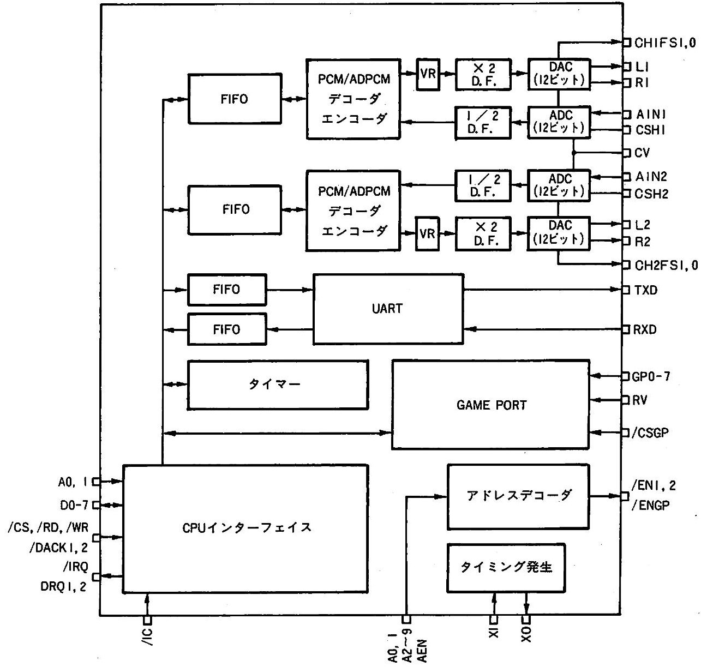

## Pin layout

**YMZ263B-F**

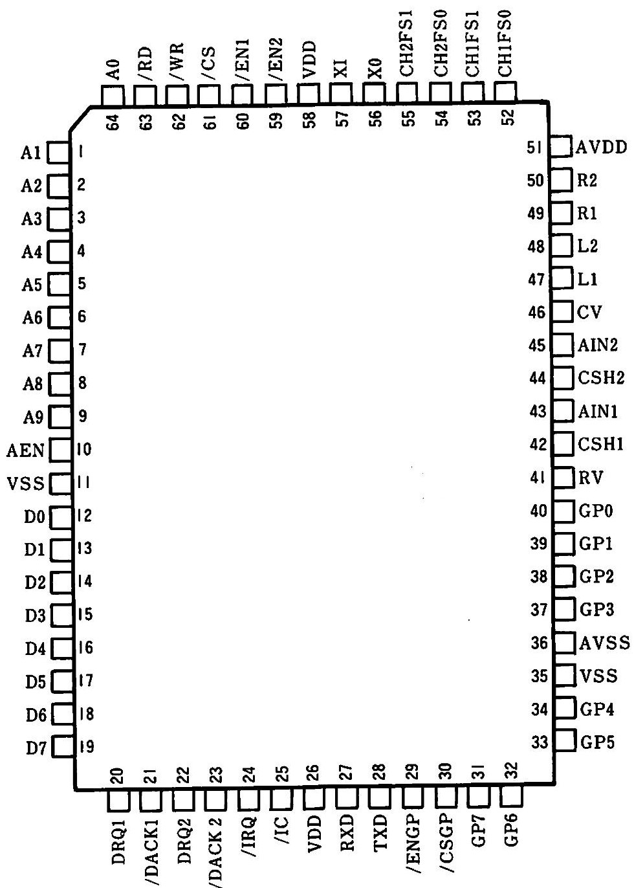

**Pin functions**

<table border="1"><tr><th>No.</th><th>Name</th><th>I/O</th><th>Function</th></tr><tr><td>1</td><td>A1</td><td>I</td><td>CPU interface address bus</td></tr><tr><td>2</td><td>A2</td><td>I</td><td>Address bus</td></tr><tr><td>3</td><td>A3</td><td>I</td><td>Address bus</td></tr><tr><td>4</td><td>A4</td><td>I</td><td>Address bus</td></tr><tr><td>5</td><td>A5</td><td>I</td><td>Address bus</td></tr><tr><td>6</td><td>A6</td><td>I</td><td>Address bus</td></tr><tr><td>7</td><td>A7</td><td>I</td><td>Address bus</td></tr><tr><td>8</td><td>A8</td><td>I</td><td>Address bus</td></tr><tr><td>9</td><td>A9</td><td>I</td><td>Address bus</td></tr><tr><td>10</td><td>AEN</td><td>I</td><td>Address enable</td></tr><tr><td>11</td><td>VSS</td><td>-</td><td>Ground (digital)</td></tr><tr><td>12</td><td>D0</td><td>I/O</td><td>CPU interface data bus</td></tr><tr><td>13</td><td>D1</td><td>I/O</td><td>Data bus</td></tr><tr><td>14</td><td>D2</td><td>I/O</td><td>Data bus</td></tr><tr><td>15</td><td>D3</td><td>I/O</td><td>Data bus</td></tr><tr><td>16</td><td>D4</td><td>I/O</td><td>Data bus</td></tr><tr><td>17</td><td>D5</td><td>I/O</td><td>Data bus</td></tr><tr><td>18</td><td>D6</td><td>I/O</td><td>Data bus</td></tr><tr><td>19</td><td>D7</td><td>I/O</td><td>Data bus</td></tr><tr><td>20</td><td>DRQ1</td><td>O</td><td>DMA request signal 1</td></tr><tr><td>21</td><td>/DACK1</td><td>I</td><td>DMA acknowledge signal 1</td></tr><tr><td>22</td><td>DRQ2</td><td>O</td><td>DMA request signal 2</td></tr><tr><td>23</td><td>/DACK2</td><td>I</td><td>DMA acknowledge signal 2</td></tr><tr><td>24</td><td>/IRQ</td><td>OD</td><td>CPU interface interrupt signal</td></tr><tr><td>25</td><td>/IC</td><td>I+</td><td>Initial clear input</td></tr><tr><td>26</td><td>VDD</td><td>-</td><td>+5 V supply (digital)</td></tr><tr><td>27</td><td>RXD</td><td>I</td><td>MIDI UART data input</td></tr><tr><td>28</td><td>TXD</td><td>O</td><td>MIDI UART data output</td></tr><tr><td>29</td><td>/ENGP</td><td>O</td><td>Address decoder output for game port (201H)</td></tr><tr><td>30</td><td>/CSGP</td><td>I+</td><td>Game port chip select</td></tr><tr><td>31</td><td>GP7</td><td>I+</td><td>Game port input port</td></tr><tr><td>32</td><td>GP6</td><td>I+</td><td>Game port input port</td></tr><tr><td>33</td><td>GP5</td><td>I+</td><td>Game port input port</td></tr><tr><td>34</td><td>GP4</td><td>I+</td><td>Game port input port</td></tr><tr><td>35</td><td>GP3</td><td>I+A</td><td>Game port input port</td></tr><tr><td>36</td><td>GP2</td><td>I+A</td><td>Game port input port</td></tr><tr><td>37</td><td>GP1</td><td>I+A</td><td>Game port input port</td></tr><tr><td>38</td><td>GP0</td><td>I+A</td><td>Game port input port</td></tr><tr><td>39</td><td>RV</td><td>I+A</td><td>Game port comparator reference voltage input</td></tr><tr><td>40</td><td>AVSS</td><td>-A</td><td>Ground (analog)</td></tr><tr><td>41</td><td>CSH2</td><td>I+A</td><td>A/D conversion sample-and-hold capacitor pin 2</td></tr><tr><td>42</td><td>AIN2</td><td>I+A</td><td>Analog input 2</td></tr><tr><td>43</td><td>R2</td><td>OA</td><td>Channel 2 R output</td></tr><tr><td>44</td><td>L2</td><td>OA</td><td>Channel 2 L output</td></tr><tr><td>45</td><td>CSH1</td><td>I+A</td><td>A/D conversion sample-and-hold capacitor pin 1</td></tr><tr><td>46</td><td>AIN1</td><td>I+A</td><td>Analog input 1</td></tr><tr><td>47</td><td>R1</td><td>OA</td><td>Channel 1 R output</td></tr><tr><td>48</td><td>L1</td><td>OA</td><td>Channel 1 L output</td></tr><tr><td>49</td><td>CV</td><td>OA</td><td>A/D converter center voltage pin</td></tr><tr><td>50</td><td>AVSS</td><td>-A</td><td>Ground (analog)</td></tr><tr><td>51</td><td>AVDD</td><td>-A</td><td>+5 V supply (analog)</td></tr><tr><td>52</td><td>CH 1 FS 0</td><td>O</td><td>PCM/ADPCM CHANNEL 1 sampling frequency info output 0</td></tr><tr><td>53</td><td>CH 1 FS 1</td><td>O</td><td>Sampling frequency info output 1</td></tr><tr><td>54</td><td>CH 2 FS 0</td><td>O</td><td>PCM/ADPCM CHANNEL 2 sampling frequency info output 0</td></tr><tr><td>55</td><td>CH 2 FS 1</td><td>O</td><td>Sampling frequency info output 1</td></tr><tr><td>56</td><td>XO</td><td>O</td><td>Crystal oscillator connection pin</td></tr><tr><td>57</td><td>XI</td><td>I</td><td>Crystal oscillator connection pin, or master clock input (16.9344 MHz)</td></tr><tr><td>58</td><td>VDD</td><td>-</td><td>+5 V supply (digital)</td></tr><tr><td>59</td><td>/EN 2</td><td>O</td><td>Address decoder output for sound sources such as OPL3 (388H–38BH)</td></tr><tr><td>60</td><td>/EN 1</td><td>O</td><td>For the MMA (excluding game port) (38CH–38FH)</td></tr><tr><td>61</td><td>/CS</td><td>I+</td><td>CPU interface chip select</td></tr><tr><td>62</td><td>/WR</td><td>I</td><td>Write enable</td></tr><tr><td>63</td><td>/RD</td><td>I</td><td>Read enable</td></tr><tr><td>64</td><td>A0</td><td>I</td><td>Address bus</td></tr></table>

Note — I/O column symbols:

- **OD**: open-drain output pin
- **I+**: input pin with internal pull-up resistor
- **A**: analog signal pin
- **I+A**: analog input pin with internal pull-up resistor (normally shorted to AVSS internally)

## Functional description

### 1. Clock generation — XI, XO

A crystal oscillator circuit is constructed using the XI and XO pins. The oscillation frequency is 16.9344 MHz.

An external clock may also be driven into the XI pin.

### 2. CPU interface — A0, A1, D0–D7, /CS, /RD, /WR, /IRQ

An 8-bit parallel interface is provided to control each section of this LSI.

Data bus control — register data read/write, status read — is performed by the /CS, /RD, /WR, A0, and A1 signals. These signals place the data bus into the following modes.

<table border="1"><tr><td>/CS</td><td>/RD</td><td>/WR</td><td>A0</td><td>A1</td><td>CPU access mode</td></tr><tr><td>H</td><td>×</td><td>×</td><td>×</td><td>×</td><td>Inactive mode</td></tr><tr><td>L</td><td>H</td><td>L</td><td>L</td><td>×</td><td>Address-write mode</td></tr><tr><td>L</td><td>H</td><td>L</td><td>H</td><td>L/H</td><td>Data-write mode</td></tr><tr><td>L</td><td>L</td><td>H</td><td>L</td><td>L</td><td>Status-read mode</td></tr><tr><td>L</td><td>L</td><td>H</td><td>H</td><td>L/H</td><td>Data-read mode</td></tr></table>

Note: × = don't care.

**(a) Inactive mode**

When /CS is 'H', the data bus D0–D7 is in the high-impedance state.

**(b) Address-write mode**

Specifies the address of the register to be written or read. The address data is placed on the data bus.

**(c) Data-write mode**

Writes data to the address set in address-write mode. The data-bus value is written to the register at the specified address.

**(d) Status-read mode**

Reads status information. The status information is output onto the data bus.

**(e) Data-read mode**

Reads data from the address set in address-write mode. The data of the register at the specified address is output onto the data bus.

When an interrupt signal is generated from any section of this LSI, the /IRQ pin is driven 'L' to notify the CPU.

Note: On the YMZ263B, the following wait time is required between consecutive write operations, and between consecutive read operations.

> Wait time ... 8 cycles (of the master clock) or more

### 3. FIFO section — DRQ1, DRQ2, /DACK1, /DACK2

Data I/O between the PCM/ADPCM section and the CPU is performed through the 128-byte FIFOs of CHANNEL 1 and CHANNEL 2 respectively. Connection to a DMA controller for DMA transfer is also possible.

### 4. PCM / ADPCM section

CH1FS1, CH1FS0, L1, R1, AIN1, CSH1, CV / CH2FS1, CH2FS0, L2, R2, AIN2, CSH2

The PCM/ADPCM decoder output of each of the two channels (CHANNEL 1, CHANNEL 2) has its output level adjusted by a digital volume, is processed by 2× oversampling, is D/A converted at twice the set sampling frequency, and is output as a voltage from the L1, R1, L2, R2 pins respectively. (In 44.1 kHz PCM mode, no oversampling is performed.)

The analog signal input at AIN1, AIN2 is A/D converted at twice the set sampling frequency, processed by 1/2 undersampling, and fed to the PCM/ADPCM encoder. (In 44.1 kHz PCM mode, no undersampling is performed.)

An external sample-and-hold capacitor for A/D conversion is attached to the CSH1, CSH2 pins. The CV pin is the center-voltage pin of the A/D converter.

CH1FS1,0 and CH2FS1,0 output the PCM/ADPCM sampling-frequency information of CHANNEL 1 and CHANNEL 2 respectively, for purposes such as external LPF switching.

<table border="1"><tr><td>PCM</td><td>ADPCM</td><td>CH1FS1, CH2FS1</td><td>CH1FS0, CH2FS0</td></tr><tr><td>44.1 kHz</td><td>-</td><td>L</td><td>L</td></tr><tr><td>22.05 kHz</td><td>22.05 kHz</td><td>L</td><td>H</td></tr><tr><td>11.025 kHz</td><td>11.025 kHz</td><td>H</td><td>L</td></tr><tr><td>7.35 kHz</td><td>7.35 or 5.5125 kHz</td><td>H</td><td>H</td></tr></table>

### 5. MIDI section — TXD, RXD

Transmit data is buffered in the 16-byte FIFO and output asynchronously from the TXD pin via the UART. The asynchronous input at the RXD pin is received by the UART and buffered by the 16-byte FIFO.

### 6. Game port section — /CSGP, GP0–GP7, RV

Apply the comparator reference voltage ($0.63 \times V_{DD} \sim 0.70 \times V_{DD}$) to the RV pin.

The GP0–GP3 pins are normally shorted to AVSS internally, so care is required.

When /CSGP = 'L' and /WR = 'L', the GP0–GP3 pins are disconnected from the AVSS pin, and when the GP0–GP3 pin voltage rises above the reference voltage, the flip-flop is reset to 0. The flip-flop value can be read from the D0–D3 pins when /CSGP = 'L' and /RD = 'L'. The time until reset to 0 therefore varies with the external time constant.

The GP4–GP7 pins are general-purpose input ports; when /CSGP = 'L' and /RD = 'L', the values of GP4–GP7 are output onto data bus D4–D7 respectively.

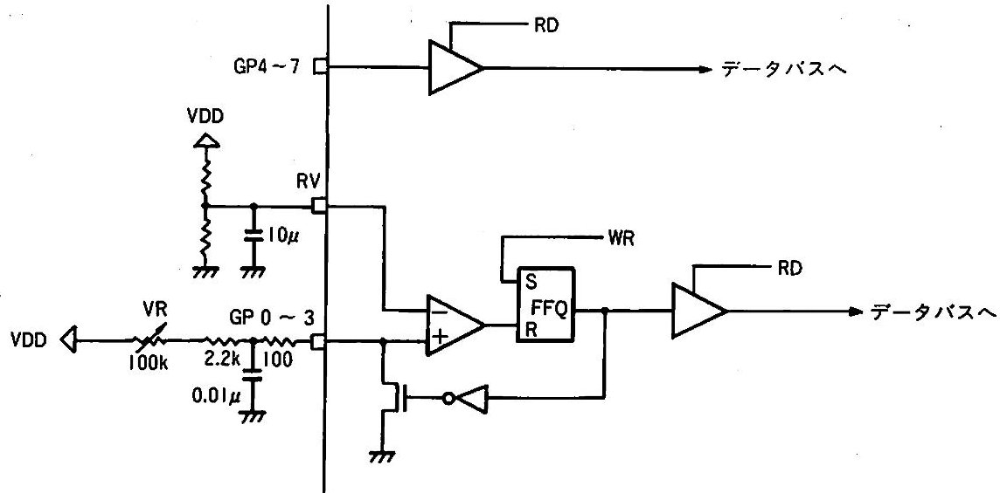

### 7. Address decoder section — AEN, A0–A9, /EN1, /EN2, /ENGP

A fixed-value address decode is built in to reduce external circuitry.

/EN1, /EN2, and /ENGP are the address-decoder outputs for the YMZ263B (excluding the game port), for sound sources such as the YMF262, and for the game port section respectively; each goes to 'L' when its address matches.

AEN is used to prevent spurious chip-select assertions during DMA operation. When AEN = 'H', none of /EN1, /EN2, or /ENGP goes to 'L' regardless of the values of A0–A9.

### 8. Initial clear

This LSI requires an initial clear on power-up.

## Register description

### 1. Register map

<table border="1"><tr><td>CH</td><td colspan="9">CHANNEL 1 (A1='L')</td><td colspan="9">CHANNEL 2 (A1='H')</td></tr><tr><td>ADDR</td><td>R/W</td><td>D7</td><td>D6</td><td>D5</td><td>D4</td><td>D3</td><td>D2</td><td>D1</td><td>D0</td><td>R/W</td><td>D7</td><td>D6</td><td>D5</td><td>D4</td><td>D3</td><td>D2</td><td>D1</td><td>D0</td></tr><tr><td>$00</td><td>R/W</td><td colspan="7"></td><td>SELT</td><td>—</td><td rowspan="9" colspan="9"></td></tr><tr><td>$01</td><td>—</td><td colspan="8">LSI TEST</td><td>—</td></tr><tr><td>$02</td><td>W</td><td colspan="8">TIMER 0 (L)</td><td>—</td></tr><tr><td>$03</td><td>W</td><td colspan="8">TIMER 0 (H)</td><td>—</td></tr><tr><td>$04</td><td>W</td><td colspan="8">BASE COUNTER (L)</td><td>—</td></tr><tr><td>$05</td><td>W</td><td colspan="4">TIMER 1</td><td colspan="4">BASE COUNTER (H)</td><td>—</td></tr><tr><td>$06</td><td>R/W</td><td colspan="8">TIMER 2 (L)</td><td>—</td></tr><tr><td>$07</td><td>R/W</td><td colspan="8">TIMER 2 (H)</td><td>—</td></tr><tr><td>$08</td><td>W</td><td>*1</td><td>T2MSK</td><td>T1MSK</td><td>T0MSK</td><td>STBC</td><td>ST2</td><td>ST1</td><td>ST0</td><td>—</td></tr><tr><td>$09</td><td>W</td><td>ADPRST</td><td>R</td><td>L</td><td>FS1</td><td>FS0</td><td>PCM</td><td>PLY/REC</td><td>ADPST</td><td>W</td><td>ADPRST</td><td>R</td><td>L</td><td>FS1</td><td>FS0</td><td>PCM</td><td>PLY/REC</td><td>ADPST</td></tr><tr><td>$0A</td><td>W</td><td colspan="8">VOLUME CONTROL</td><td>W</td><td colspan="8">VOLUME CONTROL</td></tr><tr><td>$0B</td><td>R/W</td><td colspan="8">PCM DATA</td><td>R/W</td><td colspan="8">PCM DATA</td></tr><tr><td>$0C</td><td>W</td><td>DMA MOD</td><td>FMT1</td><td>FMT0</td><td>SELF2</td><td>SELF1</td><td>SELF0</td><td>MSK FIF</td><td>DMA ENB</td><td>W</td><td></td><td>FMT1</td><td>FMT0</td><td>SELF2</td><td>SELF1</td><td>SELF0</td><td>MSK FIF</td><td>DMA ENB</td></tr><tr><td>$0D</td><td>W</td><td colspan="2"></td><td>MSKPOV</td><td>MSKMOV</td><td>MDITRSRST</td><td>MSKTRQ</td><td>MDIRCVRST</td><td>MSKRRQ</td><td>W</td><td colspan="2"></td><td>MSKPOV</td><td>MSKMOV</td><td>MDITRSRST</td><td>MSKTRQ</td><td>MDIRCVRST</td><td>MSKRRQ</td></tr><tr><td>$0E</td><td>R/W</td><td colspan="8">MIDI DATA</td><td>R/W</td><td colspan="8">MIDI DATA</td></tr></table>

Note: hatched cells are don't care; *1 must always be '0'. On initial clear, all register values become '0' except SELT, ADPRST, MDITRSRST, and MDIRCVRST.

### 2. Register description

CHANNEL 1 and CHANNEL 2 of the PCM/ADPCM section are selected by the A1 pin. Registers marked R/W in the R/W column can be read via data-read mode.

<table border="1"><tr><td>Address</td><td>Name</td><td>Function</td></tr><tr><td>$00</td><td>SELT</td><td>Selects the PCM data type (2's complement or offset binary).</td></tr><tr><td>$01</td><td>LSI TEST</td><td>Used to test this LSI.</td></tr><tr><td>$02–03</td><td>TIMER 0</td><td>16-bit programmable down-counter.</td></tr><tr><td>$04–05</td><td>BASE COUNTER</td><td>12-bit programmable down-counter that supplies the clock to TIMER 1 and TIMER 2.</td></tr><tr><td>$05</td><td>TIMER 1</td><td>4-bit programmable down-counter clocked by the base counter.</td></tr><tr><td>$06–07</td><td>TIMER 2</td><td>16-bit programmable down-counter clocked by the base counter.</td></tr><tr><td>$08</td><td>T0MSK, T1MSK, T2MSK</td><td>Mask only the IRQ signals generated by TIMER 0, TIMER 1, and TIMER 2. The status-register flags are not masked.</td></tr><tr><td>$08</td><td>ST0, ST1, ST2, STBC</td><td>Control start/stop of TIMER 0, TIMER 1, TIMER 2, and the base counter.</td></tr><tr><td>$09</td><td>ADPRST</td><td>Resets the PCM/ADPCM section.</td></tr><tr><td>$09</td><td>L, R</td><td>Selects the output channel.</td></tr><tr><td>$09</td><td>FS0, FS1</td><td>Selects the PCM/ADPCM sampling frequency.</td></tr><tr><td>$09</td><td>PCM</td><td>Selects PCM mode or ADPCM mode.</td></tr><tr><td>$09</td><td>PLY/REC</td><td>Selects recording or playback.</td></tr><tr><td>$09</td><td>ADPST</td><td>Controls start/stop of recording and playback.</td></tr><tr><td>$0A</td><td>VOLUME CONTROL</td><td>Sets the output volume value.</td></tr><tr><td>$0B</td><td>PCM DATA</td><td>Writes data to the FIFO / reads data from the FIFO.</td></tr><tr><td>$0C</td><td>DMAMOD</td><td>Selects the 1-channel DMA mode, which alternately transfers CHANNEL 1 and CHANNEL 2 data using a single DMA controller channel.</td></tr><tr><td>$0C</td><td>FMT0, FMT1</td><td>Selects the PCM data format.</td></tr><tr><td>$0C</td><td>SELF0, SELF1, SELF2</td><td>Selects the FIFO interrupt generation point.</td></tr><tr><td>$0C</td><td>MSKFIF</td><td>Masks only the IRQ signal generated by the FIFO interrupt signal. The status-register flag is not masked.</td></tr><tr><td>$0C</td><td>DMAENB</td><td>Selects DMA mode / CPU mode.</td></tr><tr><td>$0D</td><td>MSKPOV</td><td>Masks only the IRQ signal from overrun errors during PCM/ADPCM recording. The status-register flag is not masked.</td></tr><tr><td>$0D</td><td>MSKMOV</td><td>Masks only the IRQ signal from overrun errors during MIDI reception. The status-register flag is not masked.</td></tr><tr><td>$0D</td><td>MDITRSRST</td><td>Resets the MIDI transmit circuit.</td></tr><tr><td>$0D</td><td>MSKTRQ</td><td>Masks only the IRQ signal of the MIDI transmit FIFO. The status-register flag is not masked.</td></tr><tr><td>$0D</td><td>MDIRCVRST</td><td>Resets the MIDI receive circuit.</td></tr><tr><td>$0D</td><td>MSKRRQ</td><td>Masks only the IRQ signal of the MIDI receive FIFO. The status-register flag is not masked.</td></tr><tr><td>$0E</td><td>MIDIDATA</td><td>Writes data to the MIDI FIFO / reads data from the FIFO.</td></tr></table>

### 3. Status assignment

<table border="1"><tr><td>Bit</td><td>D7</td><td>D6</td><td>D5</td><td>D4</td><td>D3</td><td>D2</td><td>D1</td><td>D0</td></tr><tr><td>Status</td><td>OV</td><td>T2</td><td>T1</td><td>T0</td><td>TRQ</td><td>RRQ</td><td>FIF2</td><td>FIF1</td></tr></table>

### 4. Status description

When an interrupt signal is generated from any of the blocks shown below, the corresponding status-register bit becomes '1', and the /IRQ pin is simultaneously driven 'L' to notify the CPU.

However, the /IRQ pin is driven 'L' to notify the CPU only when the mask bit corresponding to each interrupt (T0MSK, T1MSK, T2MSK, MSKFIF, MSKPOV, MSKMOV, MSKTRQ, MSKRRQ) is '0'.

<table border="1"><tr><td>Name</td><td>Function</td></tr><tr><td>OV</td><td>Becomes '1' on an overrun error during MIDI reception, or during PCM/ADPCM recording or playback.</td></tr><tr><td>T0, T1, T2</td><td>Become '1' when each timer's counter value reaches 0.</td></tr><tr><td>TRQ</td><td>Becomes '1' when the MIDI transmit FIFO becomes empty.</td></tr><tr><td>RRQ</td><td>Becomes '1' when data is placed in the MIDI receive FIFO.</td></tr><tr><td>FIF1, FIF2</td><td>Become '1' when the amount of data in the PCM/ADPCM FIFO reaches the point set by SELF2, 1, 0.</td></tr></table>

## Electrical characteristics

### 1. Absolute maximum ratings

<table border="1"><tr><td>Item</td><td>Symbol</td><td>Rating</td><td>Unit</td></tr><tr><td>Supply voltage</td><td>$V_{DD}$</td><td>$-0.3 \sim 7.0$</td><td>V</td></tr><tr><td>Input voltage</td><td>$V_{I}$</td><td>$-0.3 \sim V_{DD}+0.5$</td><td>V</td></tr><tr><td>Operating temperature</td><td>$T_{op}$</td><td>$0 \sim 70$</td><td>℃</td></tr><tr><td>Storage temperature</td><td>$T_{stg}$</td><td>$-50 \sim 125$</td><td>℃</td></tr></table>

### 2. Recommended operating conditions

<table border="1"><tr><td>Item</td><td>Symbol</td><td>Min</td><td>Typ</td><td>Max</td><td>Unit</td></tr><tr><td>Supply voltage</td><td>$V_{DD}$</td><td>4.75</td><td>5.00</td><td>5.25</td><td>V</td></tr><tr><td>Operating temperature</td><td>$T_{op}$</td><td>0</td><td>25</td><td>70</td><td>℃</td></tr></table>

### 3. DC characteristics

(condition: $T_{a} = 0 \sim 70^{\circ}\mathrm{C}$, $V_{DD} = 5.0 \pm 0.25\mathrm{V}$)

<table border="1"><tr><td>Item</td><td>Symbol</td><td>Condition</td><td>Min</td><td>Typ</td><td>Max</td><td>Unit</td></tr><tr><td>Power consumption</td><td>$P_d$</td><td>$V_{DD}=5.0\mathrm{V}$, $f_M=16.9344\mathrm{MHz}$</td><td></td><td></td><td>200</td><td>mW</td></tr><tr><td>Input voltage H level (1)</td><td>$V_{IH1}$</td><td>*1</td><td>2.2</td><td></td><td></td><td>V</td></tr><tr><td>Input voltage L level (1)</td><td>$V_{IL1}$</td><td>*1</td><td></td><td></td><td>0.8</td><td>V</td></tr><tr><td>Input voltage H level (2)</td><td>$V_{IH2}$</td><td>*2</td><td>3.5</td><td></td><td></td><td>V</td></tr><tr><td>Input voltage L level (2)</td><td>$V_{IL2}$</td><td>*2</td><td></td><td></td><td>1.0</td><td>V</td></tr><tr><td>Input leakage current</td><td>$I_{L1}$</td><td>$V_I = 0 \sim 5\mathrm{V}$, *3</td><td>-10</td><td></td><td>10</td><td>μA</td></tr><tr><td>Input capacitance</td><td>$C_I$</td><td></td><td></td><td></td><td>10</td><td>pF</td></tr><tr><td>Output voltage H level</td><td>$V_{OH}$</td><td>$I_{OH} = -80\mu\mathrm{A}$</td><td>$V_{DD}-1.0$</td><td></td><td></td><td>V</td></tr><tr><td>Output voltage L level</td><td>$V_{OL}$</td><td>$I_{OL} = 2.0\mathrm{mA}$</td><td></td><td></td><td>$V_{SS}+0.4$</td><td>V</td></tr><tr><td>Output capacitance</td><td>$C_O$</td><td></td><td></td><td></td><td>10</td><td>pF</td></tr><tr><td>Output leakage current</td><td>$I_{L0}$</td><td>$V_I = 0 \sim 5\mathrm{V}$, *4</td><td>-10</td><td></td><td>10</td><td>μA</td></tr><tr><td>Pull-up resistor</td><td>$R_U$</td><td></td><td>80</td><td></td><td>400</td><td>kΩ</td></tr></table>

Notes:

- *1 : Applies to /WR, /RD, /CS, A0–A9, AEN, D0–D7, RXD, /CSGP, GP4–GP7, /DACK1, /DACK2. (For D0–D7, applies when in the input state.)
- *2 : Applies to XI, /IC.
- *3 : Applies to /WR, /RD, A0–A9, AEN, D0–D7, RXD, /CSGP, GP4–GP7. (For D0–D7, applies when in the input state.)
- *4 : For D0–D7, during the high-impedance state.

### 4. AC characteristics

(condition: $T_{a} = 0 \sim 70^{\circ}\mathrm{C}$, $V_{DD} = 5.0 \pm 0.25\mathrm{V}$)

<table border="1"><tr><td>Item</td><td>Symbol</td><td>Fig</td><td>Min</td><td>Typ</td><td>Max</td><td>Unit</td></tr><tr><td>Master clock frequency</td><td>$f_M$</td><td>A-1</td><td></td><td>16.9344</td><td></td><td>MHz</td></tr><tr><td>Duty</td><td>$D$</td><td></td><td>45</td><td>50</td><td>55</td><td>%</td></tr><tr><td>Reset pulse width</td><td>$t_{ICW}$</td><td>A-2</td><td>80</td><td></td><td></td><td>cycle *1</td></tr><tr><td>Address setup time</td><td>$t_{AS}$</td><td>A-3, 4</td><td>10</td><td></td><td></td><td>ns</td></tr><tr><td>Address hold time</td><td>$t_{AH}$</td><td>A-3, 4</td><td>10</td><td></td><td></td><td>ns</td></tr><tr><td>Chip-select write width</td><td>$t_{CSW}$</td><td>A-3</td><td>50</td><td></td><td></td><td>ns</td></tr><tr><td>Chip-select read width</td><td>$t_{CSR}$</td><td>A-4</td><td>100</td><td></td><td></td><td>ns</td></tr><tr><td>Write pulse width</td><td>$t_{WW}$</td><td>A-3</td><td>50</td><td></td><td></td><td>ns</td></tr><tr><td>Write data setup time</td><td>$t_{WDS}$</td><td>A-3</td><td>10</td><td></td><td></td><td>ns</td></tr><tr><td>Write data hold time</td><td>$t_{WDH}$</td><td>A-3</td><td>20</td><td></td><td></td><td>ns</td></tr><tr><td>Read pulse width</td><td>$t_{RW}$</td><td>A-4</td><td>100</td><td></td><td></td><td>ns</td></tr><tr><td>Read data access time</td><td>$t_{ACC}$</td><td>A-4</td><td></td><td></td><td>100</td><td>ns</td></tr><tr><td>Read data hold time</td><td>$t_{RDH}$</td><td>A-4</td><td>10</td><td></td><td></td><td>ns</td></tr><tr><td>DRQ hold time</td><td>$t_{DRQH}$</td><td>A-5</td><td></td><td></td><td>50</td><td>ns</td></tr><tr><td>DMA read setup time</td><td>$t_{DRS}$</td><td>A-5</td><td>50</td><td></td><td></td><td>ns</td></tr><tr><td>DMA read hold time</td><td>$t_{DRH}$</td><td>A-5</td><td>20</td><td></td><td></td><td>ns</td></tr><tr><td>DMA read data access time</td><td>$t_{DRAC}$</td><td>A-5</td><td></td><td></td><td>100</td><td>ns</td></tr><tr><td>DMA read data hold time</td><td>$t_{DRDH}$</td><td>A-5</td><td>10</td><td></td><td></td><td>ns</td></tr><tr><td>DMA write setup time</td><td>$t_{DWS}$</td><td>A-6</td><td>50</td><td></td><td></td><td>ns</td></tr><tr><td>DMA write hold time</td><td>$t_{DWH}$</td><td>A-6</td><td>20</td><td></td><td></td><td>ns</td></tr></table>

Note: *1 : in master-clock cycles.

### 5. Analog characteristics

(condition: $T_{a} = 0 \sim 70^{\circ}\mathrm{C}$, $AV_{DD} = 5.0\mathrm{V}$)

<table border="1"><tr><td>Item</td><td>Symbol</td><td>Condition</td><td>Min</td><td>Typ</td><td>Max</td><td>Unit</td></tr><tr><td>Analog input voltage</td><td>$V_{IA}$</td><td>*1</td><td></td><td></td><td>4.8</td><td>V</td></tr><tr><td>Analog output voltage</td><td>$V_{OA}$</td><td>*2</td><td></td><td></td><td>4.8</td><td>V</td></tr><tr><td>DC offset voltage</td><td>$CV$</td><td>*3</td><td></td><td>2.5</td><td></td><td>V</td></tr><tr><td>Offset voltage</td><td>$V_{OFF}$</td><td>*2</td><td></td><td></td><td>0.1</td><td>V</td></tr><tr><td>Linearity error</td><td></td><td>*2</td><td></td><td></td><td>±30</td><td>mV</td></tr><tr><td>Step error</td><td></td><td>*2</td><td></td><td></td><td>±1.0</td><td>LSB</td></tr></table>

Notes:

- *1 : Applies to AIN1, AIN2.
- *2 : Applies to L1, R1, L2, R2.
- *3 : Applies to CV.

### 6. Timing diagrams

**(1) Input clock timing**

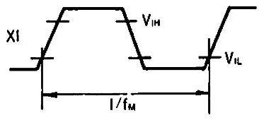

**(2) Reset pulse**

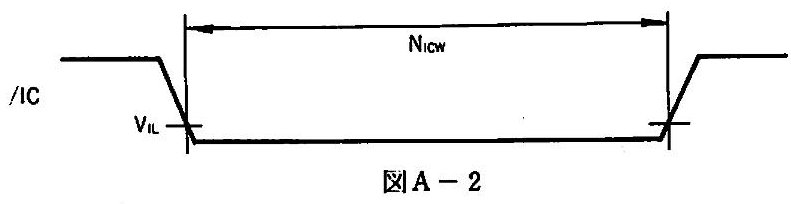

**(3) Address and data write timing**

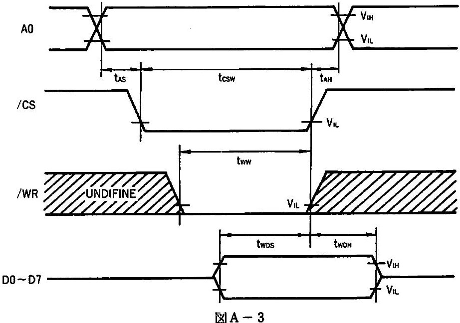

$t_{CSW}$, $t_{WW}$, $t_{WDH}$ are referenced to whichever of /CS, /WR goes High.

**(4) Status and data read timing**

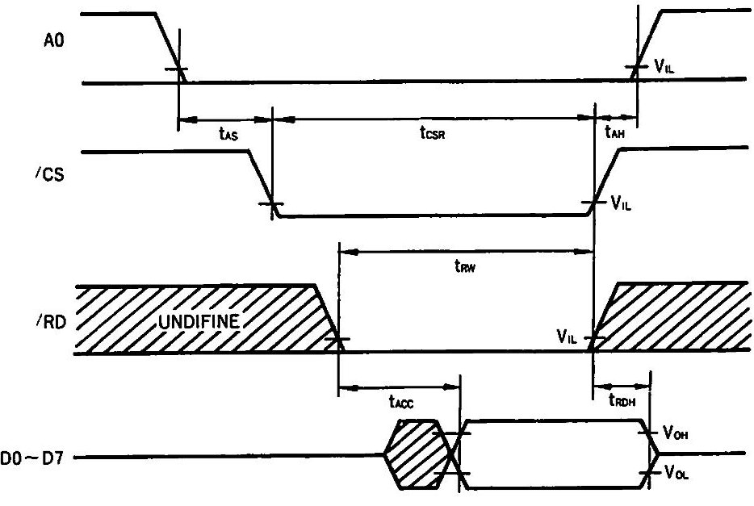

$t_{ACC}$ is referenced to whichever of /CS, /RD goes Low later.

$t_{CSR}$, $t_{RW}$, $t_{RDH}$ are referenced to whichever of /CS, /RD goes High.

**(5) DMA read timing**

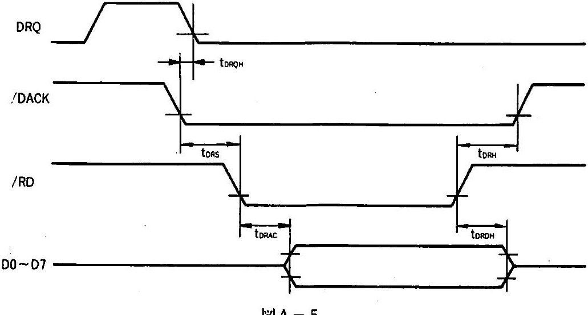

**(6) DMA write timing**

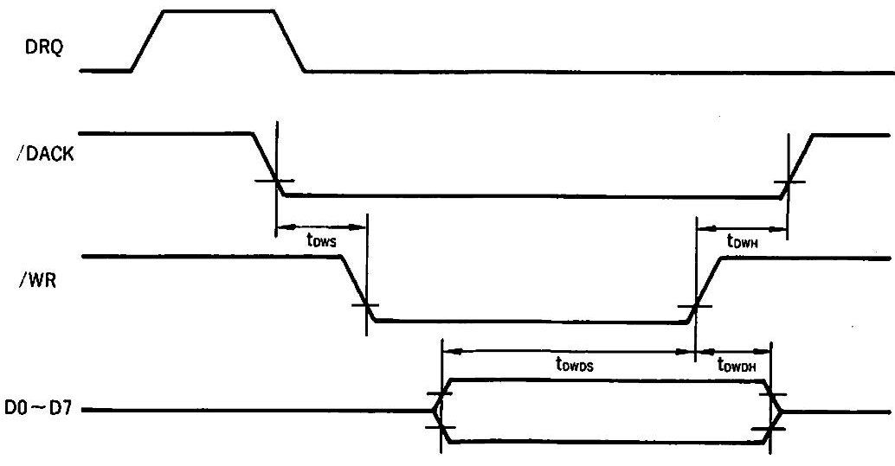

## Package outline

**YMZ263B-F**

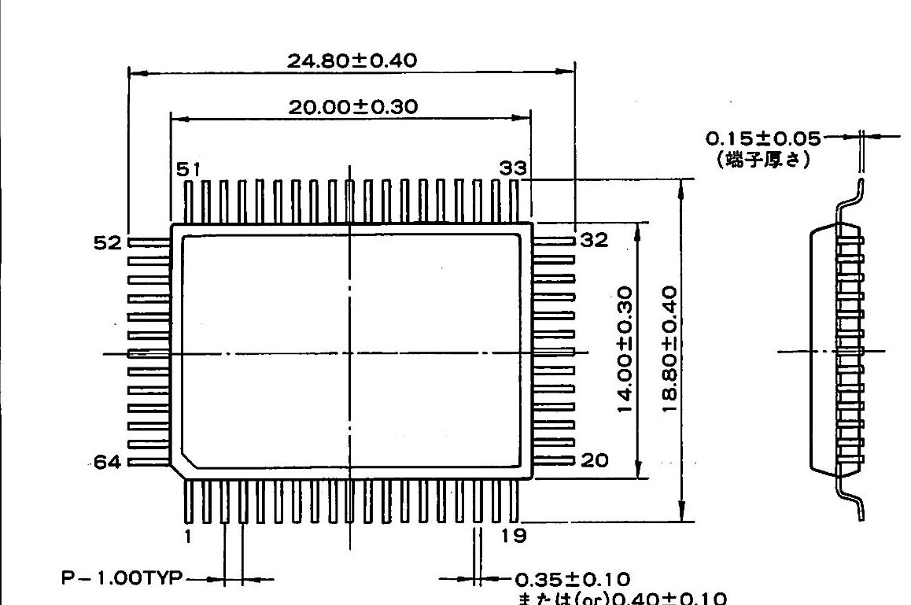

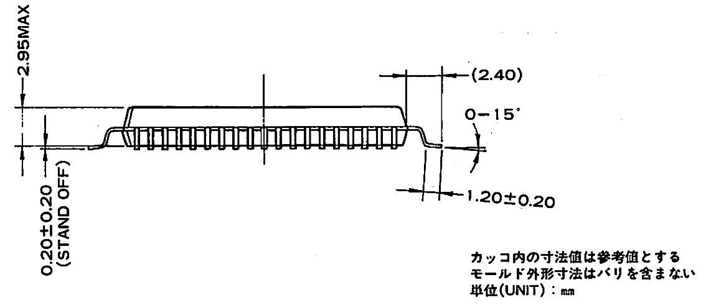

